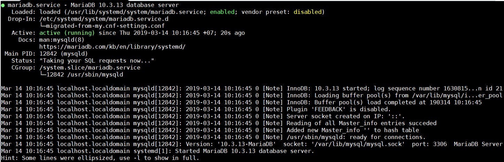
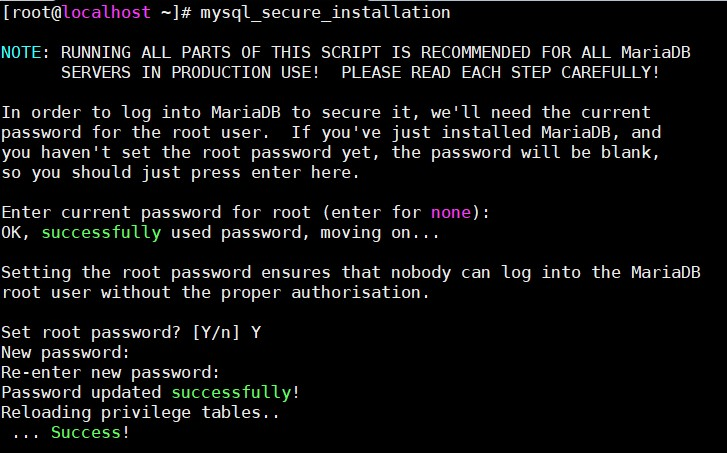
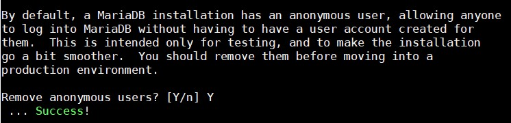
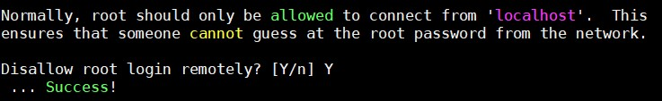
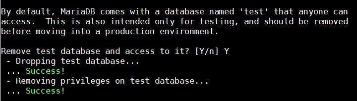
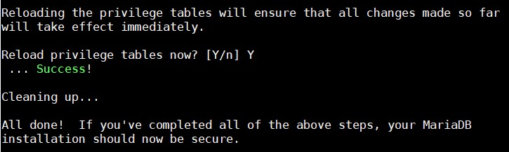

# MariaDB

## Cài đặt MariaDB 10.3 trên CentOS

- Cài đặt Repo MariaDB

Truy cập link: https://downloads.mariadb.org/mariadb/repositories/ để MariaDB web tạo cho bạn nội dung Repo tương ứng với OS và phiên bản MariaDB bạn muốn cài.

- Cài đặt Repo MariaDB 10.3

Tạo file `MariaDB.repo` trong thư mục `/etc/yum.repos.d/` với nội dung sau:

```
[mariadb]
name = MariaDB
baseurl = http://yum.mariadb.org/10.3/centos7-amd64
gpgkey=https://yum.mariadb.org/RPM-GPG-KEY-MariaDB
gpgcheck=1
```

- Cài đặt

```
rm -rf /var/lib/mysql
yum install mariadb-server
```

- Khởi động MariaDB

`systemctl start mariadb`

- Cho phép MariaDB khởi động cùng hệ thống

`systemctl enable mariadb`

- Kiểm tra 

`systemctl status mariadb`



## File cấu hình

Tập tin cấu hình của MariaDB được lưu tại `/etc/my.cnf` và thư mục `/etc/my.cnf.d` 

Một số mẫu Template cấu hình nằm tại thư mục `/usr/share/mysql`. Đây là các cấu hình mẫu dựa trên độ lớn của dịch vụ CSDL bạn mong muốn, các file cấu hình mẫu này đã được MariaDB kiểm tra và test nhiều lần:

- **my-small.cnf**: Cấu hình lý tưởng cho các server/vps có RAM giới hạn thấp tầm 64MB trở xuống dành cho database

- **my-medium.cnf**: Cấu hình lý tưởng cho các server/vps có RAM giới hạn thấp tầm 128MB trở xuống dành cho database

- **my-large.cnf**: Cấu hình lý tưởng cho các server/vps có RAM giới hạn thấp tầm 512MB trở xuống dành cho database

- **my-huge.cnf**: Cấu hình lý tưởng cho các server/vps có RAM giới hạn thấp tầm 1GB trở xuống dành cho database

Để sử dụng file mẫu, làm như sau:

```
mv /etc/my.cnf /etc/my.$(date -I)
cp /usr/share/mysql/my-large.cnf /etc/my.cnf 
```

## Thiết lập cấu hình bảo mật cơ bản cho MariaDB

Ngay sau khi cài đặt xong MariaDB, chạy script `mysql_secure_installation` để:

- Thay đổi mật khẩu root 



- Xoá bỏ user anonymous



- Tắt tính năng cho phép root login từ ngoài hệ thống 



- Xoá bỏ database "test" và quyền truy cập nó 



- Reload lại các table liên quan đến quyền hạn 



## Tham khảo

https://cuongquach.com/cai-dat-mariadb-10-2-tren-centos-7.html