# Các thao tác cơ bản với MariaDB

## Truy cập vào mysql shell

`mysql -u username -p`

- **username**: Tài khoản

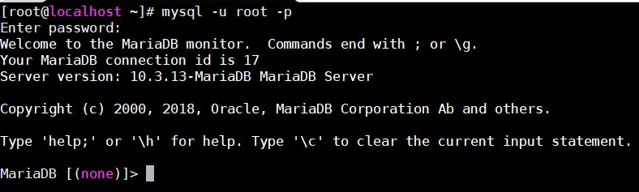

## Thao tác với Database

### Tạo Database

- Câu lệnh:

`create database dbname;`

- Ví dụ:

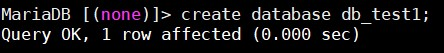

### Xoá Database

- Câu lệnh:

`drop database dbname;`

- Ví dụ:

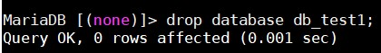

### Liệt kê các Database

- Câu lệnh:

`show databases;`

- Ví dụ:

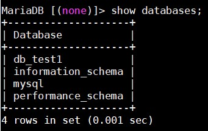

### Chọn Database

- Câu lệnh:

`use dbname;`

- Ví dụ:

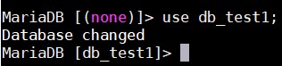

## Thao tác với Table

### Tạo bảng

- Câu lệnh:

`create table table_name(column_name column_type);`

- Ví dụ:

Tạo bảng tên persons gồm các trường id, name, sex, bd với id là khoá chính và tự tăng

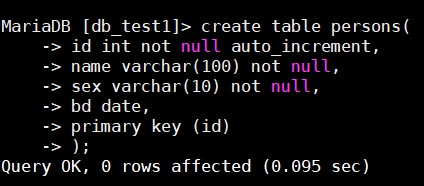

Thuộc tính **not null** để tránh các lỗi gây ra bởi một giá trị null.

Thuộc tính **auto_increment** chỉ thị trường tự động tăng giá trị.

Thuộc tính **primary key** định nghĩa trường được đặt làm khoá chính của bảng.

### Liệt kê bảng

- Câu lệnh:

`show tables;`

- Ví dụ:

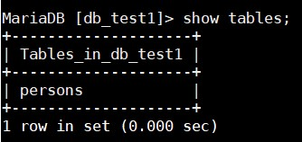

### Xem các trường trong bảng 

- Câu lệnh:

`describe table_name;`

- Ví dụ:

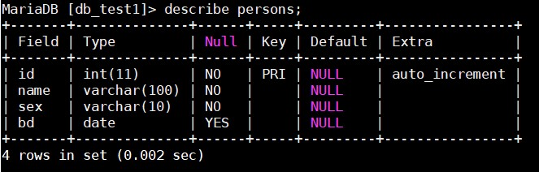

### Xoá bảng 

- Câu lệnh:

`drop table table_name;`

- Ví dụ:

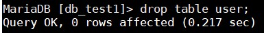

### Đổi tên bảng

- Câu lệnh:

`rename table old_name to new_name;`

- Ví dụ:

## Thao tác với row và column 

### Hiển thị toàn bộ cột trong bảng 

- Câu lệnh: 

`SHOW COLUMNS FROM table_name;`

- Ví dụ:

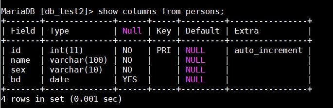

### Thêm cột mới 

- Câu lệnh:

`ALTER TABLE table_name ADD column_name column_definition;`

- Ví dụ:

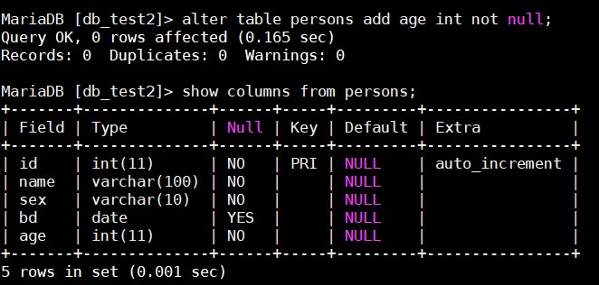

### Đổi tên cột

- Câu lệnh:

`ALTER TABLE table_name CHANGE COLUMN old_column new_column column_definition;`

- Ví dụ:

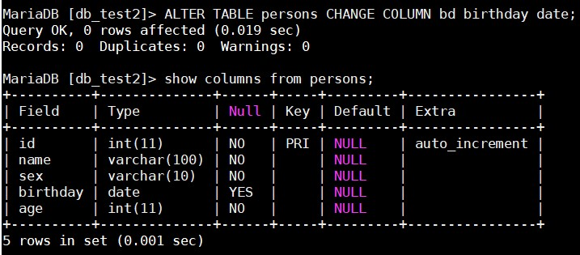

### Xoá cột 

- Câu lệnh:

`ALTER TABLE table_name DROP COLUMN column_name;`

- Ví dụ:

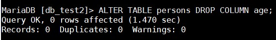

### Thay đổi kiểu dữ liệu của cột 

- Câu lệnh:

`ALTER TABLE table_name MODIFY column_name column_definition;`

- Ví dụ:

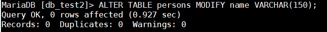

### Hiển thị dữ liệu trong bảng 

- Câu lệnh:

`SELECT field1, field2,... FROM table_name WHERE ...;`

- Ví dụ: Xem tên và tuổi của người có id là 2 trong table persons 

`SELECT name,age FROM persons WHERE id = 2;`

### Thêm dữ liệu vào bảng 

- Câu lệnh:

`INSERT INTO table_name (field1, field2,...) VALUES ('values1', 'values2', ...);`

- Ví dụ:

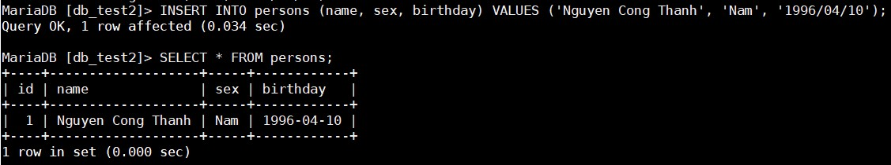

### Cập nhật dữ liệu 

- Câu lệnh:

`UPDATE table_name SET field1='new_value1', field2='new_value2',... WHERE ...;`

- Ví dụ:

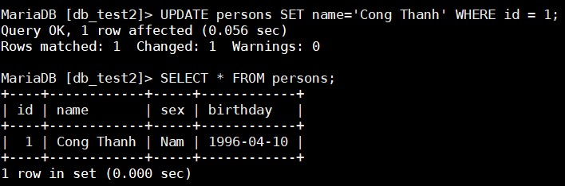

### Xoá dữ liệu 

- Câu lệnh:

`DELETE FROM table_name WHERE ...;`

- Ví dụ: 

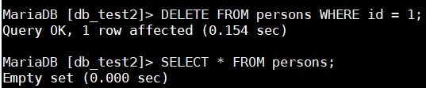

## Người dùng và phân quyền

### Tạo user 

- Để tạo user cần đăng nhập vào MySQL Shell trước

- Câu lệnh:

`create user 'username'@'localhost' identified by 'password';`

**username**: Tên người dùng

**password**: Mật khẩu người dùng 

- Ví dụ:

### Phân quyền

- Sau khi tạo người dung mới, cần phải set quyền cho nó để kiểm soát hành vi của người dùng.

- Câu lệnh cấp quyền: `GRANT [quyền] ON [tên_database].[tên_table] TO 'username'@'localhost';`

- Câu lệnh thu hồi quyền: REVOKE [quyền] on [tên_database].[tên_table] TO 'username'@'localhost';`

| Quyền | Mô tả |
|-------|-------|
| ALL PRIVILEGES | Cấp tất cả quyền |
| CREATE | Cho phép tạo database và table |
| DROP | Cho phép xoá database và table |
| DELETE | Cho phép xoá các dòng trong table |
| INSERT | Cho phép thêm dòng vào table |
| SELECT | Cho phép đọc dữ liệu trong table |
| UPDATE | Cho phép cập nhật dòng trong table |
| GRANT OPTION | Cho phép cấp hoặc thu hồi quyền của user khác |

**tên_database**: Tên database sẽ cấp quyền cho user. Có thể dùng dấu * để cấp quyền cho tất cả database

**tên_table**: Tên table sẽ cấp quyền cho user. Có thể dùng dấu * để cấp quyền cho tất cả database

Để quyền có tác dụng sau khi phân quyền cần thực hiện `FLUSH PRIVILEGES;`

- Ví dụ:

Cấp tất cả quyền cho user trên một database: `GRANT ALL PRIVILEGES ON db_test1.* TO 'vibi'@'localhost';`

Cấp quyền update cho user trên một table cụ thể: `GRANT UPDATE ON db_test1.persons TO 'vibi'@'localhost';`

Cấp tất cả quyền trên tất cả database: `GRANT ALL PRIVILEGES ON *.* TO 'vibi'@'localhost';`

## MYSQLDUMP

### Dump Database

- Câu lệnh:

`mysqldump -u username -p database_name > data-dump.sql`

**username**: Tên người dùng có thể đăng nhập vào database

**database_name**: Tên database sẽ được dump 

**data-dump.sql**: Tệp tin lưu database

- Ví dụ:

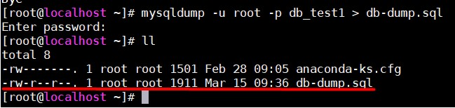

### Restore database

- Để restore database, đầu tiên phải đăng nhập vào MySQL Shell bằng user có quyền tạo database mới:

`mysql -u root -p`

- Tạo một database mới:

`CREATE DATABASE new_database;`

- Thoát khỏi MySQL Shell bằng `CTRL+D`. Dùng câu lệnh sau để restore database:

`mysql -u username -p new_database < data-dump.sql`

**username**: Tên người dùng có thể đăng nhập vào database

**new_database**: Tên database mới được tạo 

**data-dump.sql**: Tệp dump database

- Ví dụ:

Tạo database db_test2 để restore dữ liệu của database db_test1 từ file db-dump.sql, câu lệnh:

`mysql -u root -p db_test2 < db-dump.sql` 

Kết quả:

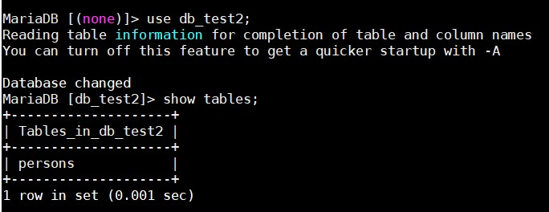

## Tham khảo

https://www.codehub.vn/Lam-the-nao-de-nhap-va-xuat-co-so-du-lieu-trong-MySQL-hoac-MariaDB
https://teamvietdev.com/chuyen-muc/mariadb/
https://github.com/nguyenhungsync/Report-Intern-Meditech/blob/master/Database/5.%20User%20and%20Permission%20MYSQL.md