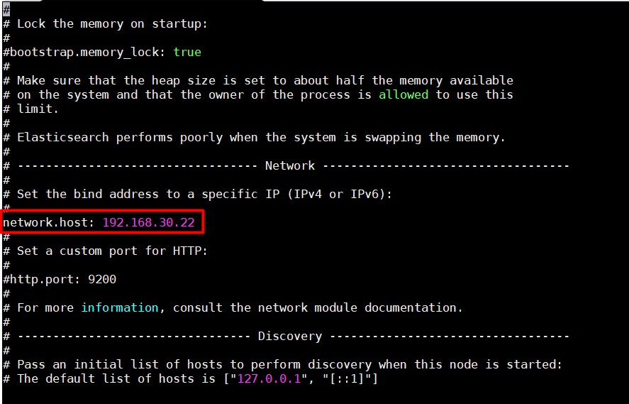
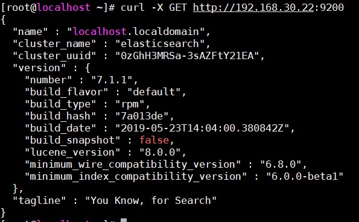
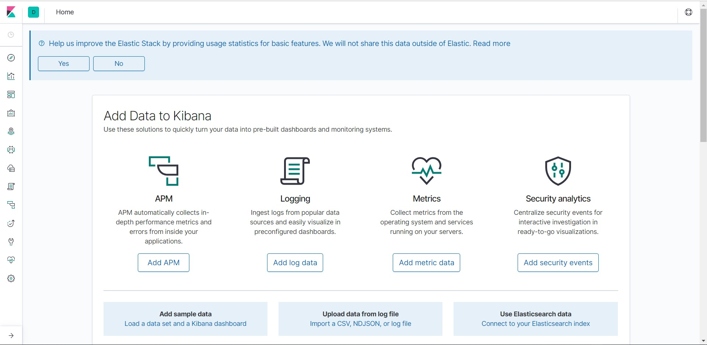

# Cài đặt ELK trên CentOS 7

- Cài đặt java:

```
yum install java-1.8.0p-openjdk -y
```

## 1. Cài đặt Elasticsearch

- Download public key Elasticsearch

```
rpm --import http://packages.elastic.co/GPG-KEY-elasticsearch
```

- Thêm repo:

```
cat <<EOF > /etc/yum.repos.d/elasticsearch.repo
[elasticsearch-7.x]
name=Elasticsearch repository for 7.x packages
baseurl=https://artifacts.elastic.co/packages/7.x/yum
gpgcheck=1
gpgkey=https://artifacts.elastic.co/GPG-KEY-elasticsearch
enabled=1
autorefresh=1
type=rpm-md
EOF
```

- Cài đặt

```
yum install elasticsearch -y 
```

- Mở file `/etc/elasticsearch/elasticsearch.yml`, tìm đến dòng `network.host` và sửa lại:



Thêm dòng sau vào trường `Discovery` nếu cài Elasticsearch 1 node:

```
discovery.type=single-node
```

- Khởi động lại Elasticsearch và cho phép khởi động cùng hệ thống:

```
systemctl restart elasticsearch
systemctl enable elasticsearch
```

- Mở cổng 9200 firewall:

```
firewall-cmd --add-port=9200/tcp --permanent
firewall-cmd --reload
```

- Kiểm tra dịch vụ Elasticsearch

```
curl -X GET http://192.168.30.22:9200
```

- Kết quả thu được:



## 2. Cài đặt Logstash

- Thêm repo

```
cat << EOF > /etc/yum.repos.d/logstash.repo
[logstash-7.x]
name=Elastic repository for 7.x packages
baseurl=https://artifacts.elastic.co/packages/7.x/yum
gpgcheck=1
gpgkey=https://artifacts.elastic.co/GPG-KEY-elasticsearch
enabled=1
autorefresh=1
type=rpm-md
EOF
```

- Cài đặt:

```
yum install -y logstash
```

- Start và enable logstash:

```
systemctl daemon-reload
systemctl start logstash
systemctl enable logstash
```

- Cấu hình firewall cho phép Logstash nhận log từ client (port 5044):

```
firewall-cmd --add-port=5044/tcp --permanent
firewall-cmd --reload
```

## 3. Cài đặt Kibana

- Thêm repo:

```
cat <<EOF > /etc/yum.repos.d/kibana.repo
[kibana-7.x]
name=Kibana repository for 7.x packages
baseurl=https://artifacts.elastic.co/packages/7.x/yum
gpgcheck=1
gpgkey=https://artifacts.elastic.co/GPG-KEY-elasticsearch
enabled=1
autorefresh=1
type=rpm-md
EOF
```

- Cài đặt:

```
yum install -y kibana
sed -i 's/#server.host: "localhost"/server.host: "0.0.0.0"/'g /etc/kibana/kibana.yml
```

- Start và enable Kibana

```
systemctl daemon-reload
systemctl start kibana
systemctl enable kibana
```

- Cho phép truy cập Kibana web interface (port 5601):

```
firewall-cmd --add-port=5601/tcp --permanent
firewall-cmd --reload
```

- Truy cập vào Kibana để kiểm tra:

```
http://ip-server:5601
```

- Kết quả:

