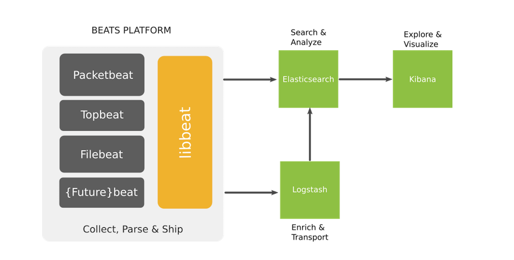
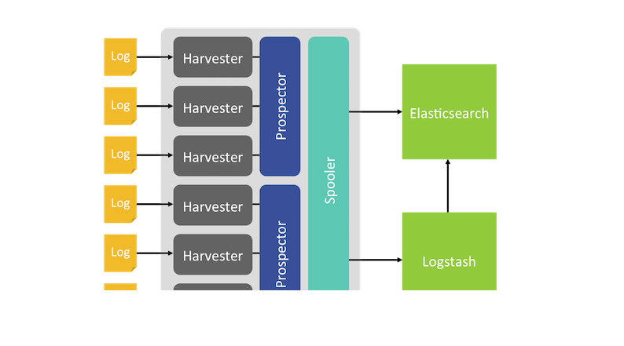
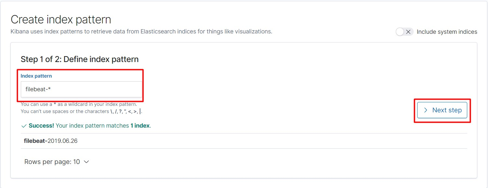
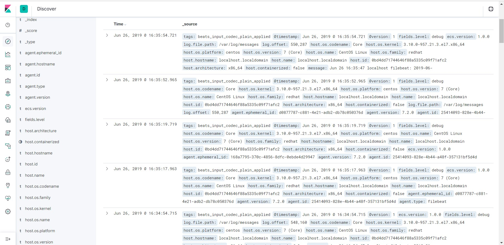

# Tìm hiểu về Beat

## 1. Beat là gì?

- Beat là những data shipper mã nguồn mở mà ta sẽ cài đặt như các agent trên các server để gửi các kiểu dữ liệu khác nhau tới Elasticsearch. Beat có thể gửi dữ liệu trực tiếp tới Elasticsearch hay tới Logstash

- Beats là một platform trong đó có các project nhỏ sinh ra thực hiện trên từng loại dữ liệu nhất định.

- ELK cần sử dụng các "beat" để làm shipper giúp gửi các loại dữ liệu từ client tới Server.

- Các beat index pattern cần được cài đặt trên cả ELK server và các client. Trên ELK server, các beat sẽ kết hợp với các thành phần để lọc dữ liệu, đánh chỉ mục, hiển thị.

- Các beats pattern thường dùng:

	- **Packetbeat**: Thực hiện gửi dữ liệu capture từ các port về server
	
	- **Topbeat**: Như là một monitoring agent, giúp thu thập các thông tin về phần cứng như CPU, RAM,...
	
	- **Filebeat**: Vận chuyển các log từ server
	
	- **Winlogbeat**: Vận chuyển windows event log
	
	- **Metricbeat**: Thu thập các dữ liệu từ hệ điều hành, các dịch vụ như: Apache, HAProxy, MongoDB, Nginx,...
	
- Mô hình beats platform:



## 2. Filebeat làm việc như thế nào

- Khi khởi động filebeat, nó sẽ khởi chạy một hay nhiều prospector, sẽ tìm kiếm các đường dẫn của tập tin mà ta đã khai báo. Với mỗi tập tin log mà prospector tìm thấy được, Filebeat sẽ khởi chạy một harvester. Mỗi một harvester đọc một tập tin log, và gửi các bản tin log này khi có dữ liệu mới tới spooler. Spooler là nơi tổng hợp các sự kiện và gửi dữ liệu đã tổng hợp được tới output mà ta đã cấu hình trên Filebeat.

- Cấu trúc bên trong filebeat



## 3. Cấu hình filebeat thu thập log

- Yêu cầu: 

	- Đã cài đặt ELK stack
	
	- CentOS 7
	
- Trên máy chủ muốn đẩy log về chúng ta cần phải cài đặt filebeat, Cài đặt GPG keys từ Elastic và thêm Elastic repo:

```
rpm --import https://packages.elastic.co/GPG-KEY-elasticsearch

cat > /etc/yum.repos.d/elastic.repo << EOF
[elasticsearch-7.x]
name=Elasticsearch repository for 7.x packages
baseurl=https://artifacts.elastic.co/packages/7.x/yum
gpgcheck=1
gpgkey=https://artifacts.elastic.co/GPG-KEY-elasticsearch
enabled=1
autorefresh=1
type=rpm-md
EOF
```
	
- Cài đặt filebeat

```
yum install filebeat -y
```

- Enable và start filebeat

```
systemctl enable filebeat
systemctl start filebeat
```

- Sao chép file cấu hình `filebeat.yml` để backup:

```
mv /etc/filebeat/filebeat.yml /etc/filebeat/filebeat.yml.orig
touch /etc/filebeat/filebeat.yml
```

- Tạo thư mục lưu trữ debug từ filebeat

```
mkdir /var/log/filebeat
```

- Thêm cấu hình sau vào file `/etc/filebeat/filebeat.yml`:

```
filebeat.inputs:
- type: log
  enabled: true
  paths:
    - /var/log/*.log
    - /var/log/secure
    - /var/log/messages
  fields:
    level: debug
filebeat.config.modules:
  path: ${path.config}/modules.d/*.yml
  reload.enabled: true
setup.template.settings:
  index.number_of_shards: 1
setup.kibana:
output.logstash:
  hosts: ["192.168.30.22:5044"]
processors:
  - add_host_metadata: ~
  - add_cloud_metadata: ~
logging.level: info
logging.selectors: ["*"]
```

### Cấu hình trên máy chủ ELK

- Tạo file config logstash:

```
vi /etc/logstash/conf.d/02-logstash.conf
```

- Thêm nội dung sau vào file:

```
input {
beats {
    port => 5044
    ssl => false
}
}

output {
    elasticsearch {
    hosts => ["192.168.30.22:9200"]
    sniffing => true
    index => "%{[@metadata][beat]}-%{+YYYY.MM.dd}"
    }
}
```

- Trên máy chủ ELK restart lại logstash

```
systemctl restart logstash
```

- Trên máy client đẩy log, khởi động lại filebeat:

```
systemctl restart filebeat
```

- Kiểm tra trên Kibana

Truy cập địa chỉ ip ELK server:

```
http://ip-ELK:5601
```

- Vào mục `Management` và chọn `Create Index`:


- Điền vào ô `Define index pattern` rồi chọn `Next step`:



- Kiểm tra lại thông tin log được đẩy về ở phần `Discover`:



## Tham khảo

https://github.com/datkk06/tong-hop/blob/master/Ghi%20chep%20ELK/7.Tim-hieu-ve-beats.md

