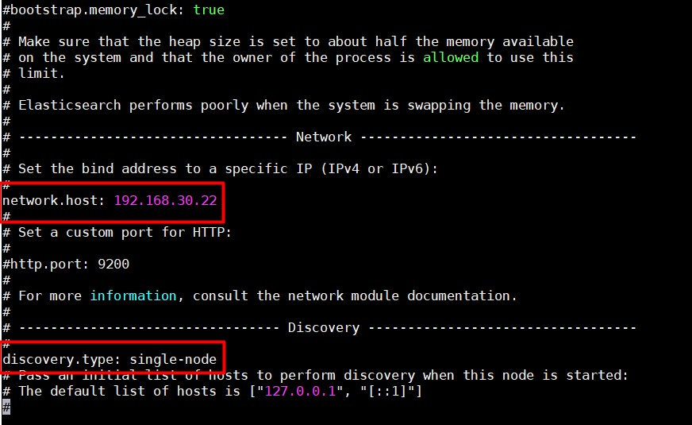
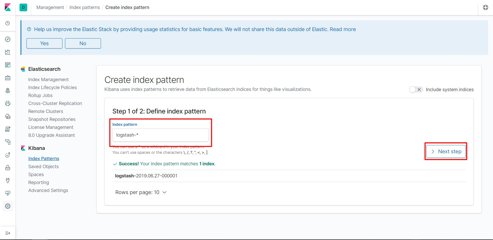
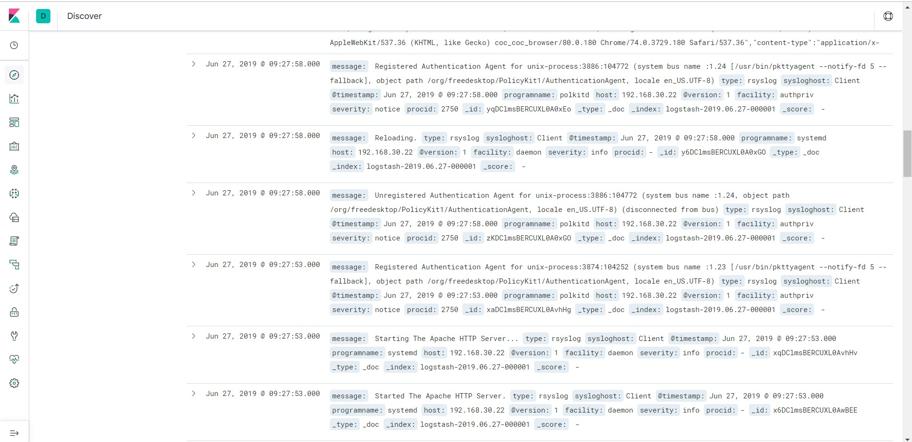

# Đẩy log về Logstash bằng Rsyslog

## Mô hình

- Server: Đã cài ELK stack

OS: CentOS 7

IP: 192.168.30.22

- Client:

OS: CentOS 7

IP: 192.168.30.23

## Cấu hình

- **Bước 1**: Cấu hình bind address cho Elasticsearch

Truy cập file `/etc/elasticsearch/elasticsearch.yml` và sửa như trong hình, với `network.host` là địa chỉ IP máy ELK server



Restart Elasticsearch:

```
systemctl restart elasticsearch 
```

- **Bước 2**: Cấu hình rsyslog trên server

Sửa file `/etc/rsyslog.conf`, bỏ comment các dòng sau:

```
$ModLoad imudp
$UDPServerRun 514

$ModLoad imtcp
$InputTCPServerRun 514
```

Lưu file và khởi động lại rsyslog

```
systemctl restart rsyslog
```

- **Bước 3**: Cấu hình rsyslog trên Client

Cấu hình file `/etc/rsyslog.conf`, thêm dòng sau:

```
*.*		@IP_server:514
```

Thay IP của server vào phần `IP_server`. 1 dấu `@` là sử dụng UDP, `@@` để sử dụng TCP

Lưu file và khởi động lại rsyslog

```
systemctl restart rsyslog
```

- **Bước 4**: Định dạng log về JSON

Tạo file `/etc/rsyslog.d/01-json-template.conf` và thêm vào nội dung:

```
template(name="json-template"
  type="list") {
    constant(value="{")
      constant(value="\"@timestamp\":\"")     property(name="timereported" dateFormat="rfc3339")
      constant(value="\",\"@version\":\"1")
      constant(value="\",\"message\":\"")     property(name="msg" format="json")
      constant(value="\",\"sysloghost\":\"")  property(name="hostname")
      constant(value="\",\"severity\":\"")    property(name="syslogseverity-text")
      constant(value="\",\"facility\":\"")    property(name="syslogfacility-text")
      constant(value="\",\"programname\":\"") property(name="programname")
      constant(value="\",\"procid\":\"")      property(name="procid")
    constant(value="\"}\n")
}
```

- **Bước 5**: Cấu hình rsyslog gửi log đến Logstash

Tạo file `/etc/rsyslog.d/60-output.conf` và thêm vào nội dung sau:

```
*.*                         @private_ip_logstash:10514;json-template
```

Thay thế địa chỉ IP Logstash server vào `private_ip_logstash`

- **Bước 6**: Cấu hình Logstash nhận JSON message 

Tạo file `/etc/logstash/conf.d/rsyslog.conf` và thêm nội dung sau:

```
input {
  udp {
    host => "logstash_private_ip"
    port => 10514
    codec => "json"
    type => "rsyslog"
  }
}

filter { }

output {
  if [type] == "rsyslog" {
    elasticsearch {
      hosts => [ "elasticsearch_private_ip:9200" ]
    }
  }
}
```

Chú ý thay thế địa chỉ IP của Logstash và Elasticsearch vào `logstash_private_ip` và `elasticsearch_private_ip`.

Khởi động lại logstash và rsyslog

```
systemctl restart logstash rsyslog
```

- **Bước 7**: Kiểm tra lại trên Kibana

Truy cập địa chỉ ELK server

```
http://ip-ELK:5601
```

Vào mục `Management` và chọn `Create Index`:


Điền vào ô `Define index pattern` rồi chọn `Next step`:



Kiểm tra lại thông tin log được đẩy về ở phần `Discover`:



## Tham khảo 

https://www.digitalocean.com/community/tutorials/how-to-centralize-logs-with-rsyslog-logstash-and-elasticsearch-on-ubuntu-14-04