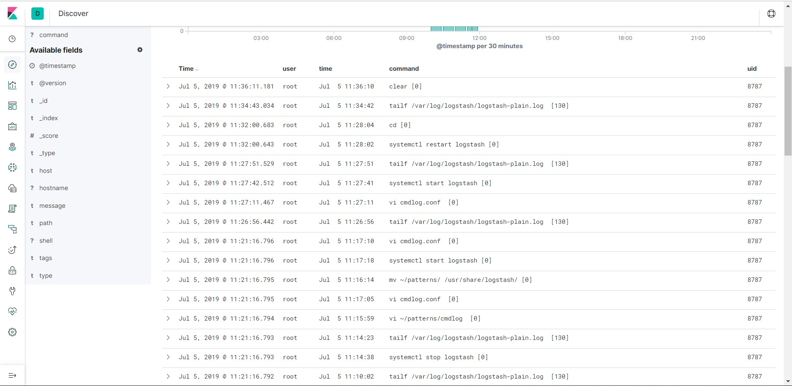

# Log command người dùng và đẩy vào ELK để phân tích

## 1. Log command

- Thêm vào file `/etc/bashrc` dòng sau:

```
export PROMPT_COMMAND='RETRN_VAL=$?;logger -p local6.debug -t bash "$(whoami) [$$]: $(history 1 | sed "s/^[ ]*[0-9]\+[ ]*//" ) [$RETRN_VAL]"'
```

- Chạy file `/etc/bashrc`

```
source /etc/bashrc
```

- Thêm nội dung sau vào file cấu hình rsyslog `/etc/rsyslog.conf`:

```
local6.*                                                /var/log/cmdlog.log
```

- Khởi động lại rsyslog:

```
systemctl restart rsyslog
```

## 2. Đẩy vào ELK và phân tích bằng Grok

- Tạo thư mục custom pattern:

```
mkdir /usr/share/logstash/patterns
```

- Tạo file pattern `/usr/share/logstash/patterns/cmdlog` với nội dung sau:

```
CMDLOG %{SYSLOGTIMESTAMP:time} %{HOSTNAME:hostname} %{WORD}: %{USER:user} \[%{POSINT:uid}\]: %{GREEDYDATA:command}
```

- Tạo file `/etc/logstash/conf.d/cmdlog.conf` cấu hình Logstash:

```
input {
  file {
    type => "cmdlog"
    start_position => "beginning"
    path => [ "/var/log/cmdlog.log" ]
  }
}

filter {
  if [type] == "cmdlog" {
    grok {
      patterns_dir => "/usr/share/logstash/patterns"
      match => { "message" => "%{CMDLOG}" }
    }
  }
}

output {
  elasticsearch {
    index => "cmdlog"
    hosts => ["192.168.30.22:9200"]
  }
}
```

- Khởi động lại Logstash

```
systemctl restart logstash 
```

- Kiểm tra lại trên Kibana:



## Tham khảo

https://github.com/datkk06/tong-hop/blob/master/Ghi%20chep%20ELK/11.Capture-CMD-user-log.md

http://saysua.com/2016/12/04/push-nginx-log-to-elasticsearch-by-using-logstash/

http://grokconstructor.appspot.com/

https://github.com/elastic/logstash/blob/v1.4.2/patterns/grok-patterns