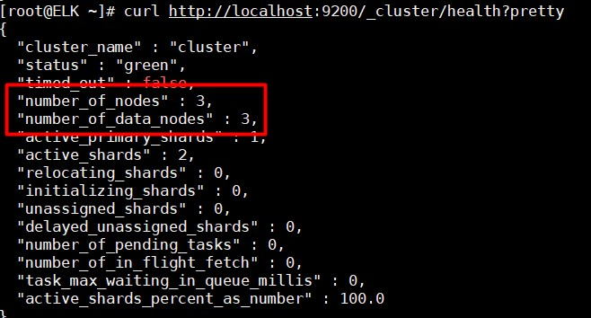
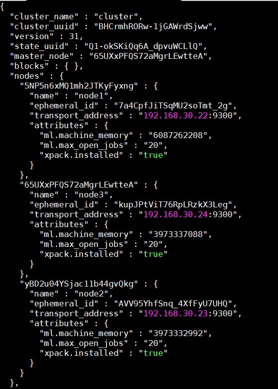

# Cấu hình Elasticsearch cluster

## Mô hình

- ELK stack (Node 1): 192.168.30.22

- Node 2: 192.168.30.23

- Node 3: 192.168.30.24

## Cài đặt

- Cài đặt Elasticsearch trên 2 node muốn join cluster

Disable IPv6

```
cat > /etc/sysctl.conf << EOF
net.ipv6.conf.all.disable_ipv6 = 1
net.ipv6.conf.default.disable_ipv6 = 1
net.ipv6.conf.lo.disable_ipv6 = 1
EOF

sysctl -p
```

Cài đặt `java` và `wget`:

```
yum install java-1.8.0-openjdk.x86_64 wget -y
```

Tải bản cài đặt Elasticsearch:

```
wget https://artifacts.elastic.co/downloads/elasticsearch/elasticsearch-7.2.0-x86_64.rpm
```

Cài đặt Elasticsearch:

```
rpm -ivh elasticsearch-7.2.0-x86_64.rpm
```

Khởi động Elasticsearch và cho phép khởi động cùng máy chủ:

```
systemctl start elasticsearch
systemctl enable elasticsearch
```

- Cấu hình Elasticsearch trên node ELK

Mở file cấu hình

```
vi /etc/elasticsearch/elasticsearch.yml
```

Chỉnh sửa các cấu hình:

```
cluster.name: my_es_cluster
node.name: node1
node.master: true
path.data: /var/lib/elasticsearch
path.logs: /var/log/elasticsearch
network.host: 0.0.0.0
http.port: 9200
discovery.seed_hosts: ["192.168.30.22", "192.168.30.23", "192.168.30.24"]
cluster.initial_master_nodes: ["192.168.30.22", "192.168.30.23", "192.168.30.24"]
```

- Cấu hình trên 2 node muốn join vào cluster

Mở file cấu hình:

```
vi /etc/elasticsearch/elasticsearch.yml
```

Sửa lại cấu hình trên 2 node như sau:

```
cluster.name: my_es_cluster
node.name: node2 # Node 2 hay Node 3 như trên mô hình
path.data: /var/lib/elasticsearch
path.logs: /var/log/elasticsearch
network.host: 0.0.0.0
http.port: 9200
discovery.seed_hosts: ["192.168.30.22", "192.168.30.23", "192.168.30.24"]
cluster.initial_master_nodes: ["192.168.30.22", "192.168.30.23", "192.168.30.24"]
```

- Restart Elasticsearch trên tất cả các node

```
systemctl restart elasticsearch
```

- Kiểm tra kết quả

Sử dụng câu lệnh sau trên 1 node bất kì

```
curl http://localhost:9200/_cluster/health?pretty
```



Check các node trong cluster:

```
curl -XGET 'http://localhost:9200/_cluster/state?pretty' | less
```

