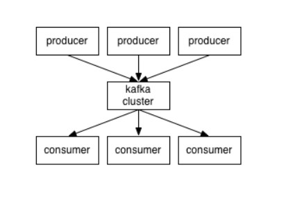
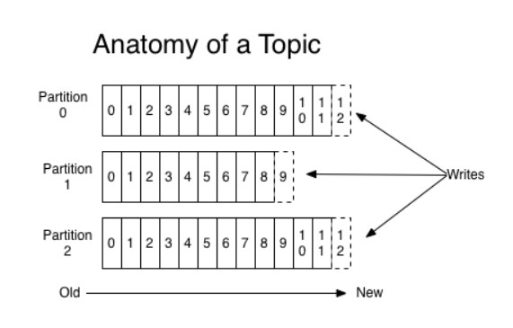
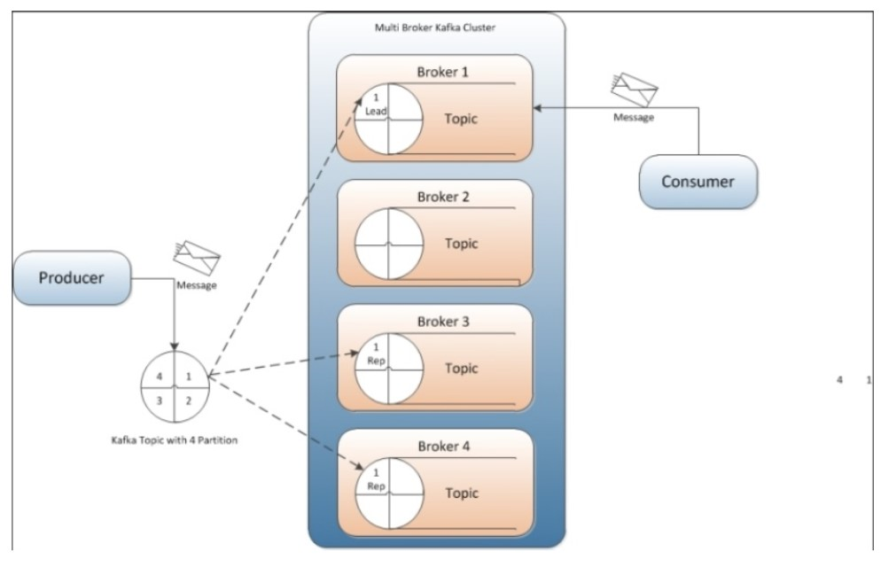

# Cài đặt ELK kết hợp kafka 

## 1. Giới thiệu về Apache Kafka

Về cơ bản kafka là hệ thống message pub/sub phân tán mà có khả năng scale tốt

Message của kafka được lưu trên đĩa cứng, đồng thời được replicate trong cluster giúp phòng tránh mất dữ liệu.

Kafka có thể hiểu là một hệ thống logging, nhằm lưu lại các trạng thái của hệ thống, nhằm phòng tránh mất thông tin.

Các khái niệm cơ bản:

- Kafka lưu, phân loại message theo `topics`

- Kafka sử dụng `producers` để publish message vào các topics ở trên

- Kafka sử dụng `consumers` để subscribe vào topics, sau đó xử lý các message lấy được theo một logic nào đó

- Kafka thường được chạy dưới dạng cluster, khi đó mỗi server trong đó sẽ được gọi là `broker`



### 1.1. Topic

Topic có thể hiểu là một ngôn ngữ chung giữa producer (người nói) và consumer (người nghe, sử dụng). Với mỗi topic, kafka sẽ duy trì thông qua partitioned log như dưới đây:



- Mỗi partition là một chuỗi log, có thứ tự và không thể thay đổi (immutable)

- Mỗi message trong partition sẽ có id tăng dần, gọi là offset

- Kafka cluster sẽ lưu lại mọi message đã được published, cho dù message đó đã/chưa được sử dụng (consume). Thời gian lưu message có thể tuỳ chỉnh được thông qua log retention.

- Consumer sẽ điều khiển những gì mình muốn đọc thông qua offset của message, hay thậm chí là thứ tự đọc. Consumer có thể reset lại vị trí của offset để re-process lại một vài message nào đó.

### 1.2. Producer

Producer nhằm mục đích chính là ném message vào topic. Cụ thể hơn là producer có nhiệm vụ là chọn message nào, để ném vào partition nào trong topic. Nhiệm vụ này rất quan trọng, giúp cho kafka có khả năng scale tốt.



### 1.3. Consumer

Thông thường thì một hệ thống messaging sẽ có 2 loại:

- Queue: Một message sẽ được xử lý bởi một consumer

- Pub/Sub: Một message sẽ được xử lý bởi một vài consumer thích hợp, tuỳ theo topic 

Ở kafka có một khái niệm gọi là `consumer group` giúp chúng ta có thể làm được đồng thời cả 2 lại trên. Việc subscribe một topic sẽ được thực hiện bởi consumer group. Mỗi một message sẽ được gửi cho duy nhất một consumer instance trong một consumer group. Việc này dẫn đến:

- Nếu nhiều instance consumer có cùng group, chúng ta sẽ có một hệ thống queue

- Nếu mỗi instance là một group, chúng ta sẽ có một hệ thống pub/sub

### 1.4. Use cases 

- Sử dụng như một hệ thống message queue thay thế cho ActiveMQ hay RabbitMQ

- Tracking hành động người dùng: các thông số như page view, search action của user sẽ được publish vào một topic và sẽ được xử lý sau.

- Log Aggregration: log sẽ được gửi từ nhiều server về một nơi thống nhất, sau đó có thể được làm sạch và xử lý theo một logic nào đó

- Event-Sourcing: Lưu lại trạng thái của hệ thống để có thể tái hiện trong trường hợp system bị down.

## 2. Cài đặt

### 2.1. Cài đặt kafka

- Cài đặt java

```
yum install -y java-1.8.0-openjdk
```

- echo environment

```
echo "export JAVA_HOME=/usr/lib/jvm/jre-1.8.0-openjdk" >> /etc/environment
echo "export JRE_HOME=/usr/lib/jvm/jre" >> /etc/environment
```

- Cấu hình firewall:

```
firewall-cmd --permanent --add-port=9092/tcp
firewall-cmd --reload
```

- Download kafka:

```
wget http://mirror.downloadvn.com/apache/kafka/2.3.0/kafka_2.11-2.3.0.tgz
```

- Giải nén:

```
tar -xvzf kafka_2.11-2.3.0.tgz
cp -r kafka_2.11-2.3.0 /opt/kafka
```

- Sửa file cấu hình:

```
cd /opt/kafka
vi config/server.properties
# sửa nội dung bên dưới 
listeners=PLAINTEXT://ip-kafka:9092
```

- Khởi động kafka:

```
yum install -y screen
screen -d -m bin/zookeeper-server-start.sh config/zookeeper.properties
screen -d -m bin/kafka-server-start.sh config/server.properties
```

- Tạo topic mới để nhận log:

```
bin/kafka-topics.sh --create --zookeeper localhost:2181 --replication-factor 1 --partitions 1 --topic log-system
```

- List topic 

```
bin/kafka-topics.sh --list --zookeeper localhost:2181
```

- Theo dõi message có trong topic

```
bin/kafka-console-consumer.sh --zookeeper localhost:2181 --from-beginning --topic log-system
```

### 2.2. Cấu hình logstash nhận log từ kafka

- Tạo file cấu hình:

```
vi /etc/logstash/conf.d/02-logstash.conf
```

- Thêm vào nội dung sau:

```
input {
    kafka {
            bootstrap_servers => 'ip_kafka:9092'
            topics => ["log-system"]
            codec => json {}
          }
}

output {
    elasticsearch {
      hosts => ["localhost:9200"]
      index => "%{[@metadata][beat]}-%{+YYYY.MM.dd}"
    }
}
```

- Khởi động lại logstash

```
systemctl restart logstash
```

### 2.3. Cấu hình filebeat đẩy log về kafka

- Thêm repo Elastic:

```
rpm --import http://packages.elastic.co/GPG-KEY-elasticsearch

cat <<EOF > /etc/yum.repos.d/elasticsearch.repo
[elasticsearch-7.x]
name=Elasticsearch repository for 7.x packages
baseurl=https://artifacts.elastic.co/packages/7.x/yum
gpgcheck=1
gpgkey=https://artifacts.elastic.co/GPG-KEY-elasticsearch
enabled=1
autorefresh=1
type=rpm-md
EOF
```

- Cài đặt filebeat:

```
yum install -y filebeat
```

- Copy file cấu hình:

```
cp /etc/filebeat/filebeat.yml /etc/filebeat/filebeat.yml.orig
rm -rf /etc/filebeat/filebeat.yml
touch /etc/filebeat/filebeat.yml
```

- Thêm vào file cấu hình `/etc/filebeat/filebeat.yml` như sau:

```
filebeat.inputs:
- type: log
  paths:
    - /var/log/*.log
    - /var/log/secure
    - /var/log/messages
filebeat.config.modules:
  path: ${path.config}/modules.d/*.yml
  reload.enabled: false
setup.template.settings:
  index.number_of_shards: 1
output.kafka:
  hosts: ["ip-kafka:9092"]
  topic: log-system
processors:
  - add_host_metadata: ~
  - add_cloud_metadata:
```

- Khởi động filebeat:

```
systemctl start filebeat
```

## Tham khảo

https://kafka.apache.org/documentation/#topicconfigs

https://dzone.com/articles/kafka-logging-with-the-elk-stack

https://github.com/datkk06/tong-hop/blob/master/Ghi%20chep%20ELK/10.ELK-cache-su-dung-kafka.md