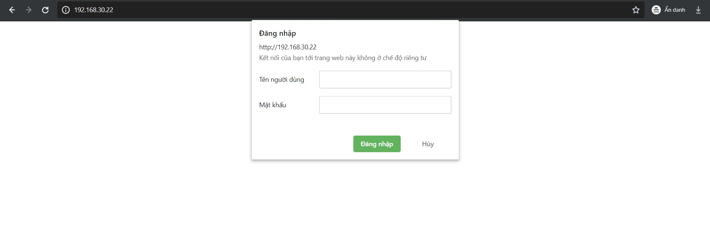
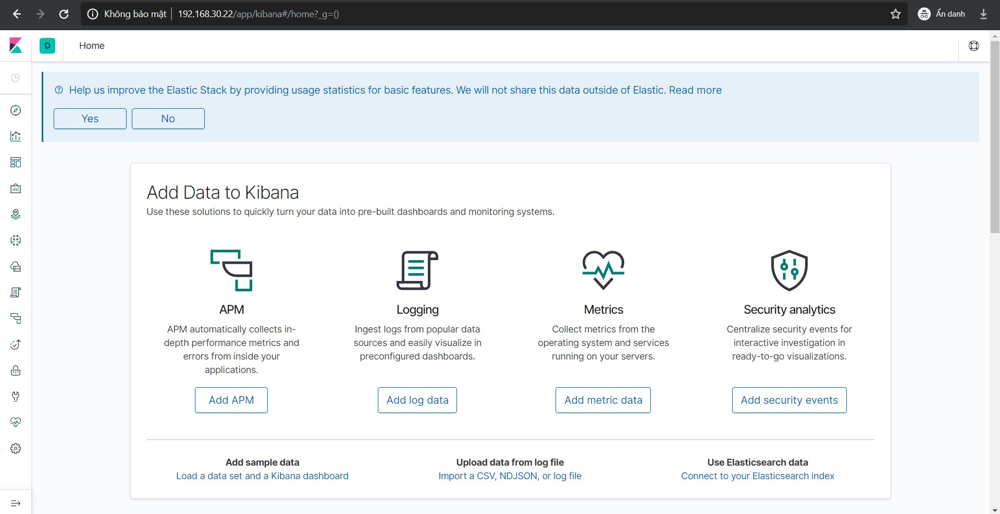

# Cài đặt nginx cho Kibana

- Cài đặt nginx

```
yum install -y nginx
```

- Tạo một user (kibadmin) để đăng nhập web Kibana

```
echo "kibadmin:`openssl passwd -apr1`" | sudo tee -a /etc/nginx/htpasswd.users
```

Điền password và xác nhận.

- Tạo file cấu hình mới

```
vi /etc/nginx/conf.d/kibana.conf
```

- Thêm nội dung sau vào file

```
server {
    listen 80;

    server_name <YourKibanaIP>;

    auth_basic "Restricted Access";
    auth_basic_user_file /etc/nginx/htpasswd.users;

    location / {
        proxy_pass http://localhost:5601;
        proxy_http_version 1.1;
        proxy_set_header Upgrade $http_upgrade;
        proxy_set_header Connection 'upgrade';
        proxy_set_header Host $host;
        proxy_cache_bypass $http_upgrade;        
    }
}
```

- Kiểm tra cấu hình nginx

```
nginx -t 
```

- Khởi động nginx và cho phép khởi động cùng hệ thống

```
systemctl start nginx
systemctl enable nginx
```

- Mở port 80:

```
firewall-cmd --permanent --add-port=80/tcp
firewall-cmd --reload
```

- Nếu đang mở cổng 5601 của Kibana thì đóng lại:

```
firewall-cmd --permanent --remove-port=5601/tcp
firewall-cmd --reload
```

- Kiểm tra kết quả:

Truy cập địa chỉ Kibana



Đăng nhập bằng user **kibadmin** và password đã tạo trước



## Tham khảo

https://burnhamforensics.com/2019/02/06/how-to-install-and-configure-nginx-for-kibana/