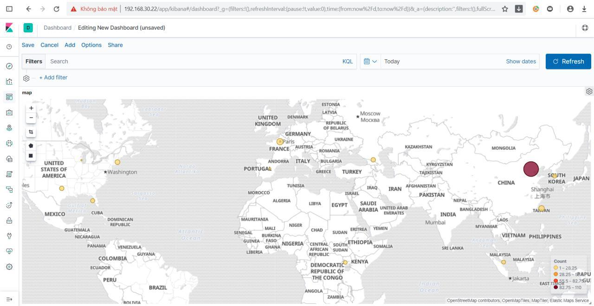

# Cấu hình geoip

Để cấu hình được geoip, trước tiên phải filter được trường `src_ip`.

Tại phần cấu hình filter trên logstash, ta thêm cấu hình sau:

```
filter {
  geoip {
    source => "src_ip" #đây là trường src_ip đã được filter từ trước
  }
}
```

Chỉ cần cấu hình như vậy vì ELK đã có sẵn template cho việc hiển thị geoip. Tại phần cấu hình output ta sẽ phải để index mặc định là `logstash-*` để áp dụng template.

Add biểu đồ trên Kibana:

  