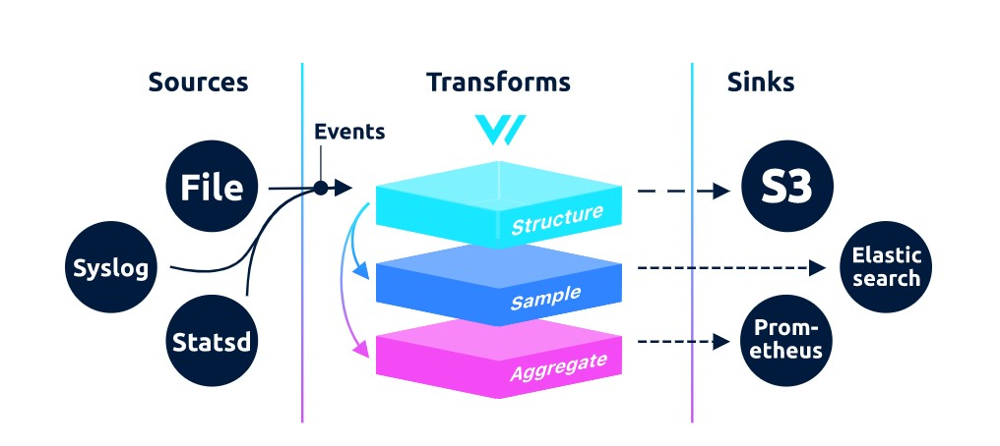
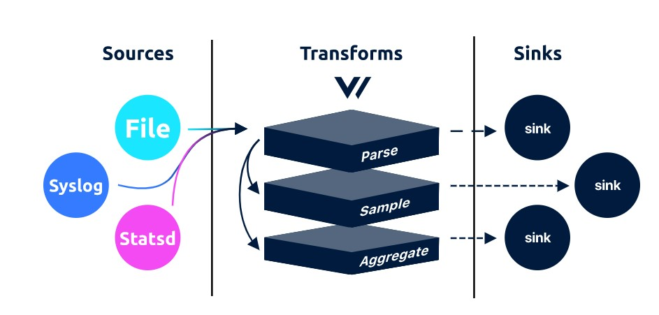
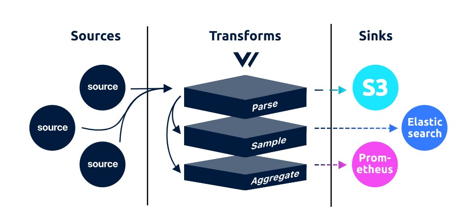
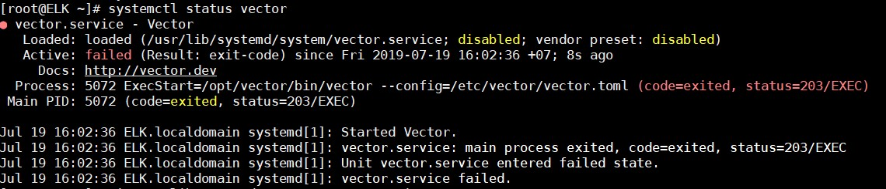
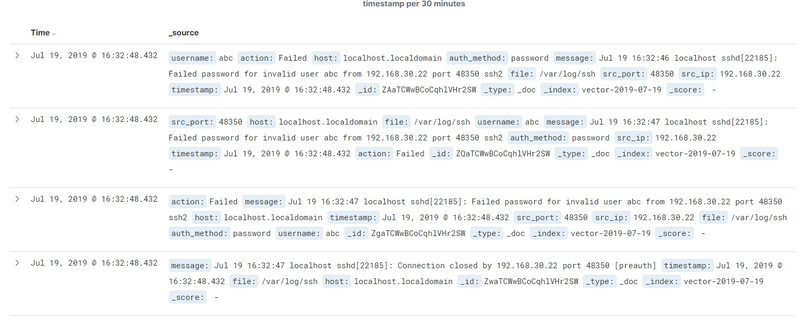

# Tìm hiểu về vector (https://vector.dev/)

## 1. Giới thiệu

Vector là một bộ giám sát định tuyến dữ liệu mã nguồn mở hiệu năng cao. Nó giúp cho việc thu thập, chuyển đổi và gửi logs, metrics và events trở nên dễ dàng. Nó tách dữ liệu thu thập từ services, mang lại cho bạn quyền sở hữu và kiểm soát dữ liệu, cùng nhiều lợi ích khác.

Được xây dựng bằng ngôn ngữ [Rust](https://www.rust-lang.org/), Vector đặt trọng tâm vào hiệu suất, tính chính xác và sự thân thiện với người vận hành. 

Phiên bản hiện tại của Vector khi viết bài này là `0.3`, và vẫn chưa hoàn thiện các chức năng.

## 2. Các use case

- [Reduce Lock-in](https://docs.vector.dev/use-cases/lock-in)

- [Multi-Cloud](https://docs.vector.dev/use-cases/multi-cloud)

- [Governance & Control](https://docs.vector.dev/use-cases/governance)

- [Reduce Cost](https://docs.vector.dev/use-cases/cost)

- [Security & Complaince](https://docs.vector.dev/use-cases/security-and-compliance)

- [Backups & Archives](https://docs.vector.dev/use-cases/backups)

## 3. Kiến trúc Vector



Vector có cấu trúc tương tự như Logstash với 3 phần là Sources, Tranforms và Sinks.

### 3.1. Sources

Nhận và đẩy log và metric events vào Vector



Sources chịu trách nhiệm nhập các event vào Vector, có thể nhận hoặc lấy dữ liệu. Nếu sử dụng Vector như một agent, bạn sẽ sử dụng các sources local như `file` và `stdin`. Nếu dùng Vector như một services, bạn sẽ muốn sử dụng các sources nhận dữ liệu từ mạng như `vector`, `tcp` và `syslog`.

Các sources hiện có:

- [file](https://docs.vector.dev/usage/configuration/sources/file)

- [statsd](https://docs.vector.dev/usage/configuration/sources/statsd)

- [stdin](https://docs.vector.dev/usage/configuration/sources/stdin)

- [syslog](https://docs.vector.dev/usage/configuration/sources/syslog)

- [tcp](https://docs.vector.dev/usage/configuration/sources/tcp)

- [vector](https://docs.vector.dev/usage/configuration/sources/vector)

### 3.2. Tranforms


Nhiệm vụ là phân tích, cấu trúc và thay đổi các event

Tranforms là phần giữa của pipeline, nằm giữa sources và sinks. 

Các tranforms hiện có:

| Tên | Mô tả |
|-----|-------|
| [add_fields](https://docs.vector.dev/usage/configuration/transforms/add_fields) | Chấp nhận log và cho phép thêm một hoặc nhiều field |
| [field_filter](https://docs.vector.dev/usage/configuration/transforms/field_filter) | Chấp nhận log, metric và cho phép lọc events theo giá trị một field |
| [grok_parser](https://docs.vector.dev/usage/configuration/transforms/grok_parser) | Chấp nhận log events và cho phép phân tích bằng grok |
| [json_parser](https://docs.vector.dev/usage/configuration/transforms/json_parser) | Chấp nhận log events và cho phép phân tích giá trị dạng JSON | 
| [log_to_metric](https://docs.vector.dev/usage/configuration/transforms/log_to_metric) | Chấp nhận log events và cho phép chuyển đổi logs thành một hoặc nhiều metric |
| [lua](https://docs.vector.dev/usage/configuration/transforms/lua) | Chấp nhận log events và cho phép bạn biến đổi event với công cụ Lua |
| [regex_parser](https://docs.vector.dev/usage/configuration/transforms/regex_parser) | Chấp nhận log events và cho phép phân tích giá trị một trường với biểu thức chính quy |
| [remove_field](https://docs.vector.dev/usage/configuration/transforms/remove_fields) | Chấp nhận log và metric events cho cho phép loại bỏ một hoặc nhiều field |
| [sampler](https://github.com/timberio/vector/tree/67a0031a34ba9e94bb772c9fcc0c7d9e2f052507/docs/usage/configuration/transforms/sampler.md) | Chấp nhận log events và cho phép bạn lấy mẫu các sự kiện với tỷ lệ có thể định cấu hình. |
| [tokenizer](https://docs.vector.dev/usage/configuration/transforms/tokenizer) | Chấp nhận log events và cho phép bạn mã hóa giá trị của một trường bằng cách tách trên khoảng trắng, bỏ qua các ký tự gói đặc biệt và nén mã thông báo thành tên trường theo thứ tự. |

### 3.3. Sinks



Sinks là phần cuối cùng của pipeline, chịu trách nhiệm send events.

Các sinks hiện có:

| Tên | Mô tả |
|-----|-------|
| [aws_cloudwatch_logs](https://docs.vector.dev/usage/configuration/sinks/aws_cloudwatch_logs) | Chuyển log tới [AWS CloudWatch Logs](https://docs.aws.amazon.com/AmazonCloudWatch/latest/logs/WhatIsCloudWatchLogs.html) bằng [PutLogEvents API](https://docs.aws.amazon.com/AmazonCloudWatchLogs/latest/APIReference/API_PutLogEvents.html) |
| [aws_kinesis_streams](https://docs.vector.dev/usage/configuration/sinks/aws_kinesis_streams) | Chuyển log tới [AWS Kinesis Data Stream](https://aws.amazon.com/kinesis/data-streams/) bằng [PutRecords API](https://docs.aws.amazon.com/kinesis/latest/APIReference/API_PutRecords.html) |
| [aws_s3](https://docs.vector.dev/usage/configuration/sinks/aws_s3) | Chuyển log tới [AWS S3](https://aws.amazon.com/s3/) bằng [PutObject API](https://docs.aws.amazon.com/AmazonS3/latest/API/RESTObjectPUT.html) |
| [blackhole](https://docs.vector.dev/usage/configuration/sinks/blackhole) | Chuyển log và metric tới một hố đen để huỷ bỏ dữ liệu | 
| [console](https://docs.vector.dev/usage/configuration/sinks/console) | Chuyển log và metric tới console, STDOUT hoặc STDERR |
| [elasticsearch](https://docs.vector.dev/usage/configuration/sinks/elasticsearch) | Chuyển log tới Elasticsearch bằng [_bulk API](https://www.elastic.co/guide/en/elasticsearch/reference/current/docs-bulk.html) |
| [http](https://docs.vector.dev/usage/configuration/sinks/http) | Chuyển log tới HTTP endpoint |
| [kafka](https://docs.vector.dev/usage/configuration/sinks/kafka) | Chuyển log tới [Apache Kafka](https://kafka.apache.org/) bằng [Kafka protocol](https://kafka.apache.org/protocol) |
| [prometheus](https://docs.vector.dev/usage/configuration/sinks/prometheus) | Exposes metric events tới [prometheus](https://prometheus.io/) |
| [splunk_hec](https://docs.vector.dev/usage/configuration/sinks/splunk_hec) | Đẩy log events tới một [Splunk HTTP Event Collector](http://dev.splunk.com/view/event-collector/SP-CAAAE6M) |
| [tcp](https://docs.vector.dev/usage/configuration/sinks/tcp) | Chuyển log tới một kết nối TCP |
| [vector](https://docs.vector.dev/usage/configuration/sinks/vector) | Chuyển log tới một Vector instance khác |

## 4. Cài đặt Vector

### 4.1. Agent role

Cài đặt Vector như một agent trên máy Client, mục đích thu thập, phân tích log ssh và gửi tới Elasticsearch, hiển thị trên Kibana.

- Lấy log ssh

Sửa file cấu hình `/etc/ssh/sshd_config`

```
SyslogFacility local2
```

Sửa file cấu hình `/etc/rsyslog.conf`

```
local2.*    /var/log/ssh
```

Khởi động lại ssh và rsyslog

```
systemctl restart sshd rsyslog
```

- Cài đặt Vector

Thêm key và Repo Timber:

```
curl -s https://packagecloud.io/install/repositories/timberio/packages/script.rpm.sh | sudo bash
```

Cài đặt Vector:

```
yum install -y vector
```

Khởi động vector và cho phép khởi động cùng hệ thống:

```
systemctl start vector
systemctl enable vector
```

Nếu sau khi start dịch vụ bị lỗi như sau:



thì sửa file `/usr/lib/systemd/system/vector.service`

```
...
User=root
Group=root
ExecStart=/usr/bin/vector --config=/etc/vector/vector.toml
...
```

Sau đó khởi động lại Vector:

```
systemctl daemon-reload
systemctl restart vector
```

- Cấu hình vector nằm duy nhất ở file `/etc/vector/vector.toml`. 

Cấu hình nhận, phân tích, gửi log ssh tới Elasticsearch:

```
data_dir = "/var/lib/vector"
[sources.ssh_log]
  type         = "file"
  include      = ["/var/log/ssh"]
[transforms.ssh_parser]
  inputs       = ["ssh_log"]
  type         = "grok_parser"
  pattern      = '%{WORD:action} %{WORD:auth_method} (for|for invalid user) %{USER:username} from %{IP:src_ip} port %{INT:src_port} ssh2'
  drop_field   = false
[sinks.es_cluster]
  inputs       = ["ssh_parser"]
  type         = "elasticsearch"
  host         = "http://ip_elasticsearch:9200"
  index        = "vector-%Y-%m-%d"
  doc_type     = "_doc"
```

Khởi động lại Vector

```
systemctl restart vector
```

- Kiểm tra trên Kibana



## Tham khảo

https://github.com/timberio/vector

https://docs.vector.dev/