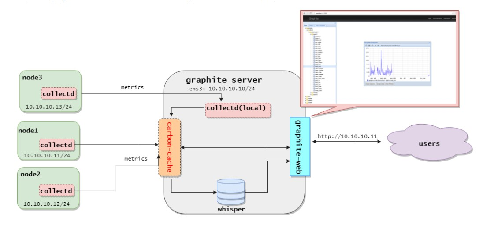

# Một số plugin của Collectd

## 1. Plugin write_graphite

- Plugin `write_graphite` là một project thu thập metric nguồn mở, kết nối tới Carbon, lớp dữ liệu của Graphite, thông qua kết nối TCP hoặc UDP và gửi dữ liệu thông qua giao thức **line based** (thường là sử dụng cổng 2003). Dữ liệu sẽ được gửi theo khối tối đa là 1428 byte để giảm thiểu số lượng gói tin mạng.

- Chỉnh sửa section Plugin `write_graphite` tương ứng:

```
<Plugin write_graphite>
        <Node "Graphite-server">
                Host "10.10.10.10"
                Port "2003"
                Protocol "tcp"
                LogSendErrors true
                Prefix "node1"
#               Postfix "collectd"
                StoreRates true
                AlwaysAppendDS false
                EscapeCharacter "_"
        </Node>
</Plugin>
```

- Trong đó:

	- `<Node "Graphite-server:>`: Mô tả tên node Graphite server mà Collectd kết nối tới. Có thể kết nối tới nhiều Graphite server khác nhau bằng cách thêm nhiều khối <Node "name">. Bên trong các khối node, yêu cầu các tuỳ chọn như sau
	
	- `Host`: Địa chỉ của Graphite server mà Collectd muốn gửi metric tới (mặc định là localhost)
	
	- `Port`: Port Graphite server
	
	- `Protocol`: Sử dụng giao thức `tcp` hay `udp`
	
	- `LogSendErrors`: Thiết lập để gửi log khi có lỗi xảy ra đến Graphite server. Cấu hình là false, nó sẽ không gửi log error
	
	- `Prefix`: Thiết lập prefix. Khi thiết lập là `node1`, tất cả data đẩy từ node này sẽ có tên bắt đầu là **node1**
	
	- `Postfix`: Khi thiết lập Prefix và Postfix thì trên Graphite server, metric từ node này sẽ hiển thị tên dạng như sau:
	
	```
	[prefix]{hostname}[postfix].{collectd_plugin}.{check}
	```
	
	- `StoreRates true|false`: Lưu giá trị đếm sang tỉ lệ, nếu chọn false thì sẽ lưu theo số nguyên
	
	- `AlwaysAppendDS false|true`: Thêm một Data Source vào định danh của metric. Nếu false thì bỏ qua. Thiết lập này thực hiện khi có nhiều hơn một DS.
	
	- `EscapeCharacter "_"`: Carbon sử dụng dấu chấm để phân tách các chữ cái và không cho phép dấu trắng. Tuỳ chọn này quyết định dấu để phân tách giữa các chữ cái. Mặc định là dấu gạch dưới.
	
## 2. Plugin network

- Có 2 cách để thực hiện đẩy metric về Graphite server. Cách 1 là dùng plugin `write_graphite`, cách 2 là sử dụng plugin `network` để đẩy metric từ các Collectd client tới Collectd server thiết lập trên Graphite-server.



- Để sử dụng plugin này cần kích hoạt nó trên cả 2 bên client và server bằng cách bỏ comment ở dòng `LoadPlugin network` trong file `/etc/collectd/collectd.conf`

### Cấu hình trên Client:

```
<Plugin network>
#       # client setup:
#       Server "ff18::efc0:4a42" "25826"
    <Server "10.10.10.11" "25826">
#               SecurityLevel None
#               Username "user"
#               Password "secret"
#               Interface "eth0"
#               ResolveInterval 14400
    </Server>
</Plugin>
```

Trong đó:

- `<Server Host [Port]>: Khối server thiết lập thông tin về Collectd server. Có thể cấu hình nhiều khối này để thực hiện gửi metric tới nhiều server khác nhau.

- Host có thể là hostname hoặc địa chỉ IP. Tuỳ chọn thứ 2 Port xác định cổng dịch vụ của Collectd server. Mặc định là 25826

Một số tuỳ chọn:

- `SecurityLevel Encrypt|Sign|None`

Thiết lập bảo mật khi truyền metric trong mạng. Khi mức bảo mật thiết lập là `Encrypt`, dữ liệu gửi qua mạng sẽ được mã hóa sử dụng AES-256. Sự toàn vẹn gói tin được đảm bảo sử dụng SHA-1. Khi thiết lập là `Sign`, dữ liệu truyền đi được kí sử dụng mã xác thực HMAC-SHA-256. Khi thiết lập là `None`, dữ liệu truyền đi mà không có bất kì sự bảo mật nào.

Tính năng này có hiệu lực nếu plugin network được liên kết với libgcrypt.

- `Username <username>`

Thiết lập username để truyền. Được sử dụng để server tìm mật khẩu khớp tương ứng. Tất cả mức bảo mật trừ None yêu cầu phải cấu hình phần này.

Tính năng này có hiệu lực nếu plugin network được liên kết với libgcrypt.

- `Password <password>`

Thiết lập password (password dùng chung giữa client và server). Tất cả mức bảo mật trừ None yêu cầu phải cấu hình phần này.

Tính năng này có hiệu lực nếu plugin network được liên kết với libgcrypt.

- `Interface <interface_name>`

Thiết lập interface đi ra cho các gói tin. Mặc định, kernel sẽ tự chọn interface thích hợp. Các cấu hình thủ công này chỉ sử dụng trong một vài trường hợp cần thiết phải cấu hình.

- `ResolveInterval <seconds>`

Thiết lập chu kì phân giải lại địa chỉ DNS cho Host. Cấu hình này hữu ích khi bắt phải phân giải DNS đều đặn để hỗ trợ tính sẵn sàng cao của dịch vụ. Nếu không thiết lập, việc phân giải lại địa chỉ sẽ không bao giờ được thực hiện.

### Cấu hình trên server

```
</Plugin>

#       # server setup:
#       Listen "ff18::efc0:4a42" "25826"
        <Listen "0.0.0.0" "25826">
#               SecurityLevel Sign
#               AuthFile "/etc/collectd/passwd"
#               Interface "eth0"
        </Listen>
</Plugin>
```

- `<Listen Host [Port]>`

Listen thiết lập các interface lắng nghe metric từ client gửi tới. Có thể thiết lập nhiều interface. (Thiết lập 0.0.0.0 cho phép lắng nghe trên tất cả các interface)

`Port` dịch vụ mặc định là 25826

Một số tuỳ chọn theo sau:

- `SecurityLevel Encrypt|Sign|None`

Thiết lập bảo mật. Nếu thiết lập là `Encrypt`, chi các dữ liệu đã mã hóa mới được chấp nhận. Sự toàn vẹn dữ liệu được đảm bảo sử dụng SHA-1. Khi thiết lập `Sign`, chỉ các dữ liệu đã kí và được mã hóa mới được chấp nhận. Nếu thiết lập là `None` thì tất cả dữ liệu đều được chấp nhận.

Nếu có tùy chọn `Authfile`, dữ liệu mã hóa được giải mã nếu có thể. Để sử dụng được thiết lập mức bảo mật, cần cấu hình cụ thể địa chỉ interface (chứ không sử dụng 0.0.0.0)

Tính năng này có hiệu lực nếu plugin network được liên kết với libgcrypt.

- `AuthFile <filename>`

Thiết lập file mà tên username được ánh xạ với password. Những password này được sử dụng để kí và giải mã các gói tin đã mã hóa. Nếu SecurityLevel được thiết lập là None, phần này là tùy chọn. Dữ liệu đã kí được xác nhận và các gói tin mã hóa được giải mã. Nếu không, dữ liệu đã kí được chấp nhận mà không kiểm tra và dữ liệu mã hóa không thể được giải mã. Với các mức bảo mật khác, tùy chọn này là bắt buộc.

Định dạng file khá đơn giản: mỗi dòng gồm một username theo sau là dấu hai chấm (“:”) phân tách username với password. Tương tự như sau:

```
user0: foo
user1: bar
```

- `Interface <interface_name>`

Thiết lập interface nhận gói tin đến server. Mặc định, việc này sẽ do kernel tự chọn interface thích hợp. Nếu thiết lập, lưu lượng sẽ chỉ được chấp nhận đến trên interface được cấu hình.

## 3. Plugin rrdtool

- `rrdtool` laf plugin thuộc kiểu write và được sử dụng để ghi lại các giá trị metric thu thập được vào các file RRD sử dụng thư viện `librrd`. Collectd sử dụng plugin này để lưu lại các giá trị metric, và giá trị đó có thể được sử dụng để render ra đồ thị nhờ các front-end phù hợp.

- Plugin này mặc định được kích hoạt sẵn

- Cách cấu hình:

```
<Plugin rrdtool>
        DataDir "/var/lib/collectd/rrd"
#       CacheTimeout 120
#       CacheFlush 900
#       WritesPerSecond 30
#       CreateFilesAsync false
#       RandomTimeout 0
#
# The following settings are rather advanced
# and should usually not be touched:
#       StepSize 10
#       HeartBeat 20
#       RRARows 1200
#       RRATimespan 158112000
#       XFF 0.1
</Plugin>
```

	- `DataDir`: Vị trí thư mục lưu trữ các file rrd
	
	- `CacheTimeout <seconds>`: Nếu tuỳ chọn này được thiết lập lớn hơn 0, plugin rrdtool sẽ lưu các giá trị vào trong cache sau `<seconds>` giây. 
	
	- `CacheFlush <seconds>`: Khi rrdtool sử dụng cache, nó sẽ ghi lại tất cả các giá trị vào một file rrd nhất định nếu các giá trị cũ nhất cũ hơn (hoặc bằng) số giây được xác định trong CacheTimeout. Nếu vì một vài lý do nào đó mà các file rrd không được cập nhật nữa, các giá trị metric vẫn được lưu trong cache. Nếu thiết lập CacheFlush thì sau khoảng thời gian được thiết lập, toàn bộ các giá trị đã lưu trong khoảng thời gian lớn hơn CacheTimeout sẽ được ghi vào ổ cứng.
	
	Giá trị này không nên thiết lập quá nhỏ. Giá trị 900 là một giá trị ổn.
		
	CacheFlush phải lớn hơn hoặc bằng CacheTimeout, nên lớn hơn khoảng 10 lần.
		
	- `CreateFilesAsync false|true`: Khi được kích hoạt, các file RRD mới được kích hoạt không đồng bộ, sử dụng các luồng tách biệt chạy ở chế độ ngầm. Việc này ngăn chặn ghi dữ liệu thành khối, đây là vẫn đề đặc biệt khi có hàng trăm file cần được tạo. Tuy nhiên, bởi mục đích tạo các file không đồng bộ là ngăn ghi dữ liệu thành khối cho đến khi file có sẵn, các giá trị trước đó trong file sẽ bị bỏ đi. Nếu vô hiệu hoá (mặc định), các file được tạo đồng bộ, theo khối trong một thời gian ngắn, khi các file được viết vào

	- `RandomTimeout <seconds>`: Khi được thiết lập, giá trị thời gian thực giữa các giá trị được chọn ngẫu nhiên giữa khoảng CacheTimeout - RandomTimeout và CacheTimeout + RandomTimeout. Mục đích là để tránh các tình huống tải cao xảy ra khi có nhiều giá trị timeout cùng lúc. Đây đặc biệt là vấn đề ngay sau khi daemon khởi động, bởi tất cả các giá trị được thêm vào cache nội bộ vào cùng lúc.
	
## 4. Plugin cpu

- Plugin CPU thu thập thông số sử dụng CPU. Thông số CPU sẽ được hiển thị mặc định theo số phần trăm sử dụng. Có thể yêu cầu hiển thị thông số từng CPU, từng trạng thái của các CPU trong hệ thống.

- Cấu hình plugin CPU

	- Tính tổng, theo trạng thái, của tất cả CPU trên hệ thống
	
	- Tính tổng, theo từng CPU, trên tất cả trạng  thái nghỉ của CPU, tạo một trạng thái "active"
	
- 2 Phương thức kết tập trên có thể kết hợp. Miễn là một trong những phương thức kết tập (hoặc cả hai) được kích hoạt, cpu plugin sẽ báo cáo phần trăm sử dụng, hơn là Jiffy. Hơn nữa, có thể request riêng biệt, theo từng trạng thái, theo từng metric CPU được báo cáo theo phần trăm.

- Các tuỳ chọn cấu hình:

	- `ReportByState true|false`
	
	Khi thiết lập true (mặc định), báo cáo metric theo trạng  thái, ví dụ: **system**, **user** và **idle**
	
	Khi thiết lập false, kết tập (tính tổng) trên tất cả trạng thái non-idel vào một metric **active**
	
	- `ReportByCpu true|false`
	
	Khi thiết lập true (mặc định), metric được thu thập theo từng core CPU. Khi thiết lập false, thay vì báo cáo metric theo từng CPU, chỉ một tổng toàn cục của các trạng thái CPU được hiển thị.
	
	- `ValuesPercentage false|true`
	
	Tuỳ chọn này được sử dụng khi cả 2 thiết lập trên được đặt là true. Trong trường hợp này, mặc định các thông số sẽ được báo cáo theo jiffy. Thiết lập này set thành true, bạn cũng có thể yêu cầu các giá trị phần trăm ở chế độ chưa được tổng hợp (cho mỗi CPU, mỗi trạng thái)
	
	- `ReportNumCpu false|true`
	
	Khi thiết lập thành true, báo cáo số lượng CPU sẵn có. Mặc định là false
	
	- `ReportGuestState false|true`
	
	Khi thiết lập thành true, báo cáo về trạng thái **guest** và **guest_nice** của CPU. Mặc định là false.
	
	- `SubtractGuestState false|true`
	
	Tuỳ chọn này chỉ được dùng khi tuỳ hconj ReportGuestState được thiết lập là true. **guest** và **guest_nice** tương ứng **user** và **nice**. Nếu thiết lập true, **guest** sẽ loại bỏ **user** và **guest_nice** sẽ bỏ **nice**. Mặc định là true.
	
## 5. Plugin memory

- Plugin memory thuộc loại read để đo đạc lượng bộ nhớ RAM sử dụng trong hệ thống

- Các giá trị được báo cáo theo mức sử dụng của hệ điều hành. Gồm các loại sau:

	- **Used**: Lượng bộ nhớ đã được sử dụng
	
	- **Buffered**: Lượng bộ nhớ tạm lưu trữ cho các khối lưu trữ thô
	
	- **Cached**: Lượng bộ nhớ RAM vật lý sử dụng để cache
	
	- **Free**: Lượng bộ nhớ RAM vật lý có sẵn mà không được hệ thống sử dụng
	
	- **Total**: Tổng lượng RAM có thể sử dụng, đó là lượng RAM vật lý không tính lượng dự trữ
	
	- **slab_recl**: The part of Slab that can be reclaimed, such as caches
	
	- **slab_unrecl**: The part of Slab that cannot be reclaimed even when lacking memory
	
- Các tuỳ chọn cấu hình plugin memory

	- `ValuesAbsolute true|false`: Kích hoạt hoặc vô hiệu hoá thu thập lượng bộ nhớ sử dụng theo số nguyên, ví dụ như byte. Mặc định là true
	
	- `ValuesPercentage false|true`: Kích hoạt hoặc vô hiệu hoá thu thập lượng bộ nhớ sử dụng theo phần trăm. Mặc định là false
	
## 6. Plugin interface

- Plugin interface hỗ trợ thu thập thông tin về lưu lượng (số lượng octet hoặc gói tin truyền qua interface trong mỗi giây), hoặc số gói lượng lỗi xảy ra mỗi giây.

- Cấu hình:

```
<Plugin "interface">
Interface "lo"
Interface "ens4"
IgnoreSelected true
</Plugin>
```

	- `Interface`: Xác định interface muốn theo dõi
	
	- `IgnoreSelected`: Nếu là true thì theo dõi tất cả các interface trong hệ thống trừ interface được cấu hình ở trên. Nếu là false thì sẽ chỉ theo dõi các interface đã cấu hình trên.
	
## 7. Plugin df

- Plugin df là loại plugin read để thu thập thông tin về sử dụng hệ thống file, ví dụ: đơn giản như việc phân chia phân vùng mount được sử dụng và sẵn có như nào. Nó được đặt tên giống với lệnh `df`

- Tuy nhiên, không phải tất cả các phân vùng được quan tâm thu thập thông tin. Ví dụ: /proc và /dev thường không được làm đầy là kích thước của chúng không có ý nghĩa nhiều. Đó là lý do tại sao plugin df cung cấp để chỉ chọn các thiết bị cụ thể, các điểm mount hoặc các loại hệ thống tập tin.

- Các tuỳ chọn cấu hình:


## 8. Plugin load

- Plugin load là loại read, sử dụng để thu thập tải hệ thống. Những con số đưa ra một cái nhìn tổng quan về việc sử dụng máy.

- Tải hệ thống là số lượng tác vụ chạy được trong hàng đợi và được cung cấp bởi nhiều hệ điều hành trung bình trong khoảng thời gian một, năm và mười lăm phút.

- Khi được kích hoạt, plugin load sẽ thu thập các thông số:

	- **shortterm**: Tải trung bình trong 1 phút
	
	- **midterm**: Tải trung bình trong 5 phút
	
	- **longterm**: Tải trung bình trong 15 phút
	
## 9. Plugin notify_email

- Plugin cảnh báo qua email: Notify email sử dụng thư viện ESMTP để gửi cảnh báo tới địa chỉ mail đã được cấu hình trước.

- Để sử dụng plugin này cần enable plugin syslog để ghi log lại việc đã gửi cảnh báo qua mail, và cấu hình plugin threshold trong file `/etc/collectd.conf` (CentOS 7)

Các tuỳ chọn cấu hình:

	- `From <address>`:
	
	Địa chỉ email gửi cảnh báo
	
	Mặc định là root@localhost
	
	Để gửi được cảnh báo ra một email ngoài mạng cục bộ, cần sử dụng một email có thể gửi ra internet.
	
	- `Recipient <address>`:
	
	Cấu hình địa chỉ email nhận cảnh báo. Có thể lặp lại cấu hình này để gửi tới nhiều email. Tuy nhiên phải có ít nhất một email để plugin làm việc chính xác.
	
	- `SMTPServer <hostname>`:
	
	Tên hostname của SMTP server kết nối tới. Mặc định là localhost
	
	- `SMTPPort <port>`
	
	TCP port kết nối tới. Mặc định là cổng 25
	
	- `SMTPPassword <password>`
	
	Mật khẩu để xác thực. Phải cấu hình khi đã cấu hình user
	
	- `Subject <subject>`
	
	Mẫu tiêu đề sử dụng khi gửi mail. Mặc định là %s@%s (%s đầu tiên thể hiện mức độ cảnh báo, %s thứ hai thay thế cho hostname có dấu hiệu vượt ngưỡng)
	
	## Tham khảo
	
	https://github.com/hocchudong/thuctap012017/blob/master/TamNT/Graphite-Collectd-Grafana/docs/6.Mot_so_Plugin_Collectd.md
	
	https://github.com/hocchudong/ghichep-collectd/blob/master/CollectD/Collectd%20Plugins.md