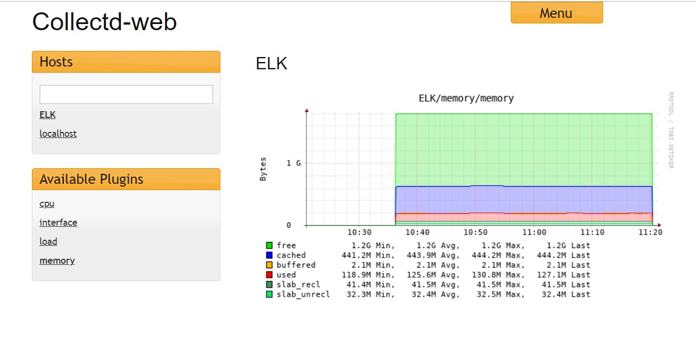

# Cài đặt Collectd và Collectd-web trên CentOS 7

## 1. Cài đặt Collectd

- Thêm repo epel

```
yum install epel-release
```

- Cài đặt Collectd và rrdtool

```
yum install collectd collectd-rrdtool
```

- Chỉnh sửa file cấu hình `/etc/collectd.conf`

Bỏ comment các dòng sau:

```
Hostname "localhost"
FQDNLookup true
BaseDir "/var/lib/collectd"
PIDFile "/var/run/collectd.pid"
PluginDir "/usr/lib64/collectd"
TypesDB "/usr/share/collectd/types.db"

Interval 10
```

- Khởi động Collectd và cho phép khởi động cùng hệ thống

```
systemctl start collectd
systemctl enable collectd
```

## 2. Cài đặt Collectd-web

- Cài đặt các package liên quan:

```
yum install git rrdtool rrdtool-devel rrdtool-perl perl-HTML-Parser perl-JSON perl-CGI
```

- Cài đặt Collectd-web

```
cd /usr/local
git clone https://github.com/httpdss/collectd-web.git
chmod +x collectd-web/cgi-bin/graphdefs.cgi
```

- Script chạy máy chủ Collectd-web được cấu hình trong file `runserver.py`, mặc định được bind tới địa chỉ loopback

- Để có thể truy cập giao diện Collectd-web từ một trình duyệt từ xa, cần chỉnh sửa file `runserver.py` đổi từ địa chỉ `127.0.0.1` thành `0.0.0.0` để bind tới tất cả interface của máy Collectd-web


- Cấu hình thư mục rrd file cho collectd-web

```
mkdir -p /etc/collectd/
echo 'datadir: "/var/lib/collectd/rrd"' > /etc/collectd/collection.conf
```

- Chạy thử script

```
cd /usr/local/collectd-web
python runserver.py
```

- Kiểm tra trên giao diện web



- Giao diện Collectd-web được tạo nên bởi script `runserver.py`. Khi dừng tiến trình chạy script này thì dịch vụ cũng ngừng hoạt động. Để tiến trình chạy như một dịch vụ ngầm trên hệ thống, thực hiện lưu lại script vào thư mục chứa file bin của hệ thống, để có thể khởi chạy dịch vụ sử dụng câu lệnh.

Tạo file script:

```
vi /usr/local/bin/collectd-web
```

Nội dung script:

```
#!/bin/bash
 PORT="8888"
 case $1 in
 start)
 cd /usr/local/collectd-web/
 python runserver.py 2> /tmp/collectd.log &
 sleep 1
 stat=`netstat -tlpn 2>/dev/null | grep $PORT | grep "python"| cut -d":" -f2 | cut -d" " -f1`
 if [[ $PORT -eq $stat ]]; then
 sock=`netstat -tlpn 2>/dev/null | grep $PORT | grep "python"`
 echo -e "Server is  still running:\n$sock"
 else
 echo -e "Server has started"
 fi
 ;;
 stop)
 pid=`ps -x | grep "python runserver.py" | grep -v "color"`
 kill -9 $pid 2>/dev/null
 stat=`netstat -tlpn 2>/dev/null | grep $PORT | grep "python"| cut -d":" -f2 | cut -d" -f1`
 if [[ $PORT -eq $stat ]]; then
 sock=`netstat -tlpn 2>/dev/null | grep $PORT | grep "python"`
 echo -e "Server is  still running:\n$sock"
 else
 echo -e "Server has stopped"
 fi
 ;;
 status)
 stat=`netstat -tlpn 2>/dev/null |grep $PORT| grep "python" | cut -d":" -f2 | cut -d" " -f1`
 if [[ $PORT -eq $stat ]]; then
 sock=`netstat -tlpn 2>/dev/null | grep $PORT | grep "python"`
 echo -e "Server is running:\n$sock"
 else
 echo -e "Server is stopped"
 fi
 ;;
 *)
 echo "Use $0 start|stop|status"
 ;;
 esac
```

Phân quyền cho script:

```
chmod +x /usr/local/bin/collectd-web
```

Sau đấy có thể dùng lệnh để thao tác dịch vụ:

```
collectd-web start
collectd-web stop
collectd-web status
```

Để khởi động dịch vụ cùng hệ thống, mở file `/etc/rc.local` và thêm dòng lệnh chạy Collectd-web vào:


## Tham khảo

https://gryzli.info/2017/12/03/centos-7-installing-collectd-and-collectd-web/