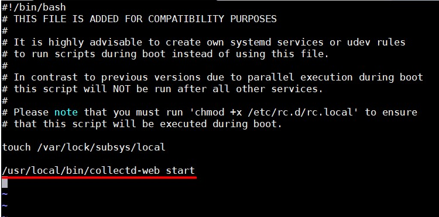
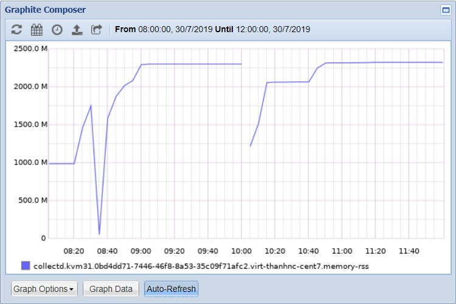

# Plugin virt

Plugin libvirt cho phép thu thập trạng thái CPU, disk, memory, và network của máy ảo mà không cần cài agent lên các máy ảo đó, chỉ cần collectd trên máy chủ. Các metrics được thu thập thông qua libvirt API

## 1. Cách cấu hình

```
LoadPlugin virt

<Plugin "virt">
RefreshInterval 120
Connection "qemu:///system"
Domain "thanhnc-cent7"
BlockDevice "/:hdb/"
InterfaceDevice "/:eth0/"
IgnoreSelected "true"
BlockDeviceFormat "target"
HostnameFormat "uuid"
InterfaceFormat "address"
PluginInstanceFormat name
</Plugin>
```

### Các tuỳ chọn khi cấu hình

- `Connection "qemu:///system"`: Kết nối tới hypervisor thông qua uri, ví dụ trên là kết nối tới hypervisor nằm chính trên host.

- `RefreshInterval 120`: Khoảng thời gian để lấy dữ liệu của domain và device (được tính bằng giây). Nếu set là 0 thì sẽ disable tuỳ chọn này

- `Domain "thanhnc-cent7"`: Tên máy ảo muốn lấy metrics

- `BlockDevice "/:hdb/"`: Đưa thiết bị hdb trên tất cả các máy ảo vào danh sách các block device (ổ cứng, CD-ROM)

- `InterfaceDevice "/:eth0/"`: Đưa interface eth0 trên tất cả các máy ảo vào danh sách các card mạng

- `IgnoreSelected "true"`: Nếu chọn `false`, hệ thống sẽ chỉ lấy thông số của các máy ảo, block device và interface device trong danh sách và bỏ qua tất cả các máy ảo và thông số khác. Nếu chọn `true`, hệ thống sẽ lấy thông số của tất cả các máy ảo và device ngoài danh sách.

- `BlockDeviceFormat "target"`: Khai báo mặc định là `target`, tên của thiết bị block device trên máy ảo sẽ được lấy theo tên được nhìn trong máy ảo (ví dụ: sda). Nếu chuyển thành `source`, tên block device sẽ được lấy dựa trên đường dẫn file block device đó trên host.

- `HostnameFormat "uuid"`: 

	- Khai báo mặc định là `name`: Tên máy ảo trên collectd sẽ lấy tên máy ảo trên hypervisor
	
	- Khai báo là `uuid`: Tên máy ảo trên collectd sẽ lấy uuid của máy ảo trên hypervisor
	
	- Khai báo là `hostname`: Tên máy ảo trên collectd sẽ lấy hostname của host chứa máy ảo
	
- `InterfaceFormat "address"`:

	- Khai báo mặc định là `name`: Tên của interface trên collectd sẽ lấy theo tên interface trong máy ảo
	
	- Khai báo là `address`: Tên của interface trên collectd sẽ lấy theo MAC của interface trong máy ảo
	
- `PluginInstanceFormat name|uuid|none`

	- Plugin virt sẽ thu thập các metrics và đặt plugin_instance của metric theo giá trị được gán
	
	- `name`: Sử dụng tên của máy ảo
	
	- `uuid`: Sử dụng uuid của máy ảo
	
	- Mặc định không gán giá trị cho plugin_instance
	
	- Có thể sử dụng cả 2 giá trị `name uuid`, khi đó plugin_instance sẽ được gán theo name và uuid của máy ảo, cách nhau bởi dấu `:`.
	
## 2. Các metric thu thập được

### 2.1. Thông số về disk

- `Disk Octet`: Thể hiện số Bytes/s được đọc hoặc ghi vào ổ cứng


- `Disk Ops`: Thể hiện số IOPS đọc hoặc ghi vào ổ cứng


Các thông số trên có thể liệt kê bằng lệnh trên host chứa máy ảo

```
virsh domblkstat tên_máy_ảo vda
```

Kết quả:

```
vda rd_req 15793
vda rd_bytes 381308416
vda wr_req 205525
vda wr_bytes 1952288768
vda flush_operations 12847
vda rd_total_times 60419245686
vda wr_total_times 22383035193589
vda flush_total_times 629910642559
```

Hoặc dùng lệnh:

```
virsh domblkstat tên_máy_ảo vda --human
```

Kết quả:

```
Device: vda
 number of read operations:      15793
 number of bytes read:           381308416
 number of write operations:     205631
 number of bytes written:        1952722944
 number of flush operations:     12847
 total duration of reads (ns):   60419245686
 total duration of writes (ns):  22383198316359
 total duration of flushes (ns): 629910642559
```

### 2.2. Thông số về network

- `Interface octets`: Thể hiện số Bytes/s đi vào hoặc đi ra card mạng


- `Interface packets`: Thể hiện số packets/s đi vào hoặc đi ra card mạng



Các thông số trên có thể liệt kê bằng lệnh trên host chứa máy ảo:

```
virsh domifstat thanhnc-cent7 52:54:00:26:3c:3e
```

Kết quả:

```
52:54:00:26:3c:3e rx_bytes 132970548
52:54:00:26:3c:3e rx_packets 148710
52:54:00:26:3c:3e rx_errs 0
52:54:00:26:3c:3e rx_drop 0
52:54:00:26:3c:3e tx_bytes 9952225
52:54:00:26:3c:3e tx_packets 73165
52:54:00:26:3c:3e tx_errs 0
52:54:00:26:3c:3e tx_drop 0
```

### 2.3. Thông số của CPU


### 2.4. Thông số RAM

- `Memory available`: Thể hiện lượng RAM được cấp phát lý thuyết cho máy ảo


- `Memory actual balloon`: Thể hiện lượng RAM được cấp phát thực tế cho máy ảo


- `Memory unused`: Thể hiện lượng RAM chưa sử dụng tới


- `Memory rss`: Thể hiện lượng RAM phân bổ cho process VM



- `Memory major fault`: Thể hiện số page fault được gọi từ disk


- `Memory minor fault`: Thể hiện số page fault được gọi từ buffer cache


Các thông số trên có thể liệt kê bằng lệnh trên host chứa máy ảo

```
virsh dommemstat thanhnc-cent7
```

Kết quả:

```
actual 6291456
swap_in 0
swap_out 0
major_fault 217
minor_fault 619596
unused 5759288
available 5944600
last_update 1564455713
rss 2267616
```

Hoặc lệnh:

```
virsh domstats --balloon thanhnc-cent7
```

Kết quả:

```
Domain: 'thanhnc-cent7'
  balloon.current=6291456
  balloon.maximum=6291456
  balloon.swap_in=0
  balloon.swap_out=0
  balloon.major_fault=217
  balloon.minor_fault=619596
  balloon.unused=5759288
  balloon.available=5944600
  balloon.last-update=1564455713
  balloon.rss=2267616
```

## Tham khảo

https://github.com/hocchudong/ghichep-collectd/blob/master/CollectD/plugins/virt_plugin.md

https://github.com/trangnth/Monitor/blob/master/Collectd-Graphite-Grafana/1.%20Collectd/Plugin_virt.md