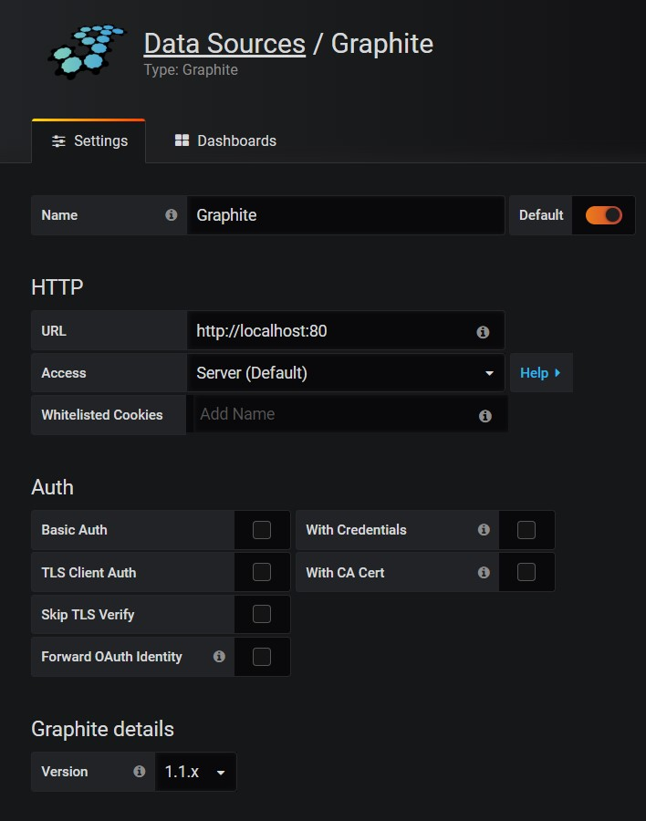

# Cài đặt Grafana với datasource Graphite

- Thêm repo Grafana

```
cat > /etc/yum.repos.d/grafana.repo <<'EOF'
[grafana]
name=grafana
baseurl=https://packages.grafana.com/oss/rpm
repo_gpgcheck=1
enabled=1
gpgcheck=1
gpgkey=https://packages.grafana.com/gpg.key
sslverify=1
sslcacert=/etc/pki/tls/certs/ca-bundle.crt
EOF
```

- Cài đặt Grafana

```
yum install -y grafana fontconfig initscripts 
```

- Khởi động Grafana

```
systemctl start grafana-server
systemctl enable grafana-server
```

- Nếu sử dụng firewall, mở port 3000:

```
firewall-cmd --permanent --add-port=3000/tcp
firewall-cmd --reload
```

- Truy cập địa chỉ `http://ip_grafana_server:3000` với username và password là `admin:admin` để vào giao diện Grafana

- Sau đó thêm Data Source Graphite như sau:

