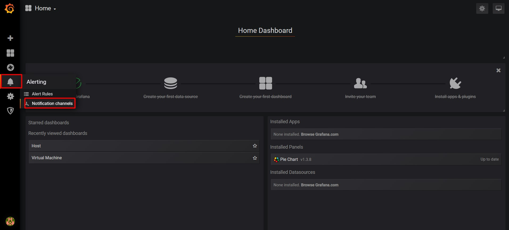
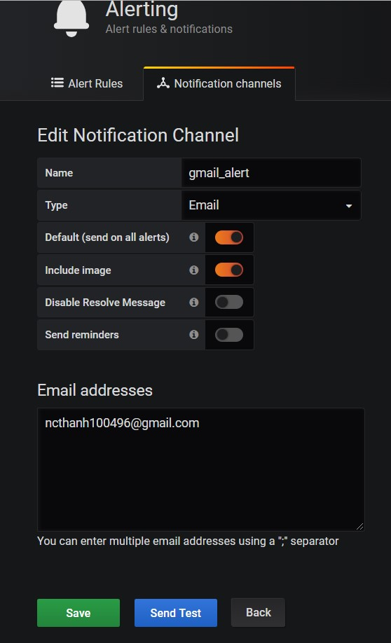
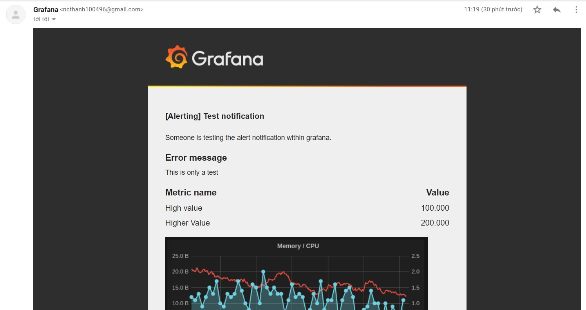
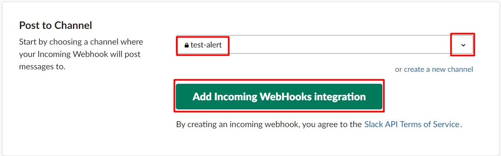
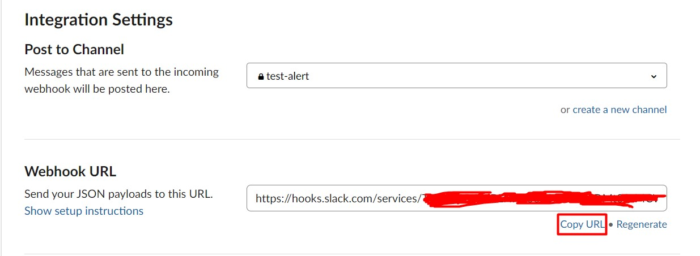
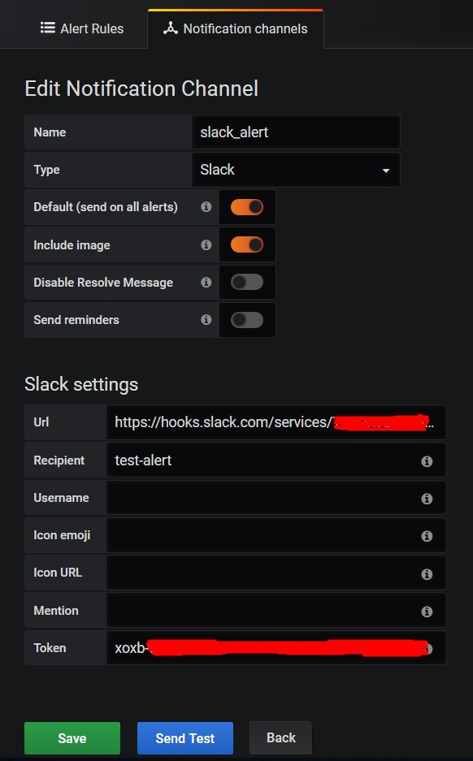
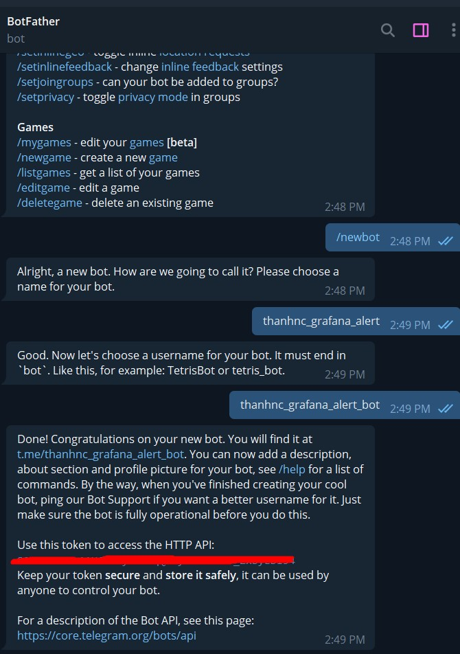

# Cấu hình cảnh báo trên Grafana

## 1. Cấu hình gửi cảnh báo qua gmail

- Sửa file `/etc/grafana/grafana.ini`

```
[smtp]
enabled = true
host = smtp.gmail.com:587
user = your_email@gmail.com
# If the password contains # or ; you have to wrap it with trippel quotes. Ex """#password;"""
password = password_your_email
cert_file =
key_file =
skip_verify = false
from_address = your_email@gmail.com
from_name = Grafana
# EHLO identity in SMTP dialog (defaults to instance_name)
ehlo_identity = dashboard.example.com
```

- Truy cập link sau để cấu hình mail cho phép các truy cập kém an toàn:

```
https://www.google.com/settings/security/lesssecureapps
```

- Vào web Grafana `http://ip_grafana:3000` và chọn như hình để tạo một Notification channel mới



- Ví dụ:



Chọn `Save` để lưu channel, `Send Test` để gửi thử 1 cảnh báo cho mail



## 2. Gửi cảnh báo qua Slack

- Truy cập đường link sau để lấy thông tin về Incomming Webhook

```
https://slack.com/apps/A0F7XDUAZ-incoming-webhooks
```

- Làm theo các bước sau







- Tạo Notification Channel mới trên Grafana



## 2. Gửi cảnh báo qua Telegram

- Chat với @BotFather để lấy token:

```
/start
/newbot
{bot_name}
{bot_name}bot
```



- Sau khi tạo xong bot, ta bắt đầu chat với bot. 

- Truy cập vào link `https://api.telegram.org/bot{your_token}/getUpdates` để lấy ID

- Tạo channel với token và id mới lấy được


## Tham khảo

https://github.com/trangnth/Monitor/blob/master/Collectd-Graphite-Grafana/3.%20Grafana/Grafana_Alert.md