# Sử dụng Graphite-web

## 1. Giao diện

Giao diện chính gồm một Navigation tree ở phía bên trái, màn hình chính chứa cửa sổ Composer và một hàng title trên cùng chứa các links (Login, Documentration, Dashboard, …)

Với navigation tree, bạn sẽ thấy được các thư mục đại diện cho các metric xuất hiện phân cấp đại diện cho các thư mục và các file dữ liệu whisper được lưu trên máy chủ Graphite

- Thêm metric và đồ thị

	- Click vào bất kì node metric nào trong cây Metrics sẽ thêm vào trong đồ thị ở cửa sổ Composer màn hình chính. Nếu metric đó đã biểu diễn trên đồ thị (và không được chỉnh sửa với các hàm render), click lần nữa vào metric sẽ xóa nó khỏi đồ thị.
	
	- Cửa sổ Composer sẽ giúp bạn không thêm các metric giống nhau vào đồ thị một cách không cần thiết.
	
	- Ví dụ: Thêm 2 metric vào đồ thị
	
	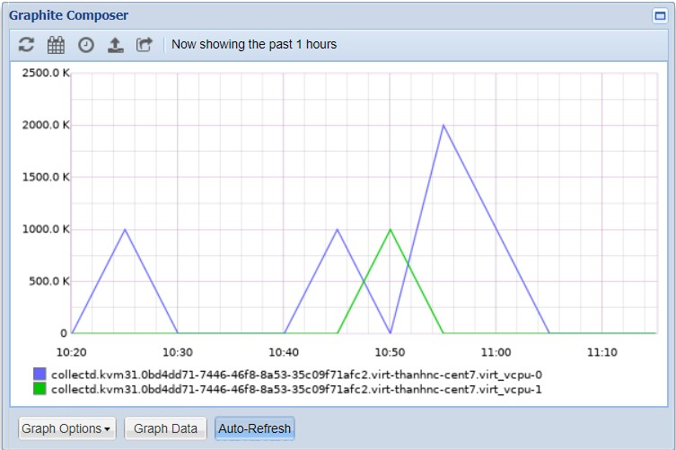
	
## 2. Thêm user

Sau khi đã phân tán dữ liệu vào Graphite database, các user có thể thấy dữ liệu trên giao diện của Graphite và có thể tạo các đồ thị tùy ý để thấy các dữ liệu thời gian thực. Khi các đồ thị được tạo, các user muốn lưu các đồ thị đó để sử dụng trong tương lai và muốn tạo một dashboard với tất các đồ thị đã tạo. Cách đơn giản (nhưng không thân thiện với người dùng) để thực hiện việc này là lưu các URL của đồ thị đã tạo và các user có thể sử dụng nó để hiện thị chúng khi cần.

Một cách khác là sử dụng tùy chọn lưu đồ thị trên Graphite web, cung cấp khả năng tạo và lưu lại dashboard. Những tùy chọn này đều yêu cầu đăng nhập vào web – yêu cầu cần có user-id/password để đăng nhập.

Cách tạo user trên Graphite-web:

- Đăng nhập vào Graphite server

- Tìm file scripts `manage.py` trong thư mục gói thư viện python cài đặt của Graphite

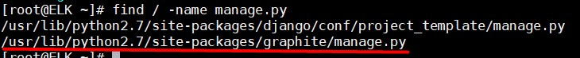

- Di chuyển vào thư mục đó và chạy scripts `manage.py` để tạo user mới:

```
python manage.py createsuperuser
```

Sau khi chạy scripts thì làm theo hướng dẫn.

Sau khi hoàn thành thì login Graphite-web với user vừa tạo là có thể lưu các đồ thị theo ý muốn.

- Đổi password user đã tạo:

```
python manage.py changepassword <username>
```

Gõ mật khẩu mới và xác nhận.

## 3. Tạo và lưu đồ thị

- Đăng nhập vào giao diện web với user vừa tạo

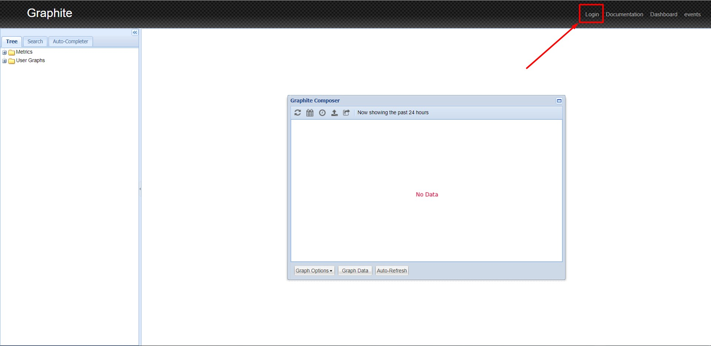

- Nhập username và password

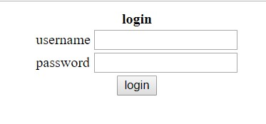

- Tạo một đồ thị và chọn biểu tượng Save để lưu đồ thị

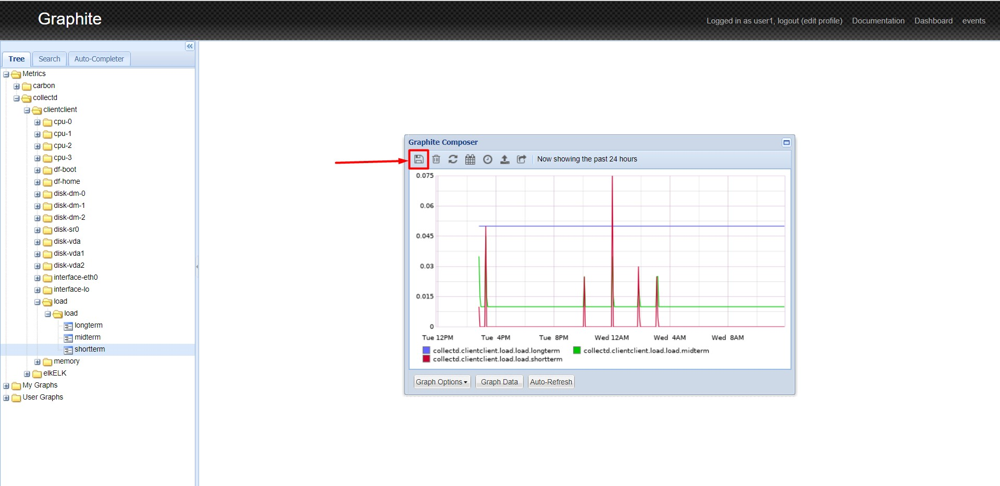

- Nhập tên đồ thị và chọn `OK` để lưu

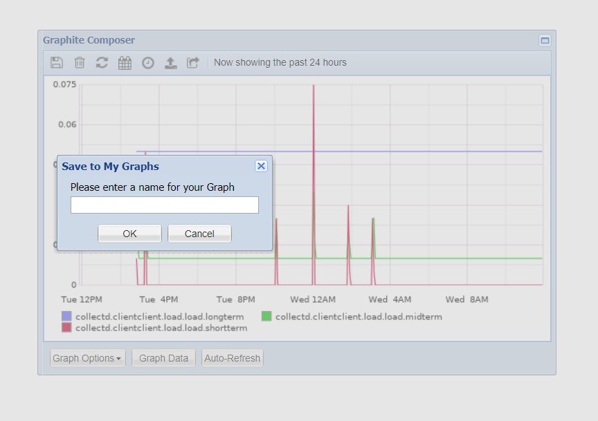

- Kiểm tra trên giao diện 

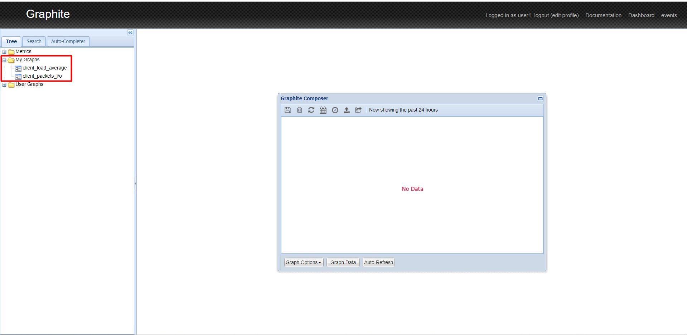

## 4. Tạo dashboard kết hợp nhiều đồ thị

- Để tạo giao diện dashboards theo dõi nhiều thông số kết hợp từ các đồ thị: Click vào Dashboards trên phần trên cùng màn hình phía bên phải.

- Thêm đồ thị đã lưu vào dashboard:

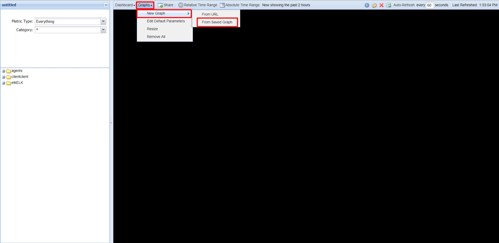

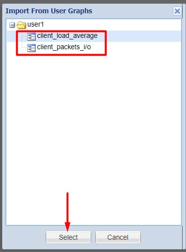

- Kết quả 

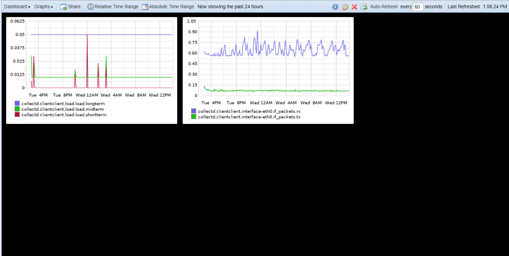

- Lưu dashboard:

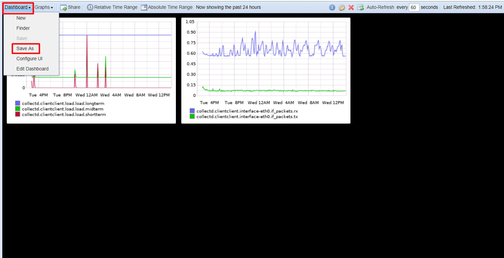

- Mở dashboard đã lưu:

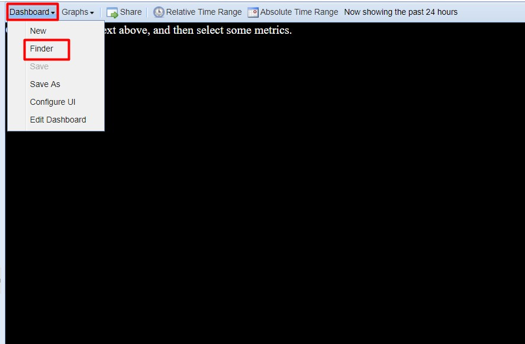

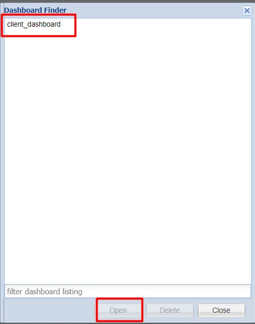

## Tham khảo

https://github.com/hocchudong/thuctap012017/blob/master/TamNT/Graphite-Collectd-Grafana/docs/5.Cai_dat_Graphite-Collectd.md