# Các function trong Graphite

Function được sử dụng để chuyển đổi, kết hợp và thực hiện các tính toán trên chuỗi dữ liệu. Chức năng này được áp dụng bằng cách sử dụng giao diện Composer hoặc bằng cách điều khiển các thông số mục tiêu trong Render API.

## 1. Sum

- Function `sum` giúp người dùng tính tổng các thông số được chọn

- Người dùng chọn thông số muốn tình tổng. Ở đây tôi chọn memory: used, buffered, cached và free. Sau đó chọn Apply/Function -> Combine -> Sum

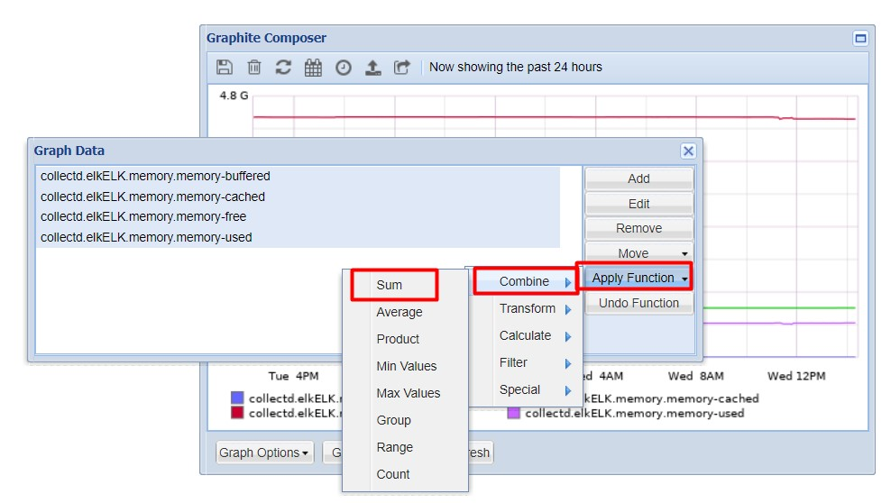

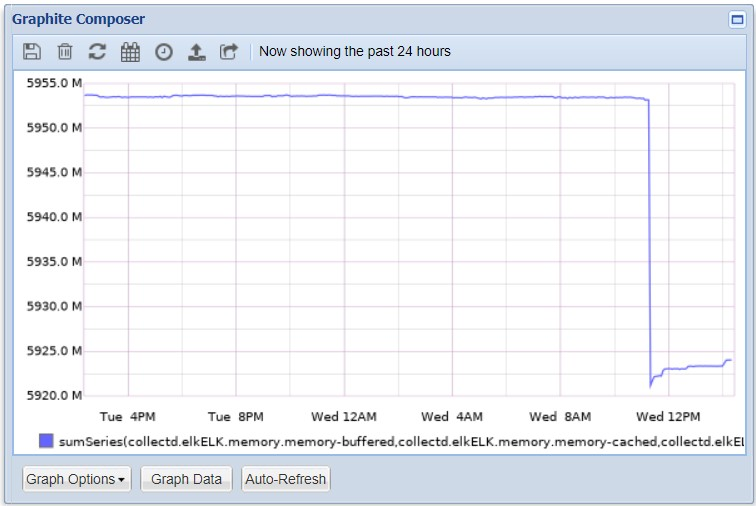

## 2. Average

- Function `average` giúp người dùng tính trung bình thông số được chọn.

- Người dùng chọn các thông số muốn tính trung bình. Ở đây tôi chọn packet nhận và chuyển đi trên card eth0. Sau đó Apply/Function -> Combine -> Average.

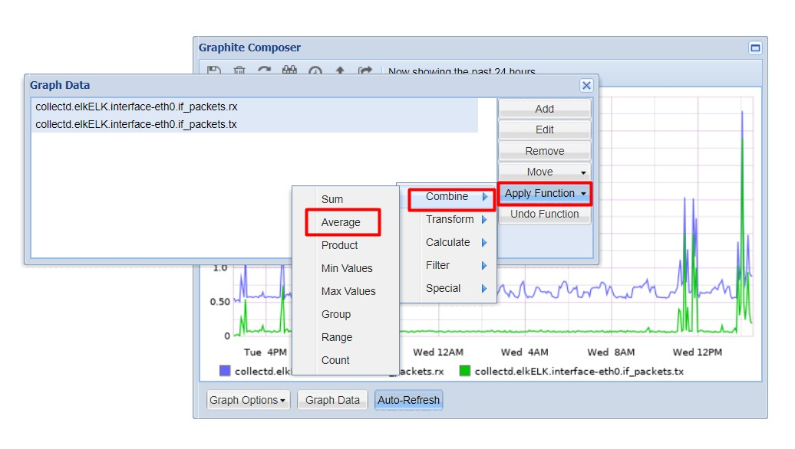

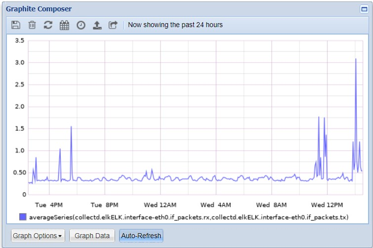

## 3. Product

- `Product` function giúp người dùng nhân hai thông số được chọn với nhau

- Người dùng chọn 2 thông số. Ở đây tôi chọn load.shortterm và load.longterm. Sau đó chọn Apply/Function -> Combine -> Product

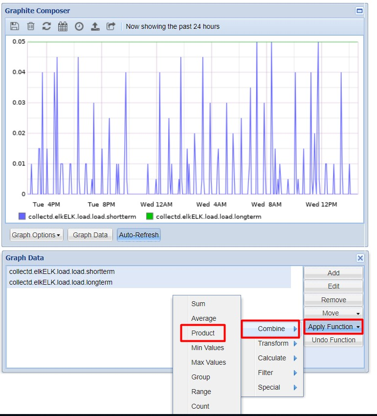

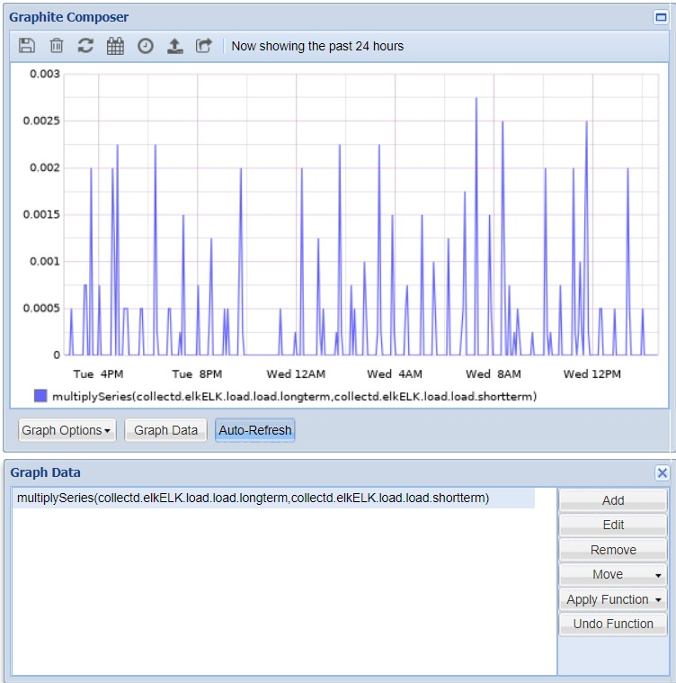

## 4. Min

- `Min` value function giúp người dùng tìm ra chỉ thông số nào là thấp nhất trong các thông số được chọn. Hệ thống sẽ so sánh các điểm để tìm ra thông số nhỏ nhất.

- Chọn các thông số muốn so sánh. Rồi chọn Apply/Function -> Combine -> Min Values để so sánh.

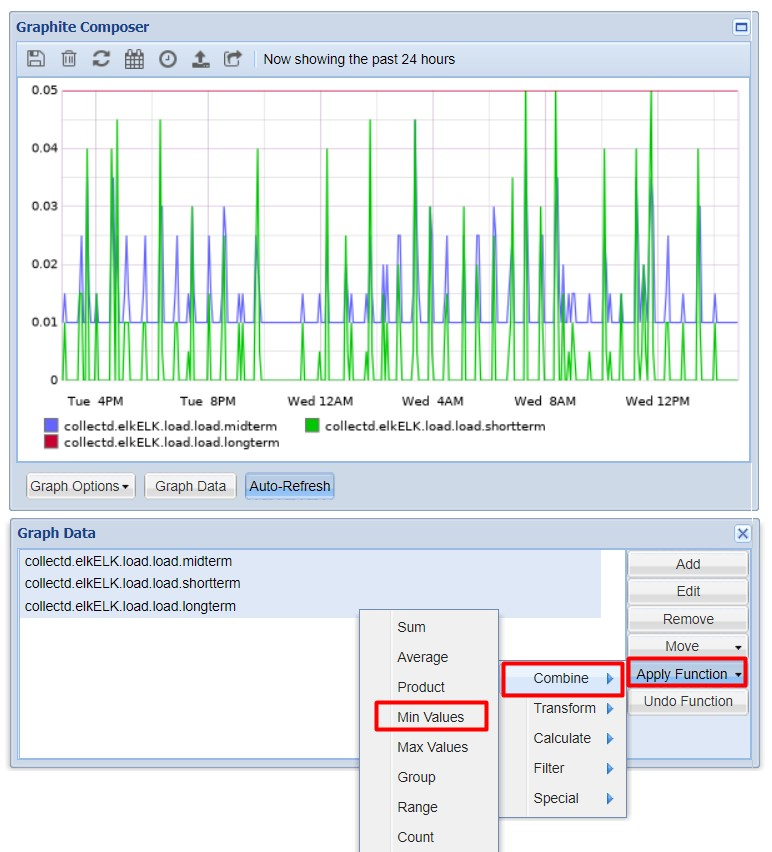

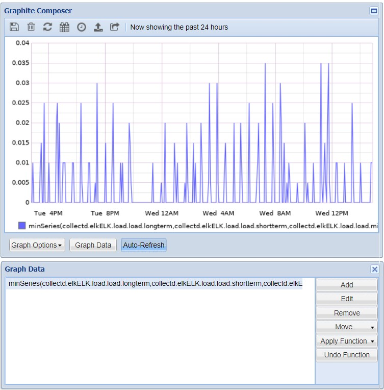

## 5. Max

- `Max` value function giúp người dùng tìm ra thông số nào là cao nhất trong các thông số được chọn. Hệ thống sẽ so sánh các điểm để tìm ra thông số lớn nhất.

- Ví dụ:

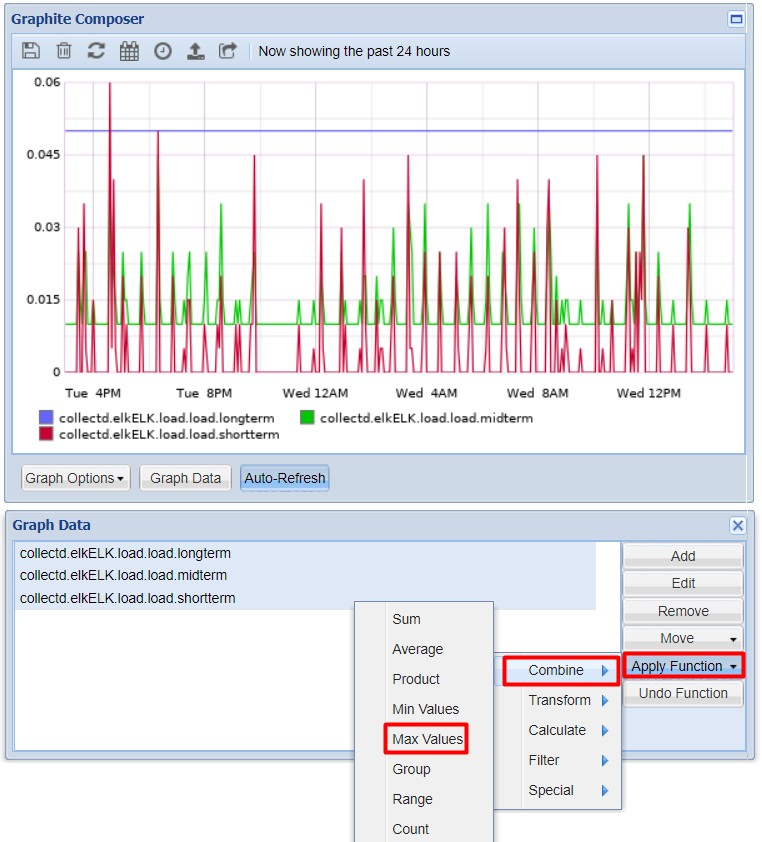

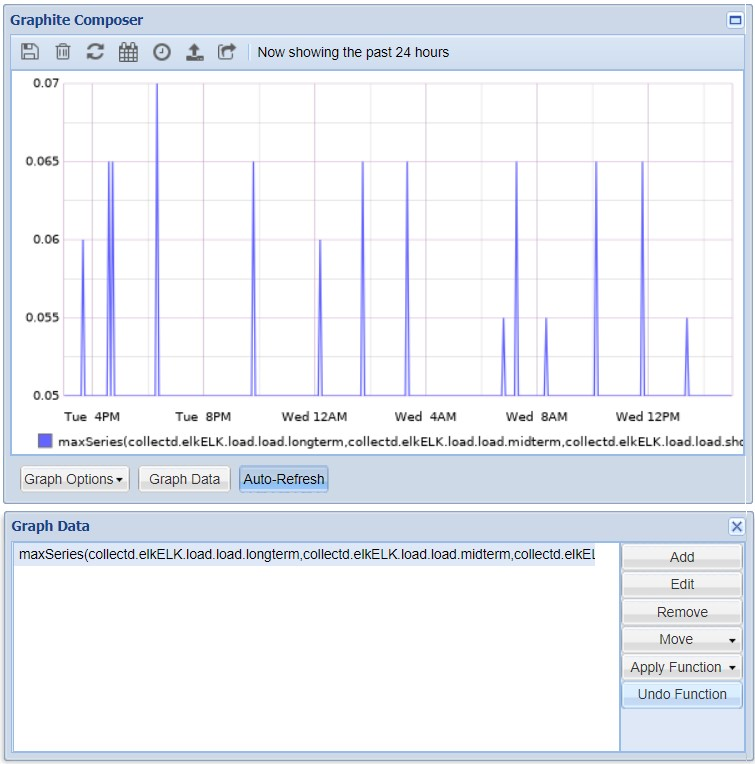

## 6. Difference function

- Người dùng có thể so sánh giữa hai thông số được chọn. Lấy thông số chọn đầu tiên trừ cho thông số thứ hai.

- Ví dụ: chọn 2 thông số packet truyền đi và nhận về của card eth0

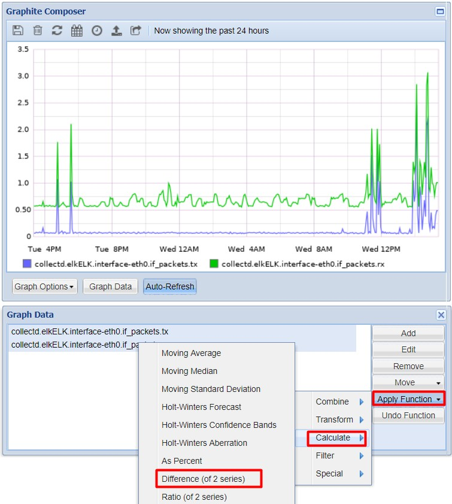

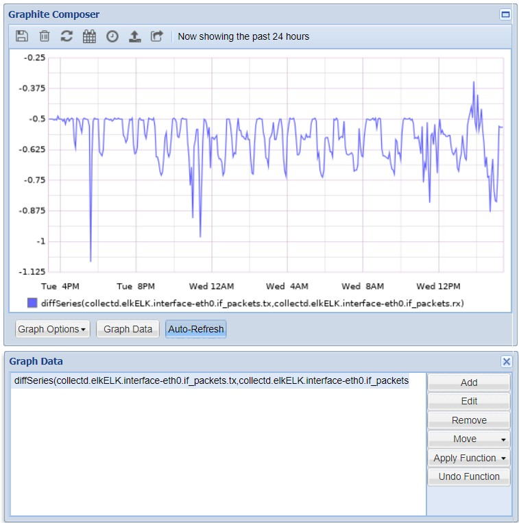

## 7. Ratio function

- `Ratio` function giúp người dùng có thể biết tỉ lệ giữa hai thông số được chọn

- Ví dụ:

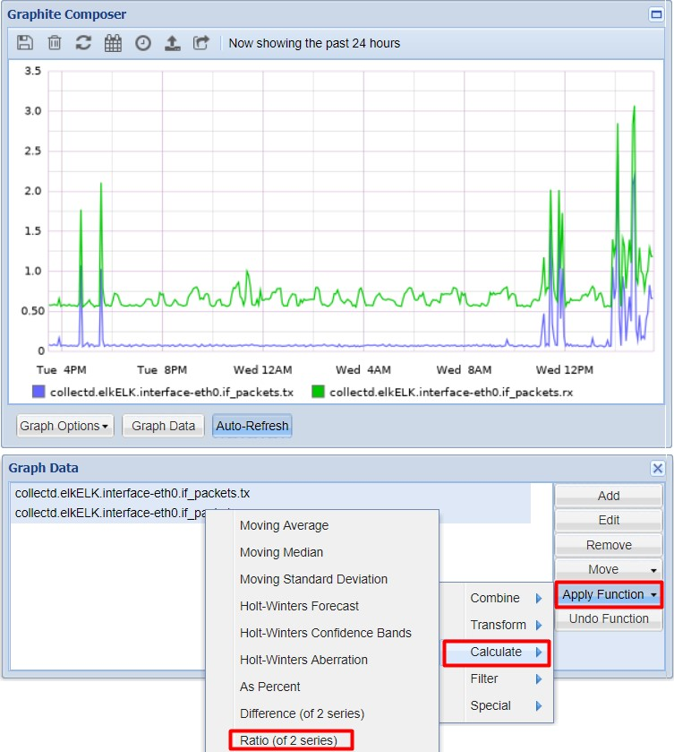

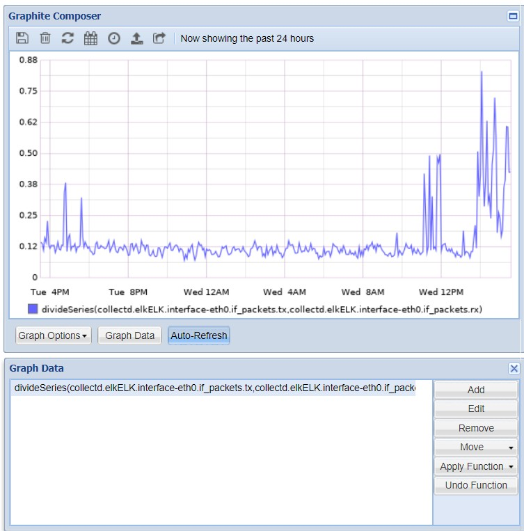

## 8. Maximum value above function

- Giúp người dùng lọc ra những thông số có giá trị lớn nhất trên một mức nào đó

- Ví dụ: chọn load.longterm và load.shortterm -> Apply/Function -> Filter -> Maximum value above

- Sau đó, người dùng được yêu cầu điền 1 giá trị để làm mốc so sánh. Nếu giá trị lớn nhất của thông số cao hơn giá trị đưa ra thì thông số đó sẽ hiện trên đồ thị, ngược lại thì không hiển thị nữa.

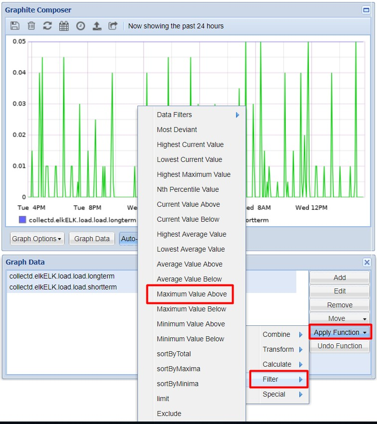

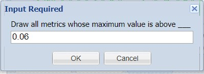

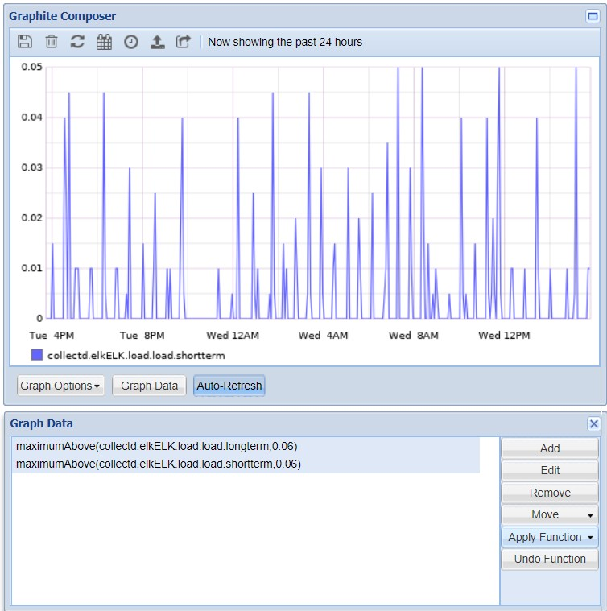

## 9. Maximum value below

- Maximum value below giúp người dùng lọc ra những thông số có giá trị lớn nhất nhỏ hơn một mức nào đó.

- Tương tự như `Maximum value above`, nhưng sẽ giữ lại các thông số có giá trị lớn nhất nhỏ hơn mốc, bỏ các thông số có giá trị lớn nhất cao hơn mốc.

## 10. Minimum value above

- `Minimum value above` giúp người dùng lọc ra những thông số có giá trị nhỏ nhất lớn hơn một mức nào đó.

- Tương tự như `Maximum value above`, người dùng cũng được nhập vào 1 giá trị làm mốc, nếu thông số nào có giá trị nhỏ nhất cao hơn mốc thì được hiển thị, còn các thông số có giá trị nhỏ nhất nhỏ hơn mốc sẽ không hiển thị.

## 11. Color

- `Color` function giúp người dùng có thể đánh dấu được thông số muốn theo dõi

- Chọn một thông số rồi chọn Apply/Function -> Special -> Color. Ở đây ta có thể nhập mã màu để đổi màu hiển thị trên đồ thị cho thông số đó.

## 12. Summarize function

- `Summarize` function giúp người dùng có thể chuyển đổi dữ liệu theo một quy mô nhỏ hơn theo thời gian.

- Ví dụ: nếu chúng ta có các dữ liệu được thể hiện trong vài phút, ta có thể nhóm dữ liệu theo giờ bằng summarize function.

## 13. Highest Average Values Function

- Trong những trường hợp người dùng có nhiều metric và chỉ muốn đồ thị hiển thị 5 hoặc 10 metric thích hợp. Lúc này có thể sử dụng function `Highest Average`. Với chức năng này, Graphite sẽ rút ra những số liệu có trung bình lớn nhất.

- Chọn thông số -> Apply/Function -> Filter -> Highest Average Value. Sau khi chọn xong, người dùng sẽ được nhập vào số lượng metric sẽ hiển thị.

## 14. Draw in Second Y Axis

- Function này giúp người dùng có thể hiển thị thêm một cột Y trên biểu đồ. Khi người dùng muốn quan sát hai thông số với 2 đơn vị khác nhau người dùng có thể dùng function này.

- Cách dùng: Chọn thông số -> Apply/Function -> Special -> Draw in Second Y Axis

## 15. Average Value Above

- `Average Value Above` function giúp người dùng lọc ra những thông số có giá trị trung bình lớn hơn một giá trị nào đó.

- Cách dùng: Chọn thông số -> Apply/Function -> Filter -> Average Value Above

## 16. Average Value Below

- `Average Value Below` function giúp người dùng lọc ra những thông số có giá trị trung bình nhỏ hơn một giá trị nào đó.

- Cách dùng: Chọn thông số -> Apply/Function -> Filter -> Average Value Below

## Tham khảo

https://github.com/hocchudong/ghichep-collectd/blob/master/Graphite/Graphite%20Functions.md

https://graphite.readthedocs.io/en/0.9.10/functions.html