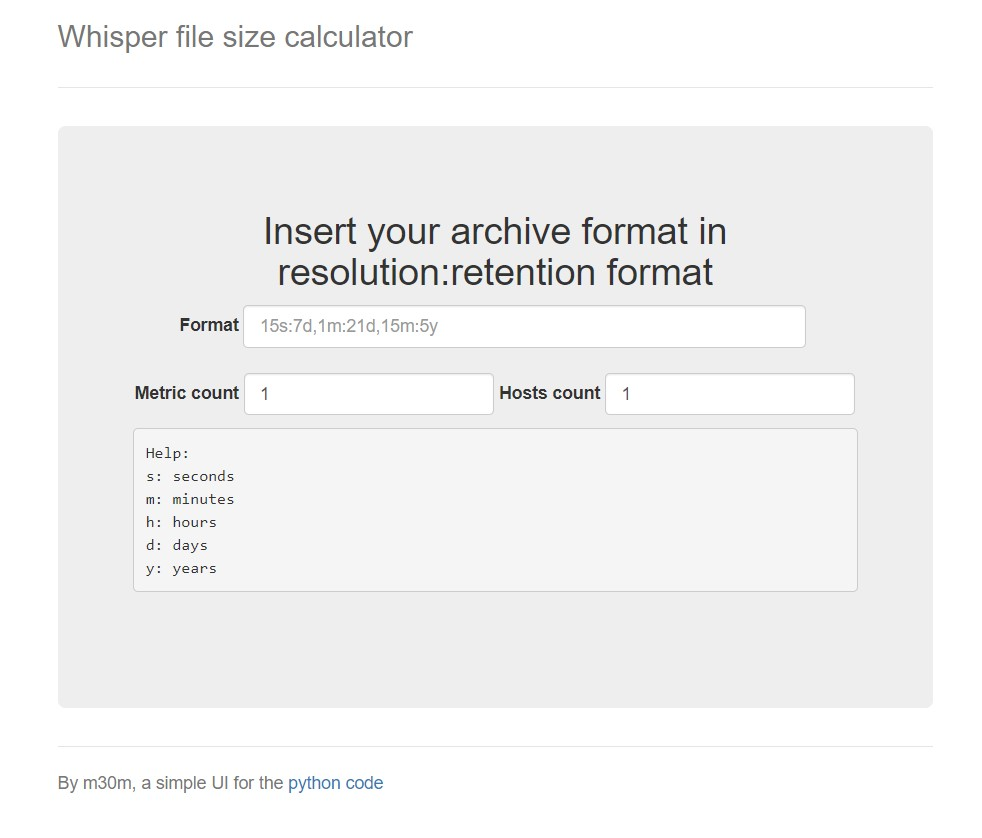
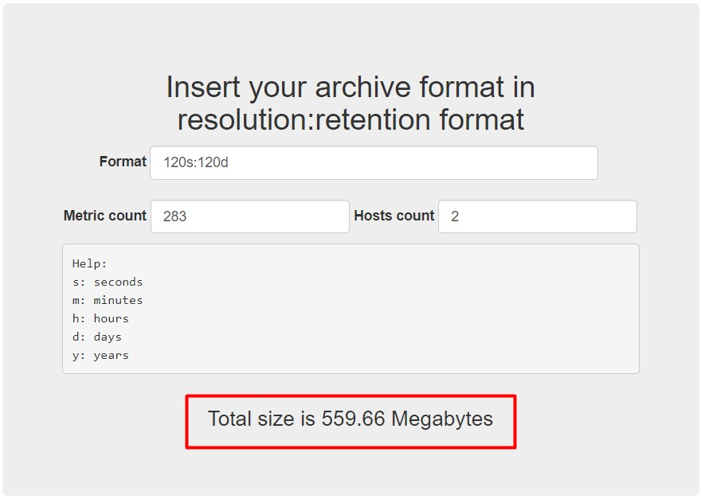
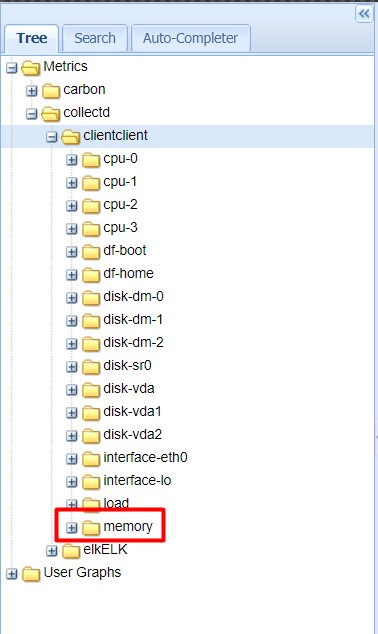

# Whisper

- Whisper là một thư viện cơ sở dữ liệu mà Graphite sử dụng để lưu thông tin metric mà nó được gửi tới.

- Nó rất linh hoạt và cho phép dữ liệu theo loạt thời gian được lưu một cách chi tiết. Nó tạo các kho lưu trữ ở các mức độ chi tiết khác nhau, để sử dụng trong thực tế, thông tin bị giảm xuống thành các độ phân giải thấp hơn khi nó vượt qua một ngưỡng nhất định đã cấu hình.

Ví dụ, bạn có thể lưu trữ điểm dữ liệu theo từng giây cho một số liệu nhất định. Bạn có thể nói với whisper là những dữ liệu chi tiết này nên được giữ trong vòng 5h. Bạn cũng có thể lưu trữ dữ liệu với độ phân giải thấp hơn. Nó có thể chỉ lưu một điểm mỗi phút và giã nó trong khoảng thời gian 6 tháng.

- Mỗi điểm trong lưu trữ với độ phân giải thấp được tính toán từ cùng dữ liệu mà nó ghi lại ở mức phân giải cao. Có thể có nhiều lưu trữ của các độ phân giải khác nhau và duy trì tỉ lệ như bạn mong muốn. Có thể cấu hình cách mà whisper tính toán dữ liệu độ phân giải thấp phụ thuộc vào kiểu số liệu theo dõi.

Ví dụ, số liệu có thể là toàn bộ số lần xảy ra sự kiện trong khoảng thời gian ngắn. Để tạo một điểm cho khoảng thời gian lớn hơn ở mức phân giải thấp, bạn thêm vào các điểm dữ liệu mức cao để tóm tắt các giá trị thông qua quét khoảng thời gian rộng hơn.

- Whisper có thể tính toán dữ liệu phân giải mức thấp theo nhiều cách khác nhau phụ thuộc vào thuộc tính của số liệu. Ví dụ, một vài dữ liệu được sinh ra bằng cách tính trung bình, trong khi một số khác thì theo dõi giá trị lớn nhất. Với giá trị trung bình, giá trị được tính từ các điểm phân giải cao hơn để tạo các điểm phân giải thấp hơn. Với giá trị lớn nhất, giá trị lớn nhất nên được giữ lại và phần còn lại không dùng đến để duy trì ý nghĩa các con số.

- Whisper tính toán và ghi lại dữ liệu phân giải mức thấp tại thời điểm mà nó nhận được dữ liệu (sau khi một khoảng thời gian cần thiết để thu được giá trị). Nó đơn giản thu thập các điểm dữ liệu cần thiết để thực hiện kĩ thuật tập hợp dữ liệu (data aggegation technique) (trung bình, lớn nhất, …) và ghi nó.

- Graphite sẽ sử dụng lưu trữ phân giải mức cao mà chứa các khung thời gian yêu cầu khi nó truy vấn dữ liệu để vẽ đồ thị.

## Cấu hình

Cách lưu các giá trị metric của Whisper được cấu hình tại file `/etc/carbon/storage-schemas.conf` 

Cấu hình mặc định:

```
[carbon]
 pattern = ^carbon\.
 retentions = 60:90d

 [default_1min_for_1day]
 pattern = .*
 retentions = 60s:1d
```

- Phần pattern mô tả các mẫu để khớp với tên metric. Phần retention mô tả độ chính xác và khoảng thời gian để lưu mỗi điểm dữ liệu. Các giá trị này có thể được biểu diễn dưới dạng số nguyên hoặc mô tả thời gian bằng các đơn vị: giây (s-seconds), phút (m-minutes), giờ (h-hours), ngày (d-days), tuần (w-weeks) và năm (y-years). Không hỗ trợ mô tả theo tháng.

- Carbon sẽ dùng thông tin trong này để so sánh các metric với pattern và cho whisper biết tần suất lưu các data point.

- Ví dụ cấu hình:

```
[client_metrics]
pattern = ^client
retentions = 10s:14d
```

	- Tên section: `client_metrics`
	
	- Phần pattern match với bất kỳ metric nào bắt đầu bằng `client`.
	
	- 10s lấy một data point và lưu dữ liệu trong vòng 14 ngày.
	
## Sizing Whisper

Cách tính dung lượng của Whisper

- Truy cập web https://m30m.github.io/whisper-calculator/



- Điền retention vào ô `Format`, số lượng metric vào `Metric count` và số lượng host vào `Hosts count`



Kết quả nhận được dung lượng dự tính của Whisper.

## Cách xoá các metric

Whisper lưu các metric tại `/var/lib/carbon/whisper/` với cấu trúc thư mục giống như hiển thị trên giao diện Graphite

Để xoá các metric đã không còn muốn thu thập, chỉ đơn giản là ta sẽ xoá các thư mục chứa các metric đó.

- Ví dụ muốn xoá metric memory của host `client` như trong hình:



Ta sẽ xoá thư mục metric đó:

```
rm -rf /var/lib/carbon/whisper/collectd/clientclient/memory
```

## Cách disable plugin

Vì Graphite không thu thập metric mà chỉ nhận metric từ Collectd gửi đến, nên khi không muốn thu thập metric nào nữa thì ta sẽ disable plugin thu thập metric đó trên Collectd.

- Ví dụ disable plugin memory của host client để không thu thập các metric memory:

Truy cập vào host client và sửa file `/etc/collectd.conf` và comment dòng sau:

```
#LoadPlugin memory
```

Sau đó khởi động lại Collectd

```
systemctl restart collectd
```