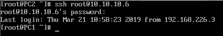
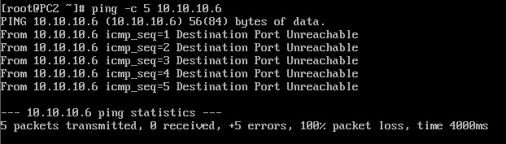
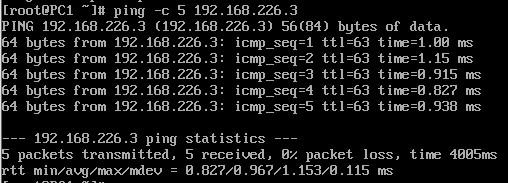
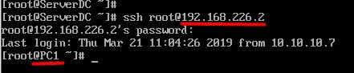

## Lab 2

### Mô hình


Đảm bảo ServerDC, PC1 và PC2 đều trỏ gateway về Server

### Yêu cầu

- PC2 chỉ có thể liên hệ tới PC1 trên cổng 22

- PC1 có thể ping tới ServerDC

- ServerDC có thể liên hệ tới PC1 trên cổng 22 thông qua địa chỉ IP Public của Server 

### Chuẩn bị

- Tắt firewalld trên tất cả các máy

```
systemctl stop firewalld
systemctl mask firewalld
```

- Cài iptables service

`yum install -y iptables-services`

- Cho phép iptables khởi động cùng hệ thống

`systemctl enable iptables`

- Bật iptables

`systemctl start iptables`

- Bật chức năng routing trên Server

```
echo "net.ipv4.ip_forward = 1" > /etc/sysctl.conf
sysctl -p
```

- Xoá hết các rule mặc định trên các máy 

`iptables -F`

### Thực hành

#### Trên PC1 

- Thiết lập rule chỉ cho phép PC2 liên hệ tới bằng cổng 22

`iptables -A INPUT -s 10.10.10.7 -p tcp --dport 22 -j ACCEPT`

- Chặn hết các kết nối khác từ PC2 

`iptables -A INPUT -s 10.10.10.7 -j REJECT`

#### Trên Server 

- Chặn các kết nối vào theo mặc định 

`iptables -P INPUT DROP`

- Chặn các gói chuyển tiếp theo mặc định

`iptables -P FORWARD DROP`

- Cho phép PC1 ping tới ServerDC

```
iptables -A FORWARD -p icmp --icmp-type echo-request -s 10.10.10.6 -d 192.168.226.3 -j ACCEPT
iptables -A FORWARD -p icmp --icmp-type echo-reply -d 10.10.10.6 -j ACCEPT
```

- Chấp nhận các kết nối ESTABLISHED và RELATED

```
iptables -A INPUT -m state --state ESTABLISHED,RELATED -j ACCEPT
iptables -A FORWARD -m state --state ESTABLISHED,RELATED -j ACCEPT
```

- Cho phép ServerDC kết nối tới cổng 22 của Server bằng IP Public 

`iptables -A INPUT -p tcp -m state --state NEW -s 192.168.226.3 -d 192.168.226.2 --dport 22 -j ACCEPT`

- Chấp nhận các kết nối được forward tới cổng 22 của PC1

`iptables -A FORWARD -p tcp -d 10.10.10.6 --dport 22 -j ACCEPT`

- NAT port

`iptables -t nat -A PREROUTING -p tcp -d 192.168.226.2 --dport 22 -j DNAT --to-destination 10.10.10.6:22`

- Lưu cấu hình iptables

`service iptables save`

### Kiểm tra

- PC2 chỉ có thể liên hệ tới PC1 trên cổng 22



Các kết nối tới cổng khác bị chặn



- PC1 có thể ping tới ServerDC



- ServerDC có thể liên hệ tới PC1 trên cổng 22 thông qua địa chỉ IP Public của Server

