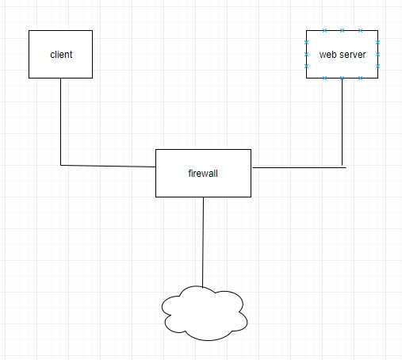
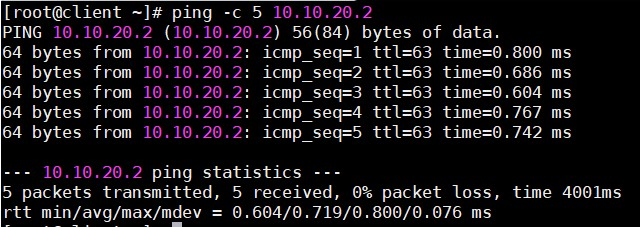
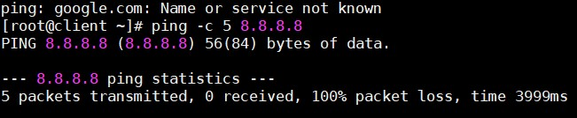
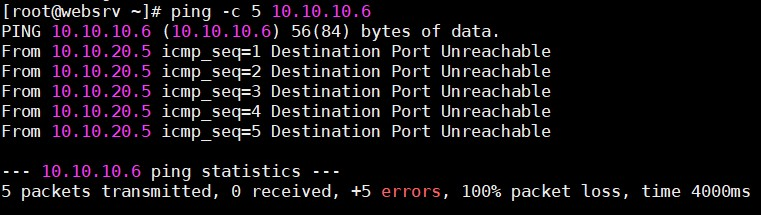
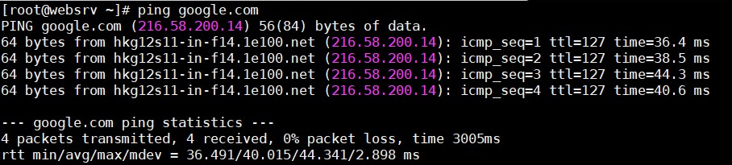

## Lab 1

### Mô hình



Client có thể ping tới Web Server nhưng không được phép ra internet

Web Server có thể ra internet nhưng không được phép truy cập tới Client 

#### Web Server

- ens34 (host-only): 10.10.20.2

#### Client

- ens34 (host-only): 10.10.10.6

#### Firewall

- Iptables 

- ens33 (NAT): 192.168.226.2

- ens34 (host-only): 10.10.10.5

- ens38 (host-only): 10.10.20.5

### Thực hành

- Tiến hành disable firewalld

```
systemctl stop firewalld 
systemctl mask firewalld 
```

- Cài iptables service

`yum install -y iptables-services`

- Cho phép iptables khởi động cùng hệ thống

`systemctl enable iptables`

- Bật iptables

`systemctl start iptables`

- Bật chức năng routing 

```
echo "net.ipv4.ip_forward = 1" > /etc/sysctl.conf
sysctl -p 
```

- Xoá các rule mặc định của iptables

`iptables -F`

#### Cấu hình cho Client

- Có thể ping tới Web Server

`iptables -A FORWARD -p icmp --icmp-type echo-request -s 10.10.10.6 -d 10.10.20.2 -j ACCEPT`

- Chấp nhận gói reply icmp request từ Web Server

`iptables -A FORWARD -p icmp --icmp-type echo-reply -s 10.10.20.2 -j ACCEPT`

- Chặn truy cập từ Web Server vào Client 

`iptables -A FORWARD -s 10.10.20.2 -d 10.10.10.6 -j REJECT`

#### Cấu hình cho Web Server

- Cho phép ra internet 

`iptables -t nat -A POSTROUTING -s 10.10.20.2 -j MASQUERADE`

### Kiểm tra

- Ping từ Client tới Web Server



- Ping từ Client ra internet 



- Ping từ Web Server đến Client 



- Ping từ Web Server ra internet 

