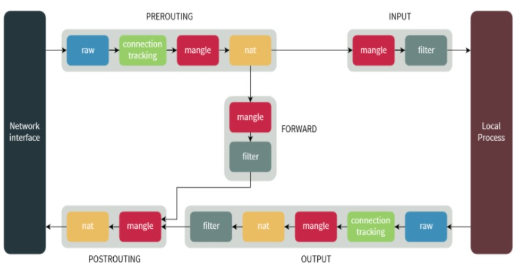
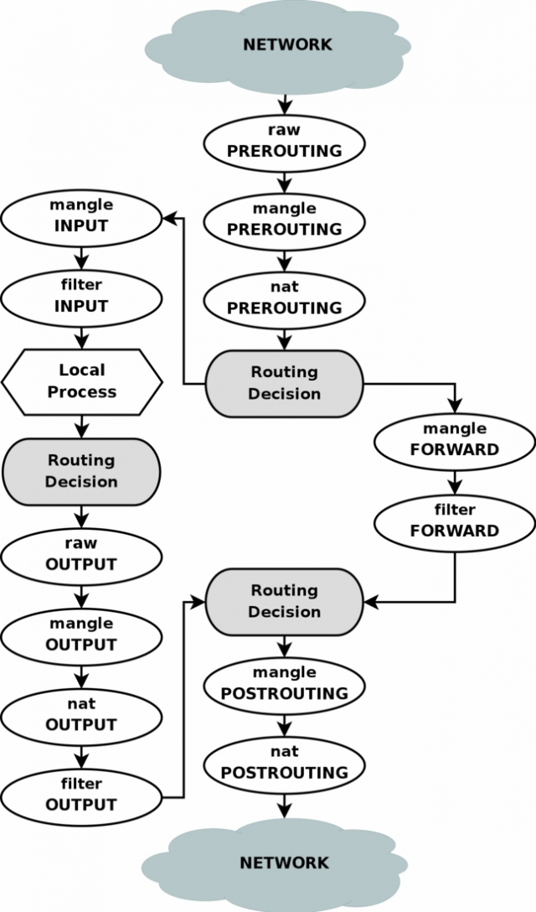
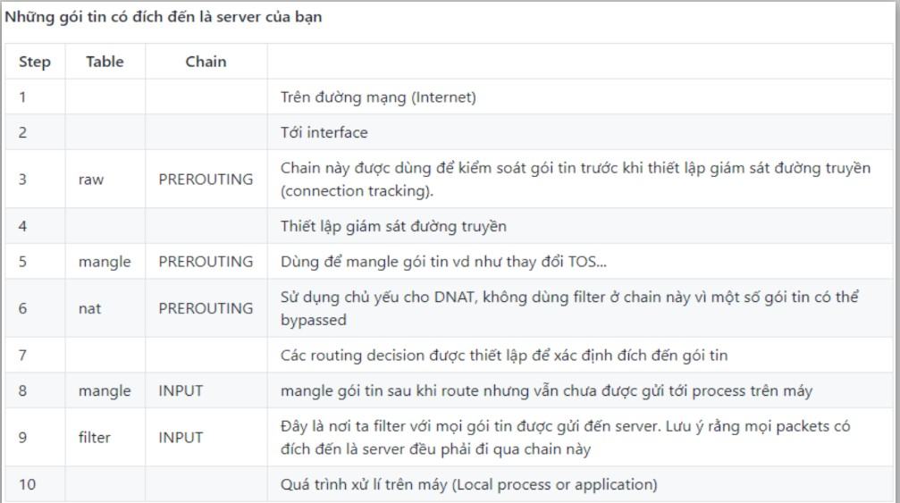
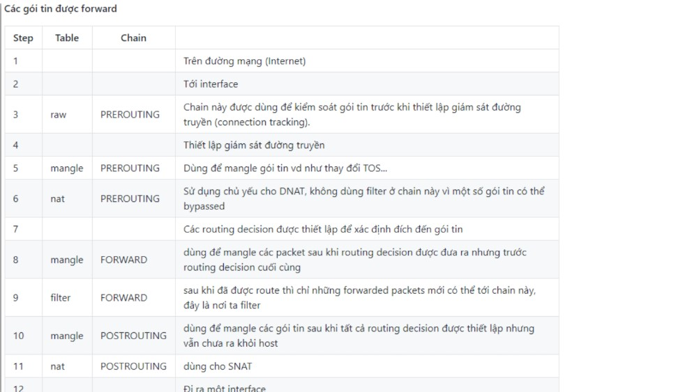

# Tổng quan về IPtables

## IPtables là gì, để làm gì?

IPtables là một ứng dụng tường lửa dựa trên lọc gói rất mạnh, miễn phí và có sẵn trên Linux

IPtables/Netfilter gồm 2 phần là Netfilter ở trong nhân Linux và IPtables nằm ngoài nhân. IPtables chịu trách nhiệm giao tiếp với người dùng và sau đó đẩy các luật của người dùng vào cho Netfilter xử lý. Netfilter tiến hành lọc các gói dữ liệu ở mức IP. Netfilter làm việc trực tiếp trong nhân, nhanh và không làm giảm tốc độ của hệ thống.

## Lịch sử

Trước IPtables, các gói chương trình dùng để quản lý tường lửa trên Linux là ipchains trên Linux 2.2; ipfwadm trên Linux 2.0, dựa trên chương trình ipfw trên BSD.

IPtables giữ lại những ý tưởng chính trong ipfwadm: Các danh sách luật, trong đó mỗi luật chỉ ra những dấu hiệu cần tìm trong một gói tin, và các hành động sẽ thực hiện với một gói tin thoả mãn các dấu hiệu. ipchains thêm khái niệm chains rules, và IPtables mở rộng ra tables: một table được tra cứu khi cần quyết định phải NAT một gói tin, và một table khác chỉ ra phải lọc gói tin như thế nào. Thêm vào đó, ba điểm lọc trên hành trình của một gói tin được biến đổi sao cho mỗi gói tin thông qua một điểm lọc.

Cách phân chia này cho phép IPtables sử dụng thông tin mà lớp giám sát kết nối thu được từ gói tin, những thông tin thường gặp trong NAT. Điều này làm cho IPtables cao cấp hơn ipchains vì nó có khả năng giám sát trạng thái của kết nối và chuyển hướng, thay đổi hay dừng các gói tin dựa trên trạng thái của kết nối, không chỉ dựa vào nguồn, đích hay nội dung gói tin. Một tường lửa sử dụng IPtables theo cách này còn được gọi là stateful firewall, trong khi ipchains chỉ có thể cài đặt stateless firewall. Ta có thể rằng IPtables có thể nhận thức được ngữ cảnh của gói tin đang di chuyển, từ đó ra một quyết định đúng đắn hơn cho số phận của các gói tin và kết nối.

Hiện nay netfilter đang phát triển nftables, một sự thay thế cho IPtables trong tương lai.

## Các khái niệm

### Table

IPtables sử dụng table để định nghĩa các rules cụ thể cho các gói tin. Các phiên bản Linux hiện nay có 4 loại table khác nhau:

- Filter table: Table này quen thuộc và hay được sử dụng nhất. Bảng này nhằm quyết định liệu gói tin có được chuyển đến địa chỉ đích hay không.

- Mangle table: Bảng này liên quan đến việc sửa head của gói tin, ví dụ chỉnh sửa giá trị các trường TTL, MTU, ToS.

- NAT table: Bảng này cho phép route các gói tin đến các host khác nhau trong mạng NAT, NAT table thay đổi IP nguồn và IP đích của gói tin. Bảng này cho phép kết nối đến các dịch vụ không được truy cập trực tiếp được do đang trong mạng NAT.

- Raw table: 1 gói tin có thể thuộc một kết nối mới hoặc cũng có thể là của 1 kết nối đã tồn tại. Bảng Raw cho phép bạn làm việc với gói tin trước khi kernel kiểm tra trạng thái gói tin.

### Chains

Mỗi table được tạo với một số chains nhất định. Chains cho phép lọc gói tin tại các điểm khác nhau. IPtables có thể thiết lập với các chains sau:

- PREROUTING: Các rule thuộc chain này sẽ được áp dụng ngay khi gói tin vừa vào đến network interface. Chain này chỉ có ở table NAT, Raw và Mangle.

- INPUT: Các rule thuộc chain này áp dụng cho các gói tin ngay trước các gói tin được vào hệ thống. Chain này có trong 2 bảng Mangle và Filter.

- OUTPUT: Các rule thuộc chain này áp dụng cho các gói tin ngay khi gói tin đi ra từ hệ thống. Chain này có trong 3 bảng Raw, Mangle và Filter.

- FORWARD: Các rule thuộc chain này áp dụng cho các gói tin chuyển tiếp qua hệ thống. Chain này chỉ có trong 2 bảng Mangle và Filter.

- POSTROUTING: Áp dụng cho các gói tin đi network interface. Chain này có trong 2 bảng Mangle và NAT.

Hình mô tả thứ tự xử lý các table và các chain trong luồng xử lý gói tin



### Target

Target hiểu đơn giản là các hành động áp dụng cho các gói tin. Đối với những gói tin đúng theo rule mà chúng ta đặt ra thì các hành động (Target) có thể thực hiện được là:

- ACCEPT: Chấp nhận gói tin, cho phép gói tin đi vào hệ thống 

- DROP: Loại bỏ gói tin, không có gói tin trả lời, giống như là hệ thống không tồn tại.

- REJECT: Loại bỏ gói tin nhưng có trả lời table gói tin khác, ví dụ trả lời table 1 gói tin "connection reset" đối với gói TCP hoặc bản tin "destination host unreachable" đối với gói UDP và ICMP.

- LOG: Chấp nhận gói tin nhưng có ghi lại log.

Gói tin sẽ đi qua tất cả các rule chứ không dừng lại khi đã đúng với 1 rule đặt ra. Đối với những gói tin không khớp với rule nào cả mặc định sẽ được chấp nhận.

### Rule

Cấu trúc 1 rule trong IPtables:

```
TARGET    PROT   OPT  IN   OUT   SOURCE     DESTINATION
```

- TARGET: Hành động sẽ thực thi

- PROT: Viết tắt của protocol, giao thức sẽ được áp dụng cho rule này 

- IN: Chỉ ra rule sẽ áp dụng cho các gói tin đi vào từ interface nào, ví dụ như lo, eth0,... hoặc **any** là áp dụng cho tất cả interface

- OUT: Tương tự như IN, chỉ ra rule sẽ áp dụng cho các gói tin đi ra từ interface nào.

- DESTINATION: Địa chỉ của lượt truy cấp được phép áp dụng quy tắc

## Quá trình xử lý gói tin








## Phân biệt Firewalld và IPtables

Sự khác nhau chủ yếu giữa Firewalld và IPtables là:

- IPtables lưu cấu hình tại file `/etc/sysconfig/iptables` trong khi đó Firewalld lưu cấu hình bằng các file XML trong thư mục `/usr/lib/firewalld/` và `/etc/firewalld/`. Lưu ý rằng file `/etc/sysconfig/iptables` không tồn tại như Firewalld được cài mặc định. 

- Với IPtables, mọi thay đổi đồng nghĩa với việc xoá bỏ toàn bộ các rule cũ và đọc lại tất cả các rule mới từ file `/etc/sysconfig/iptables`. Trong khi đó với Firewalld, không có việc khởi tạo lại toàn bộ các rule, chỉ có các sự thay đổi được áp dụng. Vì thế, Firewalld có thể thay đổi cấu hình trong khi đang chạy mà không làm mất các kết nối hiện tại.

## Các option và command cơ bản 

### Options

#### Các options để chỉ định thông số

| Option | Description |
|--------|-------------|
| -t | Chỉ định tên table (nếu không chỉ định table, giá trị mặc định là filter table) |
| -p | Chỉ định loại giao thức |
| -i | Chỉ định card mạng vào |
| -o | Chỉ định card mạng ra |
| -s | Chỉ định địa chỉ IP nguồn |
| -d | Chỉ định địa chỉ IP đích |
| --sport | Chỉ định cổng nguồn |
| --dport | Chỉ định cổng đích |

#### Các option để thao tác với chain 

| Option | Description |
|--------|-------------|
| -N | Tạo chain mới |
| -X | Xoá hết các rule đã tạo trong chain |
| -P | Đặt chính sách cho các chain built-in (INPUT, OUTPUT, FORWARD) |
| -L | Liệt kê các rule có trong chain |
| -F | Xoá các rule có trong chain |
| -Z | Reset bộ đếm packet về 0 |

#### Các option để thao tác với rule 

| Option | Description |
|--------|-------------|
| -A | Thêm rule |
| -D | Xoá rule |
| -R | Thay thế rule |
| -I | Chèn thêm rule |

### Một số command cơ bản 


## Tham khảo

https://tech.vccloud.vn/tim-hieu-ve-iptables-phan-1-660.htm
https://github.com/thaonguyenvan/meditech-thuctap/blob/master/ThaoNV/Tim%20hieu%20Linux/firewall/iptables-theory.md