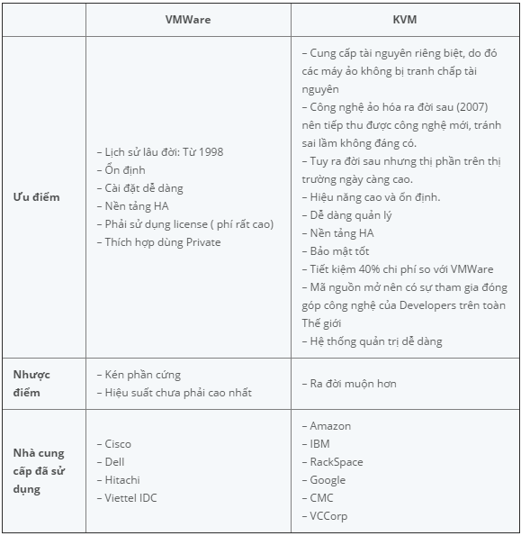
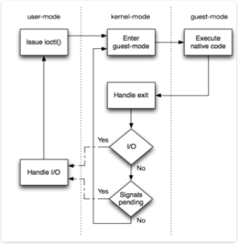
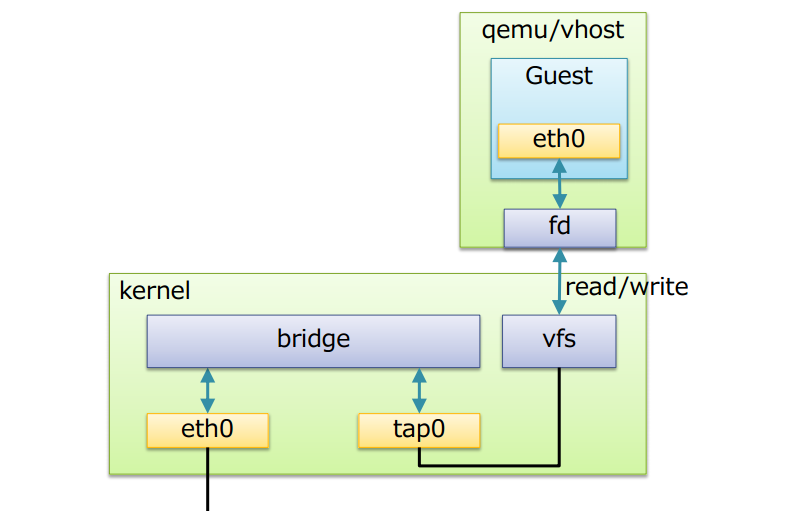

# KVM

[1. Tổng quan về KVM](#overview)

[2. Cấu trúc](#architecture)

[3. Mô hình vận hành](#mohinh)

[4. Cơ chế hoạt động](#coche)

[5. Tính năng](#tinhnang)

[6. Các chế độ mạng](#network)

[7. File cấu hình](#fileconfig)

<a name="overview"></a>
## 1. Tổng quan về KVM 

- KVM (Kernel-based virtual machine) là giải pháp ảo hóa cho hệ thống linux trên nền tảng phần cứng x86 có các module mở rộng hỗ trợ ảo hóa (Intel VT-x hoặc AMD-V). Về bản chất, KVM không thực sự là một hypervisor có chức năng giải lập phần cứng để chạy các máy ảo. Chính xác KVM chỉ là một module của kernel linux hỗ trợ cơ chế mapping các chỉ dẫn trên CPU ảo (của guest VM) sang chỉ dẫn trên CPU vật lý (của máy chủ chứa VM). Hoặc có thể hình dung KVM giống như một driver cho hypervisor để sử dụng được tính năng ảo hóa của các vi xử lý như Intel VT-x hay AMD-V, mục tiêu là tăng hiệu suất cho guest VM.

- KVM ban đầu được phát triển bởi Qumranet – một công ty nhỏ, sau đó được Redhat mua lại vào tháng 9 năm 2008. Ta có thể thấy KVM là thế hệ tiếp theo của công nghệ ảo hóa. KVM được sử dụng mặc định từ bản RHEL (Redhat Enterprise Linux) từ phiên bản 5.4 và phiên bản Redhat Enterprise Virtualization dành cho Server.

- Qumranet phát hành mã của KVM cho cộng đồng mã nguồn mở. Hiện nay, các công ty nổi tiếng như IBM, Intel và ADM cũng đã cộng tác với dự án. Từ phiên bản 2.6.20, KVM trở thành một phần của hạt nhân Linux.

- So sánh KVM với VMWare:



<a name="architecture"></a>
## 2. Cấu trúc của KVM 

- Trong kiến trúc KVM, máy ảo là một tiến trình Linux, được lập lịch bởi chuẩn Linux scheduler. Trong thực tế mỗi CPU ảo xuất hiện như là một tiến trình Linux. Điều này cho phép KVM sử dụng tất cả các tính năng của Linux kernel.

- Cấu trúc tổng quan:


- Linux có tất cả các cơ chế của một VMM cần thiết để vận hành (chạy) các máy ảo. Chính vì vậy các nhà phát triển không xây dựng lại mà chỉ thêm vào đó một vài thành phần để hỗ trợ ảo hóa. KVM được triển khai như một module hạt nhân có thể được nạp vào để mở rộng Linux bởi những khả năng này.

- Trong một môi trường linux thông thường mỗi process chạy hoặc sử dụng user-mode hoặc kernel-mode. KVM đưa ra một chế độ thứ 3, đó là guest-mode. Nó dựa trên CPU có khả năng ảo hóa với kiến trúc Intel VT hoặc AMD SVM, một process trong guest-mode bao gồm cả kernel-mode và user-mode.

**Trong cấu trúc tổng quan của KVM bao gồm 3 thành phần chính:**

- KVM kernel module:

	- Là một phần trong dòng chính của Linux kernel
	
	- Cung cấp giao diện chung cho Intel VMX và AMD SVM (thành phần hỗ trợ ảo hoá phần cứng)
	
	- Chứa những mô phỏng cho các instructions và CPU modes không được support bởi Intel VMX và AMD SVM
	
- quemu-kvm: Là chương trình dòng lệnh để tạo các máy ảo, thường được vận chuyển dưới dạng các package "kvm" hoặc "quemu-kvm". Có 3 chức năng chính:

	- Thiết lập VM và các thiết bị ra vào (input/output)
	
	- Thực thi mã khách thông qua KVM kernel module
	
	- Mô phỏng các thiết bị ra vào (I/O) và di chuyển các guest từ host này sang host khác 
	
- libvirt management stack:

	- Cung cấp API để các tool như virsh có thể giao tiếp và quản lý các VM 
	
	- Cung cấp chế độ quản lý từ xa an toàn
	
<a name="mohinh"></a>
## 3. Mô hình vận hành.

- Hình dưới đây mô tả mô hình vận hành của KVM. Đây là một vòng lặp của các hành động diễn ra để vận hành các máy ảo. Những hành động này được phân cách bằng 3 phương thức chúng ta đã đề cập trước đó: user-mode, kernel-mode, guest-mode.



Như ta thấy: 

- User-mode: Các modul KVM gọi đến sử dụng ioclt() để thực thi mã khách cho đến khi hoạt động I/O khởi xướng bởi guest hoặc một sự kiện nào đó bên ngoài xảy ra. Sự kiện này có thể là sự xuất hiện của một gói tin mạng, cũng có thể là trả lời của một gói tin mạng được gửi bởi các may chủ trước đó. Những sự kiện như vậy được biểu diễn như là tín hiệu dẫn đến sự gián đoạn của thực thi mã khách.

- Kernel-mode: Kernel làm phần cứng thực thi các mã khách tự nhiên. Nếu bộ xử lý thoát khỏi guest do cấp phát bộ nhớ hay I/O hoạt động, kernel thực hiện các nhiệm vụ cần thiết và tiếp tục luồng thực hiện, Nếu các sự kiện bên ngoài như tín hiệu hoặc I/O hoạt động khởi xướng bởi các guest tồn tại, nó thoát tới user-mode.

- Guest-mode: Đây là cấp độ phần cứng, nơi mà các lệnh mở rộng thiết lập của một CPU có khả năng ảo hóa được sử dụng để thực thi mã nguồn gốc, cho đến khi một lệnh được gọi như vậy cần sự hỗ trợ của KVM, một lỗi hoặc một gián đoạn từ bên ngoài.

- Khi một máy ảo chạy, có rất nhiều chuyển đổi giữa các chế độ. Từ kernel-mode tới guest-mode và ngược lại rất nhanh, bởi vì chỉ có mã nguồn gốc được thực hiện trên phần cứng cơ bản. Khi I/O hoạt động diễn ra các luồng thực thi tới user-mode, rất nhiều thiết bị ảo I/O được tạo ra, do vậy rất nhiều I/O thoát ra và chuyển sang chế độ user-mode chờ. Hãy tưởng tượng mô phỏng một đĩa cứng và 1 guest đang đọc các block từ nó. Sau đó QEMU mô phỏng các hoạt động bằng cách giả lập các hoạt động bằng các mô phỏng hành vi của các ổ đĩa cứng và bộ điều khiển nó được kết nối. Để thực hiện các hoạt động đọc, nó đọc các khối tương ứng từ một tập tin lớp và trả về dữ liệu cho guest. Vì vậy, user-mode giả lập I/O có xu hướng xuất hiện một nút cổ chai làm chậm việc thực hiện máy ảo.

<a name="coche"></a>
## 4. Cơ chế hoạt động.

- Để các máy ảo giao tiếp được với nhau, KVM sử dụng Linux Bridge và OpenVSwitch, đây là 2 phần mềm cung cấp các giải pháp ảo hóa network. Trong bài này, tôi sẽ sử dụng Linux Bridge.

- Linux bridge là một phần mềm đươc tích hợp vào trong nhân Linux để giải quyết vấn đề ảo hóa phần network trong các máy vật lý. Về mặt logic Linux bridge sẽ tạo ra một con switch ảo để cho các VM kết nối được vào và có thể nói chuyện được với nhau cũng như sử dụng để ra mạng ngoài.

- Cấu trúc của Linux Bridge khi kết hợp với KVM - QEMU.



- Ở đây:

	- Bridge: Tương đương với switch layer 2
	
	- Port: Tương đương với port của switch thật
	
	- Tap (tap interface): Có thể hiểu là giao diện mạng để các VM kết nối với bridge do Linux bridge tạo ra
	
	- fd (forward data): Chuyển tiếp dữ liệu từ máy ảo tới bridge
	
- Các tính năng chính:

	- STP: Spanning Tree Protocol - Giao thức chống lặp gói tin trong mạng 
	
	- VLAN: Chia switch (do Linux bridge tạo ra) thành các mạng LAN ảo, cô lập traffic giữa các VM trên các VLAN khác nhau của cùng một switch.
	
	- FDB (forwarding database): Chuyển tiếp các gói tin theo database để nâng cao hiệu năng switch. Database lưu các địa chỉ MAC mà nó học được. Khi gói tin Ethernet đến, bridge sẽ tìm kiếm trong database có chứa MAC address không. Nếu không, nó sẽ gửi gói tin đến tất cả các cổng.
	
	<a name="tinhnang"></a>
	## 5. Tính năng.
	
	### Security
	
	- Vì Virtual machine được coi như một tiến trình xử lý của Linux, nên nó tận dụng được mô hình bảo mật tiêu chuẩn của Linux để cung cấp khả năng điều khiển và cô lập tài nguyên. Nhân Linux sử dụng SELinux (Security-Enhanced Linux) để thêm quyền điều khiển truy cập, bảo mật đa mức và bảo mật đa tiêu chí, và thực thi các chính sách bắt buộc. SELinux cung cấp cơ chế cách ly tài nguyên nghiêm ngặt và hạn chế cho các tiến trình chạy trong nhân Linux.
	
	- Ngoài ra, dự án Svirt tích hợp bảo mật Mandatory Access Control (MAC) với KVM – xây dựng trên SELinux để cung cấp một nền tảng ảo hóa cho phép người quản trị định nghĩa các chính sách cho sự cô lập máy ảo. Svirt đảm bảo máy ảo không thể bị truy cập bởi các tiến trình khác (hoặc máy ảo khác), việc này có thể được mở rộng thêm bởi người quản trị hệ thống định nghĩa ra các quyền hạn đặc biệt: như là nhóm các máy ảo chia sẻ chung nguồn tài nguyên.
	
	### Memory management
	
	- KVM thừa kế tính năng quản lý bộ nhớ mạnh mẽ của Linux. Vùng nhớ của máy ảo được lưu trữ trên cùng một vùng nhớ dành cho các tiến trình Linux khác và có thể swap. KVM hỗ trợ NUMA (Non-Uniform Memory Access - bộ nhớ thiết kế cho hệ thống đa xử lý) cho phép tận dụng hiệu quả vùng nhớ kích thước lớn.
	
	- KVM hỗ trợ các tính năng ảo của mới nhất từ các nhà cung cấp CPU như EPT (Extended Page Table) của Microsoft, Rapid Virtualization Indexing (RVI) của AMD để giảm thiểu mức độ sử dụng CPU và cho thông lượng cao hơn.
	
	- Việc chia sẻ bộ nhớ được hỗ trợ thông qua một tính năng của nhân gọi là Kernel Same-page Merging (KSM). KSM quét tất cả các yêu cầu về vùng nhớ cần thiết cho máy ảo và định danh cho từng máy ảo, sau đó tổ hợp vào thành một yêu cầu về vùng nhớ duy nhất để chia sẻ chung cho các máy ảo, lưu trữ vào một bản copy.
	
	### Storage
	
	- KVM sử dụng khả năng lưu trữ hỗ trợ bởi Linux để lưu trữ các images máy ảo, bao gồm các local dish với chuẩn IDE, SCSI và SATA, Network Attached Storage (NAS) bao gồm NFS và SAMBA/CIFS, hoặc SAN được hỗ trợ iSCSI và Fibre Chanel.
	
	- Một lần nữa, bởi vì KVM là một phần trong nhân Linux, nên nó có thể tận dụng hạ tầng lưu trữ đã được chứng minh và đáng tin cậy với sự hỗ trợ từ tất cả các nhà cung cấp hàng đầu trong lĩnh vực Storage.
	
	- KVM cũng hỗ trợ các image của máy ảo trên hệ thống chia sẻ tập tin như GFS2 cho phép các image máy ảo được chia sẻ giữa các host hoặc các logical volume.
	
	- Định dạng image tự nhiên của KVM là QCOW2 – hỗ trợ việc snapshot cho phép snapshot nhiều mức, nén và mã hóa dữ liệu.
	
	### Live migration
	
	- KVM hỗ trợ live migration cung cấp khả năng di chuyển ác máy ảo đang chạy giữa các host vật lý mà không làm gián đoạn dịch vụ. Khả năng live migration là trong suốt với người dùng, các máy ảo vẫn duy trì trạng thái bật, kết nối mạng vẫn đảm bảo và các ứng dụng của người dùng vẫn tiếp tục duy trì trong khi máy ảo được đưa sang một host vật lý mới.
	
	- KVM cũng cho phép lưu lại trạng thái hiện tại của máy ảo để cho phép lưu trữ và khôi phục trạng thái đó vào lần sử dụng tiếp theo.
	
	### Performance and scalability
	
	KVM kế thừa hiệu năng và khả năng mở rộng của Linux, hỗ trợ các máy ảo với 16 CPUs ảo, 256GB RAM và hệ thống máy chủ lên tới 256 cores và trên 1TB RAM.
	
<a name="network"></a>
## 6. Các chế độ mạng.

KVM có 3 chế độ card mạng là NAT, Public Bridge và Private Bridge

### NAT 

Đây là cấu hình card mạng mặc định của KVM. Cơ chế NAT sẽ cấp cho mỗi VM một địa chỉ IP theo dải mặc định, nó sẽ hoạt động giống với một chiếc Router, chuyển tiếp các gói tin giữa những lớp mạng khác nhau trên một mạng lớn. Về mặt logic, ta có thể hiểu nó là 1 bridge riêng biệt và nó sẽ giao tiếp với bridge mà card mạng thật kết nối để các máy ảo có thể kết nối ra bên ngoài mạng internet. Chúng ta có thể xem dải mạng mặc định mà cơ chế NAT sẽ cấp cho các máy ảo ở trong file:

```
/var/run/libvirt/network/default.xml
```

Các card mạng của máy ảo sẽ được gắn vào 1 bridge mặc định (vibr0), bridge này đã có gateway mặc định, các gói tin của máy ảo sẽ đi qua bridge này trước khi được chuyển tới bridge có kết nối từ card mạng thật để ra ngoài internet.

KVM sẽ cấp DHCP cho các máy dùng chế độ NAT theo dải mặc định, có thể cấu hình trong file `/var/run/libvirt/network/default.xml`

```
<networkstatus>
  <class_id bitmap='0-2'/>
  <floor sum='0'/>
  <network>
    <name>default</name>
    <uuid>b3b1652d-233b-4a7b-9fbb-0c604c94dac6</uuid>
    <forward mode='nat'>
      <nat>
        <port start='1024' end='65535'/>
      </nat>
    </forward>
    <bridge name='virbr0' stp='on' delay='0'/>
    <mac address='52:54:00:56:f3:ed'/>
    <ip address='192.168.122.1' netmask='255.255.255.0'>
      <dhcp>
        <range start='192.168.122.2' end='192.168.122.254'/>
      </dhcp>
    </ip>
  </network>
</networkstatus>
```

### Public Bridge

Chế độ này sẽ cho phép các máy ảo có cùng dải mạng vật lí với card mạng thật. Để có thể làm được điều này, bạn cần thiết lập 1 bridge và cho phép nó kết nối với cổng vật lí của thiết bị thật (eth0).

Các bước để cấu hình public bridge:

- Sử dụng câu lệnh `brctl addbr ten_bridge` để tạo một bridge

- Gán card mạng thật cho bridge đó bằng câu lệnh `brctl addif ten_bridge ten_card_mang`

- Cấu hình cho card mạng trong file `/etc/network/interfaces`. Tại đây, hãy comment các cấu hình của card mạng vật lý và cấu hình lại cho bridge vừa tạo.

- Khởi động lại dịch vụ mạng.

Sau khi đã cấu hình public bridge, khi tạo máy ảo, bạn chỉ cần chọn chế độ "Bridge br0" là các máy ảo sẽ tự động được nhận các địa chỉ ip trùng với dải địa chỉ của card vật lí.

Cơ chế cấp DHCP cho các máy ảo sẽ do Router bên ngoài đảm nhận, nhờ vậy nên các VM mới có dải địa chỉ ip trùng với card vật lí bên ngoài.


### Private Bridge

Chế độ này sẽ sử dụng một bridge riêng biệt để các VM giao tiếp với nhau mà không ảnh hưởng tới địa chỉ của KVM host.

Ta có thể tạo ra private bridge bằng cách chỉnh sửa file `/etc/network/interfaces`. Tại đây, bạn không cần phải comment các cấu hình của card vật lý đồng thời không cần thêm tham số `bridge_ports` cho bridge.

Bạn cũng có thể tạo ra private bridge bằng cách sử dụng virt-manager.

- Trong phần `Edit`, chọn `Connection Details` -> `Virtual Networks`

- Chọn biểu tượng dấu `+`

- Điền tên

- Điền địa chỉ IP

- Chọn `Isolated virtual network` và ấn Finish

Khi tạo máy ảo và kết nối tới private bridge, các máy ảo sẽ được cấp phát địa chỉ IP theo dải IP mà người dùng chọn. Chúng có thể giao tiếp với nhau nhưng không đi ra được internet.

Việc sử dụng dnsmasq trong mode này là có thể và thực tế vì nó được sử dụng để trả lời cho DHCP request.

Việc cấu hình và tạo mạng isolate sẽ tự tạo thêm bridge ảo mới cho mạng. không cần tạo trước như mạng bridge network.

Một máy ảo có thể được kết nối tới nhiều các private bridge, nhờ vậy nó có thể giao tiếp với nhau.

<a name="fileconfig"></a>
## Các file cấu hìn của KVM

### Thư mục chứa máy ảo

Thông tin cấu hình của máy ảo nằm ở thư mục `/etc/libvirt/qemu/`. Trong thư mục này sẽ chứa tất cả các file cấu hình của từng máy ảo hiện có trong KVM dưới dạng file xml. Chúng ta có thể chỉnh sửa thông tin của máy ảo trực tiếp từ file này hoặc bằng lệnh `virsh edit tên_máy_ảo` 

Thư mục chứa các file storage của máy ảo như image thường sẽ được để ở `/var/lib/libvirt/image`

### File log của KVM

Các file log nằm ở `/var/log/libvirt/`

Log ghi lại hoạt động của từng máy ảo nằm trong thư mục `/var/log/libvirt/qemu/`. Khi một máy ảo được tạo thì sẽ tự động tạo một file log cho máy ảo đó và được lưu trong thư mục này.

### Để xem thông tin của file img (file chứa disk của máy ảo)

```
qemu-img info <đường dẫn tới file img>
```

### Tạo snapshot cho máy ảo 

```
qemu-img snapshot -c <tên snapshot> <tên file img>
```