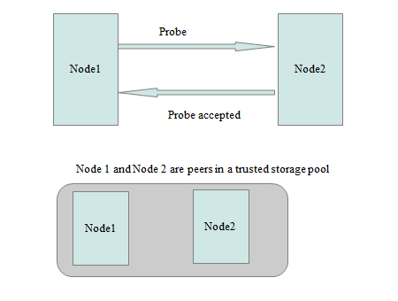
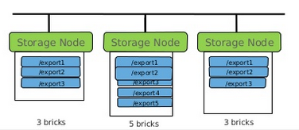
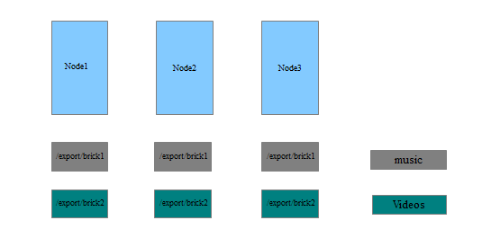
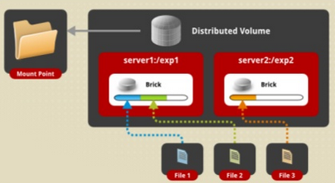
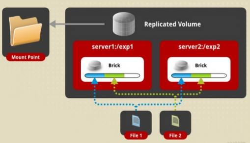

# Tìm hiểu về GlusterFS

## Giới thiệu

GlusterFS là một open source, là tập hợp file hệ thống có thể được nhân rộng tới vài peta-byte và có thể xử lý hàng ngàn Client.

GlusterFS có thể linh hoạt kết hợp với các thiết bị lưu trữ vật lý, ảo, và tài nguyên điện toán đám mây để cung cấp 1 hệ thống lưu trữ có tính sẵn sàng cao và khả năng performance cao.

Chương trình có thể lưu trữ dữ liệu trên các mô hình, thiết bị khác nhau, nó kết nối với tất cả các nút cài đặt GlusterFS qua giao thức TCP hoặc RDMA tạo ra một nguồn tài nguyên lưu trữ duy nhất kết hợp tất cả các không gian lưu trữ có sẵn thành một khối lượng lưu trữ duy nhất (distributed mode) hoặc sử dụng tối đa không gian ổ cứng có sẵn trên tất cả các ghi chú để nhân bản dữ liệu của bạn (replicated mode).

## Một số khái niệm trong GlusterFS

- Trusted Storage Pool

	Trong một hệ thống GlusterFS, những server dùng để lưu trữ được gọi là những node, và những node này kết hợp lại với nhau thành một không gian lưu trữ lớn được gọi là Pool. Dưới đây là mô hình kết nối giữa 2 node thành một Trusted Storage Pool.
	
	
	
- Brick

	Từ những phần vùng lưu trữ mới (những phân vùng chưa dùng đến) trên mỗi node, chúng ta có thể tạo ra những brick.
	
	- Brick được định nghĩa bởi 1 server (name or IP) và 1 đường dẫn. Vd: 10.10.10.20:/mnt/brick (đã mount 1 partition (/dev/sdb1) vào /mnt)
	
	- Mỗi brick có dung lượng bị giới hạn bởi filesystem
	
	- Trong mô hình lý tưởng, mỗi brick thuộc cluster có dung lượng bằng nhau.
	
	Để có thể hiểu rõ hơn về Bricks, chúng ta có thể tham khảo hình dưới đây:

	
	
- Volume

	Từ những brick trên các node thuộc cùng một Pool, kết hợp những brick đó lại thành một không gian lưu trữ lớn và thống nhất để client có thể mount đến và sử dụng.
	
	- Một volume là tập hợp logic của các brick
	
	- Tên volume được chỉ định bởi administrator
	
	- Volume được mount bởi client: mount -t glusterfs server1:/ /my/mnt/point
	
	- Một volume có thể chứa các brick từ các node khác nhau.
	
	Sau đây là mô hình tập hợp những Brick thành Volume: 
	
	
	
## Các loại Volume trong GlusterFS

### Distributed Volume

Distributed Volume có những đặc điểm cơ bản sau:

- Dữ liệu được lưu trữ phân tán trên từng bricks, file1 nằm trong brick 1, file 2 nằm trong brick 2,...

- Vì metadata được lưu trữ trực tiếp trên từng bricks nên không cần thiết phải có một metadata server ở bên ngoài, giúp cho các tổ chức tiết kiệm được tài nguyên.

- Ưu điểm: mở rộng được dung lượng store ( dung lượng store bằng tổng dung lượng các brick)

- Nhược điểm: nếu 1 trong các brick bị lỗi, dữ liệu trên brick đó sẽ mất

### Replicated Volume

- Dữ liệu sẽ được nhân bản đến những brick còn lại, trên tất cả các node và đồng bộ tất cả các nhân bản mới cập nhật.

- Đảm bảo tính nhất quán.

- Không giới hạn số lượng replicas.

- Ưu điểm: phù hợp với hệ thống yêu cầu tính sẵn sàng cao và dự phòng

- Nhược điểm: tốn tài nguyên hệ thống

### Stripe Volume

- Dữ liệu chia thành những phần khác nhau và lưu trữ ở những brick khác nhau, ( 1 file được chia nhỏ ra trên các brick )

- Ưu điểm : phù hợp với những môi trường yêu cầu hiệu năng, đặc biệt truy cập những file lớn.

- Nhược điểm: 1 brick bị lỗi volume không thể hoạt động được.

### Distributed replicated

Kết hợp từ distributed và replicated

Với mô hình trên, hệ thống sẽ yêu cầu cần tối thiểu 3 node, vừa có thể mở rộng được dung lượng lưu trữ, vừa tăng tính dự phòng cho hệ thống. Tuy nhiên, nếu đồng thời bị lỗi 2 node server1 và server2 hoặc 2 node server3 và server4 thì hệ thống sẽ không hoạt động được.

### Distributed Stripe Volume

Kết hợp từ Distributed và stripe. Do đó nó có hầu hết những thuộc tính hai loại trên và khi 1 node và 1 brick delete đồng nghĩa volume cũng không thể hoạt động được nữa.

### Replicated Stripe Volume

Kết hợp từ replicated và stripe

