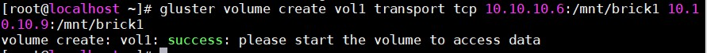
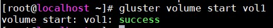
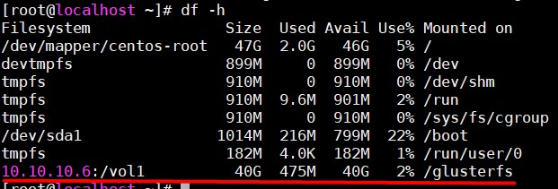
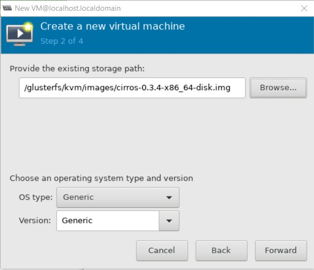

# Dựng KVM với Shared storage GlusterFS trên CentOS 7

## Chuẩn bị

### Server GlusterFS

- Server 1: 10.10.10.6

- Server 2: 10.10.10.9

### Client

- Đã cài đặt KVM 

- IP: 10.10.10.5

## Cài đặt 

- Cài đặt GlusterFS Server xem tại [đây](https://github.com/doedoe12/Internship/blob/master/KVM/GlusterFS/lab_glusterfs.md)

- Tạo Volume `vol1` kiểu Distributed với 2 brick `10.10.10.6:/mnt/brick1` và `10.10.10.9:/mnt/brick1`. Chỉ cần tạo trên 1 trong 2 server GlusterFS:

```
gluster volume create vol1 transport tcp 10.10.10.6:/mnt/brick1 10.10.10.9:/mnt/brick1
```



- Start volume để bắt đầu sử dụng

`gluster volume start vol1`



- Cài đặt GlusterFS client trên máy KVM:

`yum install -y glusterfs-client`

- Tạo thư mục và mount volume `vol1` vào Client:

```
mkdir /glusterfs 
mount -t glusterfs 10.10.10.6:/vol1 /glusterfs 
echo "10.10.10.6:/vol1 /glusterfs glusterfs _netdev 0 0" >> /etc/fstab
```

- Kiểm tra bằng lệnh `df -h`



- Tạo thư mục để làm pool cho KVM:

`mkdir -p /glusterfs/kvm/images/`

- Thay đổi thư mục pool `default` của KVM thành thư mục mới tạo:

```
virsh pool-destroy default
virsh pool-undefine default 
virsh pool-define-as --name default --type dir --target /glusterfs/kvm/images
virsh pool-autostart default
virsh pool-start default
```

- Restart libvirt:

`systemctl restart libvirtd`

## Test

- Tải file image máy ảo về:

```
cd /glusterfs/kvm/images
wget http://download.cirros-cloud.net/0.3.4/cirros-0.3.4-x86_64-disk.img
```

- Thử tạo máy ảo bằng virt-manager:

