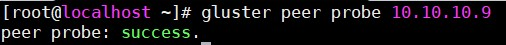
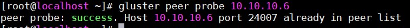
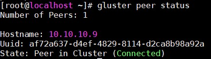
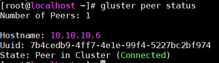

# Lab GlusterFS

## Chuẩn bị

Server 1: 10.10.10.6

Server 2: 10.10.10.9

Client: 10.10.10.5

## Cài đặt

Đầu tiên tạo một thư mục trên 2 GlusterFS server nằm trên phân vùng khác với phân vùng `/`

Ở đây, ta add thêm 1 ổ cứng mới ở 2 server và phân vùng, format thành định dạng xfs, mount vào /mnt

Tạo partition:

`fdisk /dev/sdb`

Format:

`mkfs.xfs /dev/sdb1`

Mount partition vào thư mục `/mnt` và tạo thư mục `/mnt/brick1`:

```
mount /dev/sdb1 /mnt
mkdir -p /mnt/brick1
```

Khai báo vào file `/etc/fstab` để tự động mount khi khởi động hệ thống:

`echo "/dev/sdb1 /mnt xfs defaults 0 0" >> /etc/fstab`

### Cài đặt GlusterFS

- Cài đặt repo cần thiết:

`yum install -y centos-release-gluster`

- Cài đặt GlusterFS:

`yum install -y glusterfs-server`

- Bật GlusterFS và cho phép khởi chạy cùng hệ thống:

```
systemctl start glusterd
systemctl enable glusterd
```

- Add 1 node có địa chỉ 10.10.10.9 vào pool (thực hiện tại server 10.10.10.6):



- Thực hiện tương tự tại node 10.10.10.9



- Xem status của pool:





### Tạo Volume Distributed

- Tạo Volume "voldist" từ 1 node 10.10.10.6:

`gluster volume create voldist transport tcp 10.10.10.6:/mnt/brick1`

### Tạo Volume Replicated

- Tạo Volume "volreplica" từ 2 node 10.10.10.6 và 10.10.10.9 (chỉ cần tạo trên 1 trong 2 server):

`gluster volume create volreplica rep 2 transport tcp 10.10.10.6:/mnt/brick1 10.10.10.9:/mnt/brick1`

- Loại Volume Replicated: Dữ liệu sẽ được nhân bản đến những brick còn lại. Khi dữ liệu trên 1 brick bị mất (dữ liệu lưu trên 1 con server) thì dữ liệu vẫn còn trên brick còn lại và tự động đồng bộ lại cho cả 2 server. Đảm bảo dữ liệu luôn đồng bộ và sẵn sàng.

- Thông số `rep` là số lượng brick.

### Tạo Volume Stripe

- Tạo Volume "volstripe" từ 2 node 10.10.10.6 và 10.10.10.9 (chỉ cần tạo trên 1 trong 2 server):

`gluster volume create volstripe stripe 2 transport tcp 10.10.10.6:/mnt/brick1 10.10.10.9:/mnt/brick1`

- Thông số `stripe` là số lượng brick

### Start Volume

Sau khi tạo volume, cần phải start volume đó để sử dụng:

`gluster volume start tên_volume`

### Cài đặt Client 

- Cài đặt:

`yum install -y glusterfs-client`

- Mount và sử dụng::

`mount -t glusterfs 10.10.10.6:/tên_volume /mnt 

