# Cài đặt KVM sử dụng NFS làm Storage

## Chuẩn bị

### Máy ảo KVM 

- OS: CentOS 7

- 2 NIC: Hostonly ens34, NAT ens33

- IP: 10.10.10.6

### Máy Server NFS 

- OS: CentOS 7

- 2 NIC: Hostonly ens34, NAT ens33

- IP: 10.10.10.5

## Cài đặt 

### Cài server NFS 

- Xem cài đặt Server NFS tại [đây](https://github.com/doedoe12/Internship/blob/master/KVM/NFS/lab_nfs.md)

- Tạo thư mục để làm storage cho KVM:

```
mkdir -p /var/lib/libvirt/images
```

- Thêm vào file `/etc/exports` nội dung sau:

```
/var/lib/libvirt/images 10.10.10.6(rw,sync,no_root_squash,no_subtree_check)
```

- Chạy lệnh sau để cập nhật file /etc/exports:

`exportfs -a`

### Cài đặt máy KVM 

- Bật chức năng hỗ trợ ảo hoá CPU của VMWare:

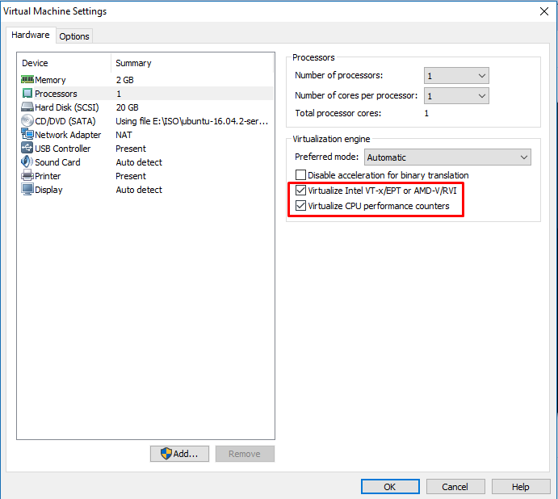

- Sử dụng câu lệnh sau để cài đặt KVM và các gói phụ trợ liên quan:

`yum -y install qemu-kvm libvirt bridge-utils virt-manager`

- Nếu sử dụng bản OS Minimal, cần cài đặt thêm gói x-window để sử dụng được công cụ virt-manager. Cài bằng lệnh:

`yum install "@X Window System" xorg-x11-xauth xorg-x11-fonts-* xorg-x11-utils -y`

- Kiểm tra để chắc chắn rằng các module của kvm đã được load vào kernel bằng lệnh:

`lsmod | grep kvm`

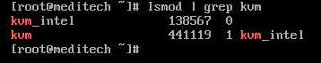

- Khởi động dịch vụ libvirt và cho phép khởi động cùng hệ thống:

```
systemctl start libvirtd
systemctl enable libvirtd 
```

- Copy file cấu hình của card NAT ens33 để cấu hình Bridge br0:

```
cd /etc/sysconfig/network-scripts
cp ifcfg-ens33 ifcfg-br0 
```

- Cấu hình card ens33, thêm vào file `ifcfg-ens33` dòng sau:

```
BRIDGE=br0
```

- Cấu hình bridge br0, thay đổi như sau:

```
DEVICE="br0"
BOOTPROTO="dhcp"
IPV6INIT="yes"
IPV6_AUTOCONF="yes"
ONBOOT="yes"
TYPE="Bridge"
DELAY="0"
```

Lưu ý: Do lúc nãy copy file cấu hình của ens33 nên phải xoá dòng UUID tại file ifcfg-br0

- Khởi động lại network:

`systemctl restart network`

- Cài đặt NFS:

`yum install -y nfs-utils`

- Thêm vào file `/etc/fstab` dòng sau để mount cứng.

```
10.10.10.5:/var/lib/libvirt/images /var/lib/libvirt/images nfs rw,sync,hard,intr 0 0
```

- Tắt SELinux, sửa file `/etc/selinux/config`:

```
SELINUX=disabled
```

- Reboot lại máy.

### Test

- Kiểm tra bằng lệnh `df -h` tại máy KVM 

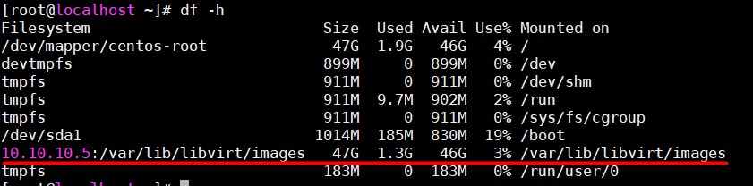

Ta thấy thư mục từ server NFS đã được mount vào máy KVM.

- Download 1 file máy ảo cài sẵn trên mạng về để test:

```
cd /var/lib/libvirt/images
wget http://download.cirros-cloud.net/0.3.4/cirros-0.3.4-x86_64-disk.img
```

- Bật `virt-manager` để tạo pool:

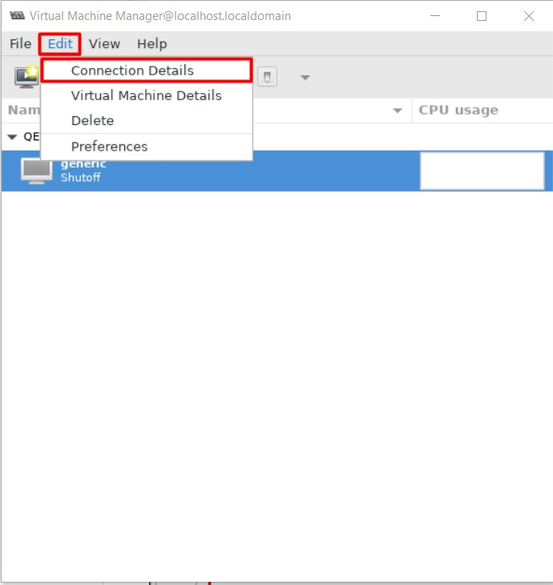

- Chọn Storage, chọn biểu tượng dấu + để add pool:

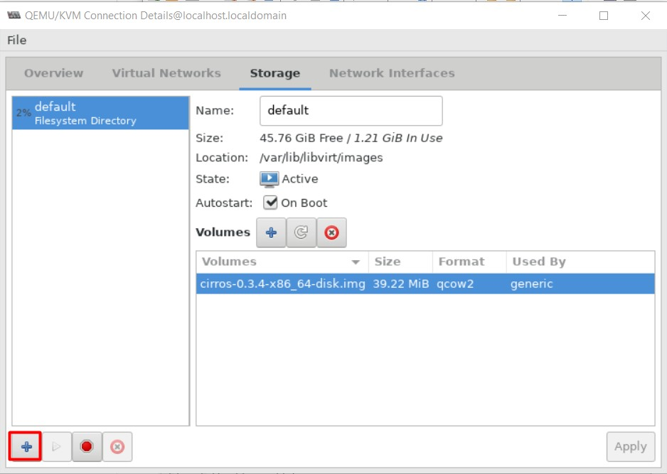

- Đặt tên cho pool và chọn type:

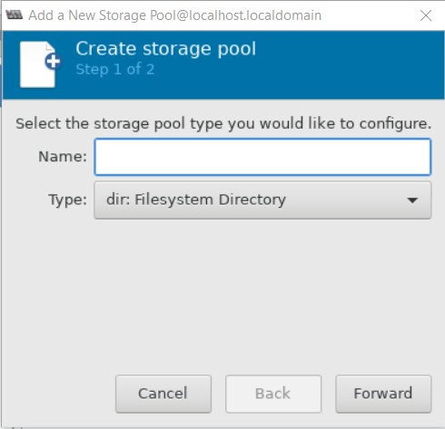

- Chọn đường dẫn tới thư mục vừa được mount từ NFS server:

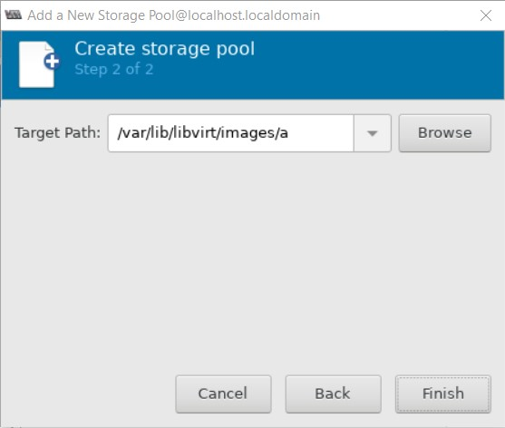

- Thử tạo máy ảo:

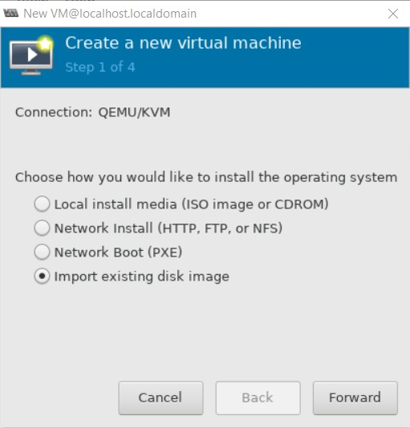

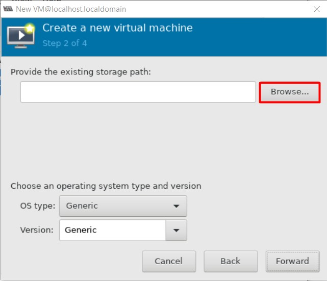

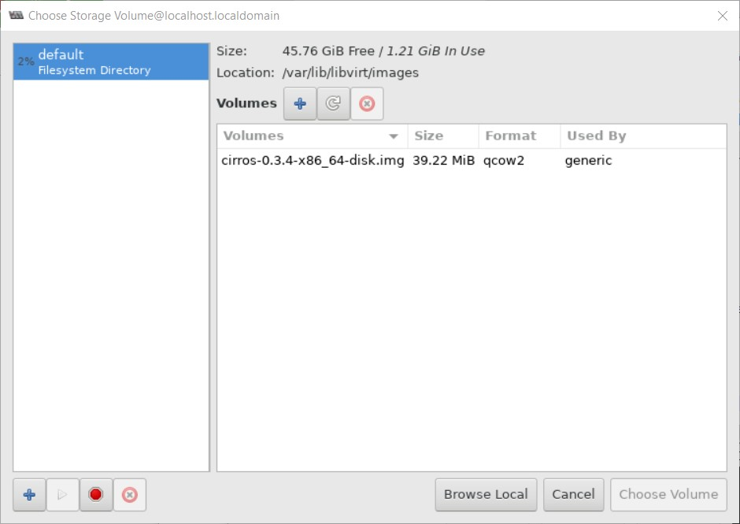

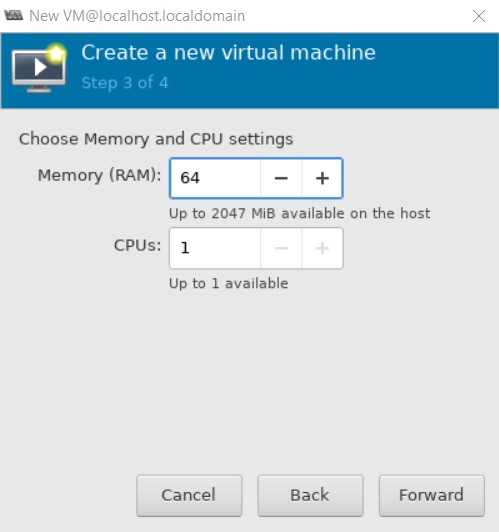

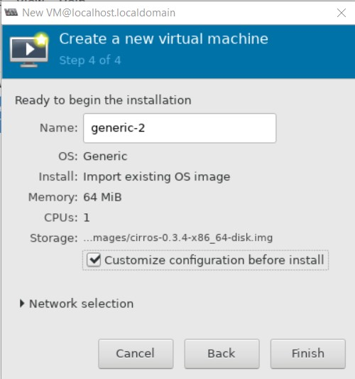


- Bật máy ảo:

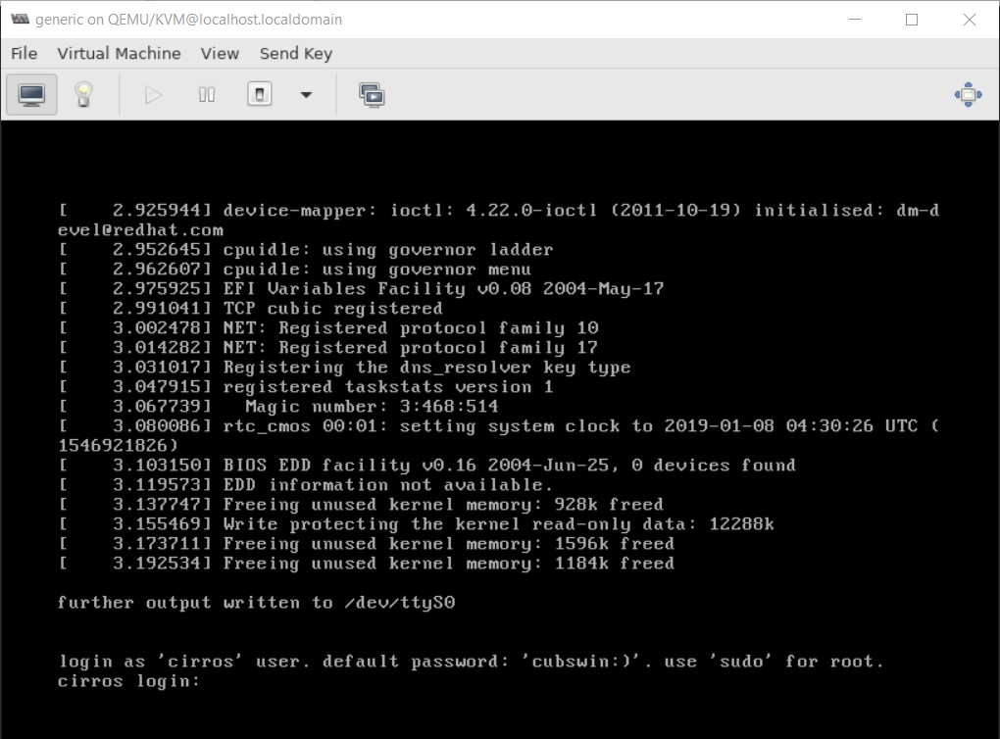