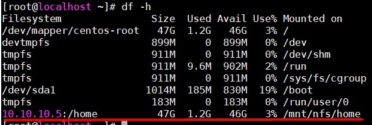
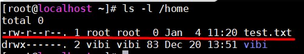

# Lab cài đặt NFS

## Mô hình

### Server

- OS: CentOS 7

- IP: 10.10.10.5

### Client

- OS: CentOS 7

- IP: 10.10.10.6

## Cài đặt 

### Server

- Mở port SSH và NFS 

```
firewall-cmd --permanent --zone=public --add-service=ssh
firewall-cmd --permanent --zone=public --add-service=nfs
firewall-cmd --reload
```

- Cài đặt nfs:

```
yum install -y nfs-utils
```

- Khởi động nfs:

```
systemctl enable nfs-server
systemctl start nfs-server
```

- Tạo thư mục chia sẻ trên Server, ví dụ chia sẻ thư mục `/home`:

`vi /etc/exports`

Sau đó thêm vào:

```
/home 10.10.10.6(rw,sync,no_root_squash,no_subtree_check)
```

- Chạy lệnh sau để cập nhật file /etc/exports:

```
exportfs -a 
```

### Client 

- Cài đặt nfs:

```
yum install -y nfs-utils
```

- Tạo thư mục để mount thư mục share

```
mkdir -p /mnt/nfs/home 
```

- Mount thư mục:

```
mount 10.10.10.5:/home /mnt/nfs/home
```

- Kiểm tra bằng lệnh `df -h`:



- Để mount cứng, thêm vào file `/etc/fstab` dòng sau:

```
10.10.10.5:/home /mnt/nfs/home nfs rw,sync,hard,intr 0 0
```

**Chú ý**: Các tuỳ chọn xem thêm tại [đây](https://linux.die.net/man/5/nfs)

## Test

- Tạo file tại Client:

```
touch /mnt/nfs/home/test.txt
```

- Kiểm tra tại server:

