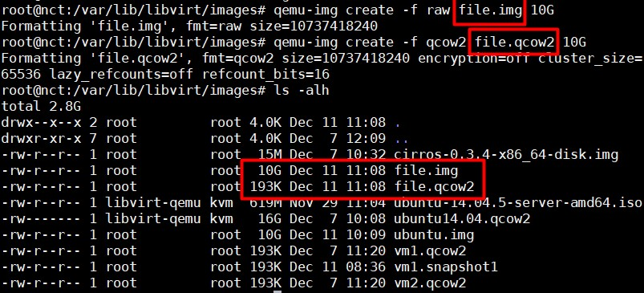
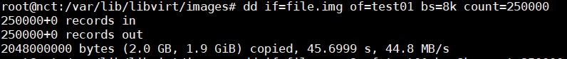
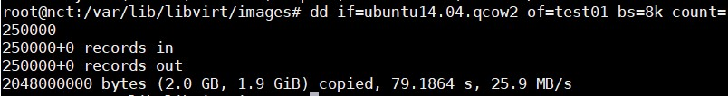

# Test performance giữa 2 định dạng ổ đĩa `raw` và `qcow2`

### Tình huống

- Test performance của 2 ổ cứng định dạng file raw và qcow2 để chứng thực việc định dạng raw cho performance tốt hơn so với qcow2 và qcow2 cho phép một vài tính năng nổi trội hơn so với định dạng raw.

### Phương pháp test

- Đối với test performance, dùng lệnh `dd`

- Đối với việc chứng thực một số tính năng đặc biệt như snapshot, nén dung lượng,... tôi sẽ tạo snapshot trên cả hai định dạng ổ đĩa và tiến hành đo dung lượng để so sánh.

### Cách làm

- Đầu tiên, khởi tạo 2 file với cùng dung lượng 10GB với định dạng raw và qcow2 và kiểm tra dung lượng.

Như vậy, file qcow2 được chuyển đổi đã "nén" dữ liệu theo cơ chế thin provisioning, nó chỉ chiếm dung lượng đúng bằng dung lượng data đang chứa trong nó. Trong khi đó, file raw sẽ mặc định chiếm đúng 1 khoảng mà người dùng khai báo trong storage pool của KVM.

- Tiếp theo, tiến hành test performance bằng câu lệnh `dd`:

	- `dd` là một câu lệnh trong linux thường được sử dụng với mục đích sao lưu và phục hồi dữ liệu của ổ cứng 
	
	- Tiến hành đo bằng câu lệnh `dd if=/source of=test01 bs=8k count=250000`. Trong đó `if` là thư mục muốn đo, `of` là thư mục đích tuy nhiên ở đây ta chỉ muốn đo tốc độ nên không cần, `bs` thể hiện quá trình đọc (ghi) bao nhiêu byte một lần đọc (ghi) và `count` cho biết máy sẽ thực hiện bao nhiêu block trong quá trình thực thi câu lệnh.
	
	- Ta thu được kết quả sau:
	
	
	
	
	
	Như vậy cho thấy file raw sẽ cho tốc độ tốt hơn so với file qcow2.