# Tìm hiểu về file XML trong KVM

## 1. Giới thiệu về file XML trong KVM 

- XML (viết tắt từ eXtensible Markup Language, tức "Ngôn ngữ đánh dấu mở rộng") là ngôn ngữ đánh dấu với mục đích chung do W3C đề nghị, để tạo ra các ngôn ngữ đánh dấu khác. Đây là một tập con đơn giản của SGML, có khả năng mô tả nhiều loại dữ liệu khác nhau. Mục đích chính của XML là đơn giản hoá việc chia sẻ dữ liệu giữa các hệ thống khác nhau, đặc biệt là các hệ thống được kết nối internet.

- VM trong KVM có hai thành phần chính đó là VM's definition được lưu dưới dạng file XML mặc định ở thư mục `/etc/lib/qemu` và VM's storage lưu dưới dạng file image.

- File domain XML chứa những thông tin về thành phần của máy ảo (số CPU, RAM, các thiết lập của I/O devices,...)

- libvirt dùng những thông tin này để tiến hành khởi chạy tiến trình QEMU-KVM tạo máy ảo.

- Ngoài domain XML, KVM cũng có các file XML khác để lưu các thông tin liên quan tới network, storage,...

- Ví dụ của domain XML:

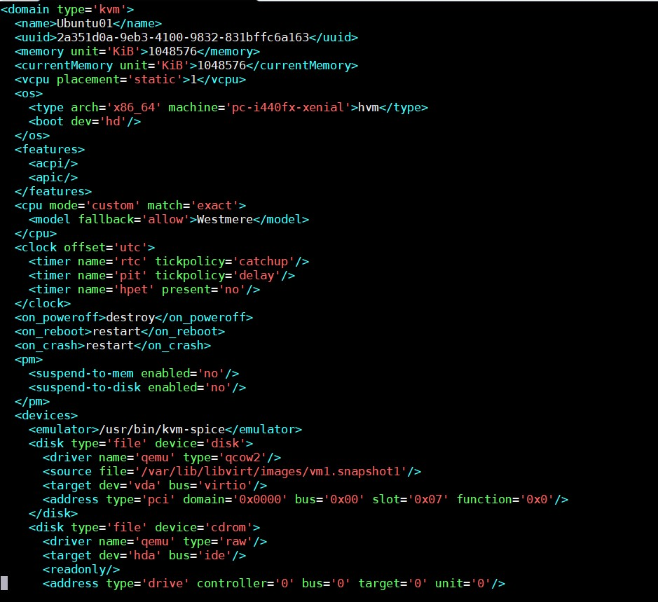

## 2. Các thành phần trong file domain XML 

- Thẻ không thể thiếu trong file domain XML là `domain`, nó có 2 thành phần chính, `type` cho biết hypervisor đang sử dụng, `id` là mã nhận dạng của máy ảo.

### Metadata

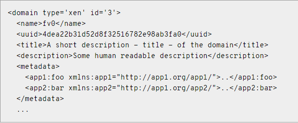

- `name`: Tên máy ảo, chỉ bao gồm kí tự chữ và số và không được trùng với những máy ảo đang chạy.

- `uuid`: Mã nhận dạng quốc tế duy nhất cho máy ảo. Format theo RFC 4122. Nếu thiếu trường uuid khi khởi tạo, mã này sẽ được tự động generate.

- `title`: Tiêu đề của máy ảo.

- `description`: Đoạn mô tả của máy ảo, nó sẽ không được libvirt sử dụng.

- `metadata`: Chứa những thông tin về file xml.

### Operating system booting

- Có nhiều cách để boot máy ảo và mỗi cách lại có những lợi ích và hạn chế riêng. Bài viết này sẽ chỉ đưa ra 2 ví dụ đó là boot từ BIOS và kernel.

#### BIOS Bootloader

- Boot thông qua BIOS được hỗ trợ bởi những hypervisor full virtualization. Người dùng sẽ phải thiết lập thứ tự ưu tiên các thiết bị boot.


- `type`: Chỉ ra loại OS được boot để tạo thành VM. `hvm` cho biết OS cần chạy trên **bare metal**, yêu cầu full virtualization. `arch` chỉ ra loại kiến trúc CPU dùng để ảo hoá, `machine` chỉ ra loại máy sử dụng.

- `boot`: `dev` chỉ ra thiết bị dùng để khởi động. Nó có thể là `fd`, `hd`, `cdrom` hoặc `network`. Nếu có nhiều thiết bị được khai báo, nó sẽ được sắp xếp làm thứ tự ưu tiên.

- `bootmenu`: Chỉ ra có cho khởi động boot menu hay không. Tuỳ chọn `enable` có giá trị `yes` hoặc `no`. `timeout` là thời gian đợi trước khi sử dụng chế độ mặc định.

#### Direct kernel boot 

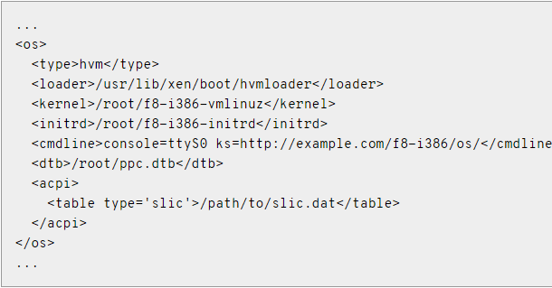

- `loader`: `readonly` có giá trị `yes` hoặc `no` chỉ ra file image writable hay readonly. `type` có giá trị `rom` hoặc `pflash` chỉ ra nơi guest memory được kết nối.

- `kernel`: đường dẫn tới kernel image trên hệ điều hành máy chủ

- `initrd`: đường dẫn tới ramdisk image trên hệ điều hành máy chủ

- `cmdline`: xác định giao diện điều khiển thay thế

### CPU Allocation

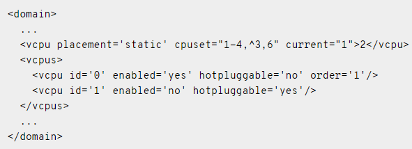

- **vcpu**

	- `cpuset`: Danh sách các CPU vật lí mà máy ảo sử dụng
	
	- `current`: Chỉ định cho phép kích hoạt nhiều hơn số CPU đang sử dụng 
	
	- `placement`: Vị trí của CPU, giá trị bao gồm `static` và `dynamic`, trong đó `static` là giá trị mặc định.
	
- **vcpus**

	- Trạng thái của từng CPU cụ thể
	
### Memory Allocation

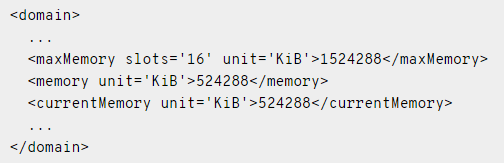

**memory**

- Dung lượng RAM tối đa ở thời điểm khởi động.

- `unit`: Đơn vị, mặc định là `KiB` (kibibytes = 1024 bytes), có thể sử dụng `b` (bytes), `KB` (Kilobytes = 1000 bytes), `MB` (Megabytes = 1000000 bytes), `M` hoặc `MiB` (Mebibytes = 1048576 bytes), `GB` (gigabytes = 10^9 bytes), `G` hoặc `GiB` (gibibytes = 1073741824 bytes), `TB` (terabytes = 10^12 bytes), `T` hoặc `TiB` (tebibytes = 1099511627776 bytes)

- `maxMemory`: Dung lượng RAM tối đa có thể sử dụng 

- `currentMemory`: Dung lượng RAM thực tế đang được sử dụng.

### Events configuration 

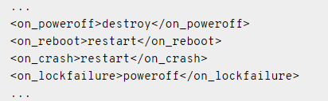

- `on_poweroff`: Hành động được thực hiện khi người dùng yêu cầu tắt máy.

- `on_reboot`: Hành động được thực hiện khi người dùng yêu cầu reset máy.

- `on_crash`: Hành động được thực hiện khi có sự cố.

- Những hành động được phép thực thi:

	- **destroy**: Chấm dứt và giải phóng tài nguyên.
	
	- **restart**: Chấm dứt rồi khởi động lại giữ nguyên cấu hình.
	
	- **preserve**: Chấm dứt nhưng dữ liệu vẫn được lưu lại.
	
	- **rename-restart**: Khởi động lại với tên mới.
	
- `destroy` và `restart` được hỗ trợ trong cả `on_poweroff` và `on_reboot`. `preserve` dùng trong `on_reboot`, `rename-restart` dùng trong `on_poweroff`

- `on_crash` hỗ trợ 2 hành động:

	- **coredump-destroy**: Domain bị lỗi sẽ được dump trước khi bị chấm dứt và giải phóng tài nguyên.
	
	- **coredump-restart**: Domain bị lỗi sẽ được dump trước khi được khởi động lại với cấu hình cũ.
	
### Hypervisor features

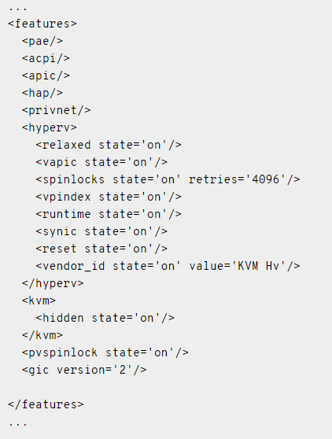

- `pae`: Chế độ mở rộng địa chỉ vật lý cho phép sử dụng 32 bit để lưu trữ tới hơn 4GB bộ nhớ.

- `acpi`: Được sử dụng để quản lí nguồn điện

- `apic`: Sử dụng cho quản lí IRQ 

- `hap`: Bật/tắt chế độ phần cứng hỗ trợ, mặc định nó sẽ bật.

### Time keeping

#### Clock 

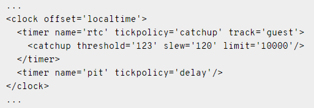

- `offset`: Giá trị `utc`, `localtime`, `timezone` và `variable`

### Devices

#### emulator

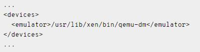

- Đường dẫn tới thiết bị mô phỏng nhị phân. Trong KVM, đó là `usr/bin/kvm`

#### Hard drives, floppy disk, CDROMs

**1. Disk**

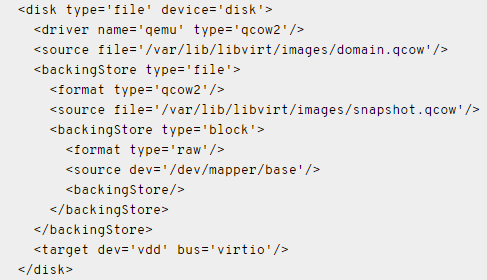

- `disk`: Mô tả ổ đĩa, bao gồm các giá trị:

	- `type`: Kiểu ổ đĩa, có thể chọn **file**, **block**, **dir**, **network** hoặc **volume**
	
	- `device`: Cách ổ đĩa tiếp xúc với hệ điều hành. Các giá trị có thể chọn là **floppy**, **disk**, **cdrom**, **lun**. Giá trị mặc định là **disk**.
	
	- `snapshot`: Chọn chế độ mặc định ổ đĩa khi snapshot. Các giá trị ở đây là **internal**, **external** và **no**.
	
- `source`:

	- `file`: Đường dẫn tới ổ đĩa.
	
	- `dir`: Đường dẫn tới thư mục chứa ổ đĩa.
	
- `target`:

	- `dev`: Tên loại ổ đĩa, ví dụ: vda, hda,...
	
	- `bus`: Xác định loại thiết bị ổ đĩa để mô phỏng, các giá trị: **ide**, **scsi**, **virtio**, **xen**, **usb**, **sata**, **sd**
	
- `driver`:

	- `name`: Tên trình điều khiển hỗ trợ, ở đây mặc định sẽ là **qemu**
	
	- `type`: "dự bị" cho `name` ở trên, các giá trị có thể chọn: **raw**, **bochs**, **qcow2**, và **qed**
	
- `address`:

	- `type`: Loại controller, có thể chọn **pci** hoặc **drive**, đối với **drive**, các giá trị **controller**, **bus**, **target**, và **unit** sẽ được mặc định thêm vào và có giá trị là 0
	
**2. Controller**

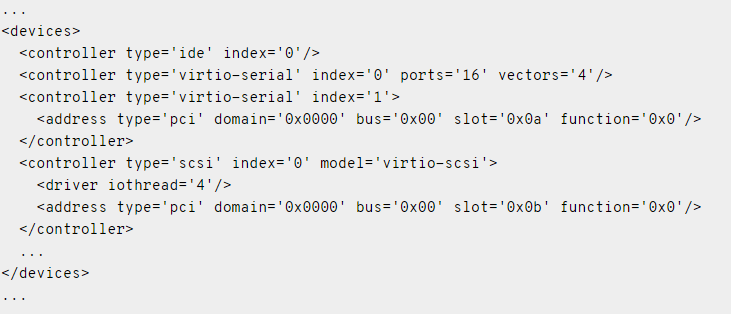

- Tuỳ thuộc vào cấu trúc của máy ảo mà nó có thể có các thiết bị ảo đi kèm, mỗi cái lại đi theo một bộ điều khiển. Thường thì libvirt sẽ tự động chỉ ra mà không cần khai báo qua file xml.

- Mỗi bộ điều khiển có một tham số bắt buộc là `type` và `index`, các giá trị có thể chọn của `type` là: **ide**, **fdc**, **scsi**, **sata**, **usb**, **ccid**, **virtio-serial** hoặc **pci**. Trong khi đó `index` sẽ chỉ ra thứ tự ưu tiên.

#### Network interfaces

- Có một vài kiểu setup network ví dụ như Virtual network (type = network), Bridge to LAN (type = bridge), Userspace SLIRP stack (type = user). Ở đây tôi sẽ nói về Bridge to LAN

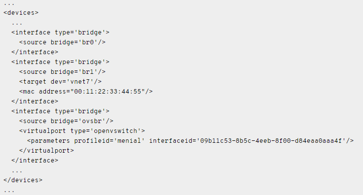

- `source`: Tham số bắt buộc là **bridge**: Tên bridge 

- `mac`: Tham số bắt buộc là **address**: địa chỉ mac.

- `model`: Tham số bắt buộc là **type**, các giá trị thường được sử dụng trong KVM: ne2k_isa, i82557b, i82559er, ne2k_pci, pcnet, rtl8139, e1000, virtio

- Cài IP tĩnh:

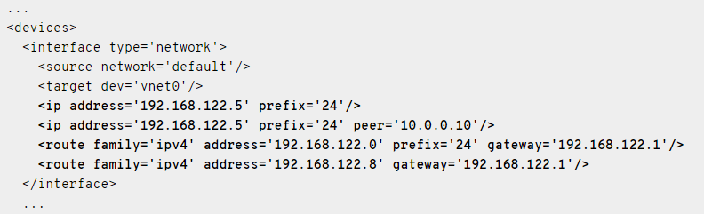

#### Input devices

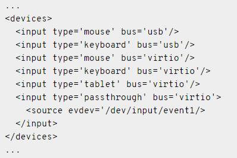

- Chỉ có 1 tham số bắt buộc đó là `type`, các giá trị có thể chọn là **mouse**, **tablet**, **keyboard** hoặc **passthrough**. Tham số `bus` để xác định chính xác thiết bị, các giá trị có thể chọn là **xen** (paravirtualized), **ps2**, **usb**, và **virtio**.

#### Graphical framebuffers

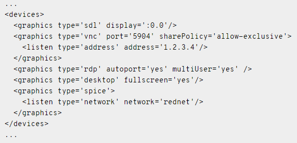

- `graphic`: Thuộc tính bắt buộc là **type**, các giá trị có thể chọn: **sdl**, **vnc**, **spice**, **rdp** và **desktop**. Đối với mỗi loại sẽ có thêm những tham số được thêm vào.

#### Video devices 

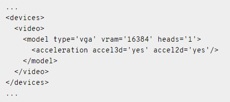

- `model`: Tham số bắt buộc là **type**, các giá trị có thể lựa chọn là **vga**, **cirrus**, **vmvga**, **xen**, **vbox**, **qxl**, **virtio** và **gop**, tuỳ thuộc vào hypervisor.

	- `heads`: Số lượng màn hình
	
	- `ram` và `vram`: Chỉ ra kích thước của primary và secondary bar 
	
#### Guest interface 

- serial port:

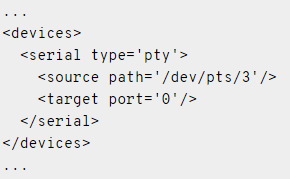

- console:

Nếu không có `target type` được chọn, mặc định trong KVM sẽ sử dụng `serial`.

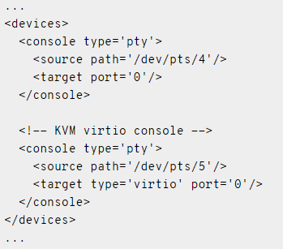

#### Sound devices 

- `sound`: Tham số bắt buộc là `model`, các giá trị có thể chọn: **es1370**, **sb16**, **ac97**, **ich6** và **usb**.

#### Memory balloon device 

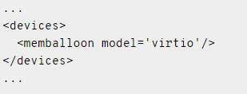

- Được thêm tự động, mặc định với KVM, `model` sẽ là `virtio`

## 3. Tạo máy ảo bằng file XML 

### Bước 1: Chuẩn bị file xml

```
<domain type='kvm'>
  <name>ubuntu</name>
  <uuid>56b802be-24e1-11e7-bbb3-1c1b0d6d34d8</uuid>
  <memory>1048576</memory>
  <currentMemory>1048576</currentMemory>
  <vcpu>1</vcpu>
  <os>
    <type>hvm</type>
    <boot dev='cdrom'/>
  </os>
  <features>
    <acpi/>
  </features>
  <clock offset='utc'/>
  <on_poweroff>destroy</on_poweroff>
  <on_reboot>restart</on_reboot>
  <on_crash>destroy</on_crash>
  <devices>
    <emulator>/usr/bin/kvm</emulator>
    <disk type="file" device="disk">
      <driver name="qemu" type="raw"/>
      <source file="/var/lib/libvirt/images/ubuntu.img"/>
      <target dev="vda" bus="virtio"/>
      <address type="pci" domain="0x0000" bus="0x00" slot="0x04" function="0x0"/>
    </disk>
    <disk type="file" device="cdrom">
      <driver name="qemu" type="raw"/>
      <source file="/var/lib/libvirt/images/ubuntu-14.04.5-server-amd64.iso"/>
      <target dev="hdc" bus="ide"/>
      <readonly/>
      <address type="drive" controller="0" bus="1" target="0" unit="0"/>
    </disk>
    <interface type='bridge'>
      <source bridge='br0'/>
      <mac address="52:54:00:29:8f:4e"/>
    </interface>
    <controller type="ide" index="0">
      <address type="pci" domain="0x0000" bus="0x00" slot="0x01" function="0x1"/>
    </controller>
    <input type='mouse' bus='ps2'/>
    <graphics type='vnc' port='-1' autoport="yes" listen='0.0.0.0'/>
    <console type='pty'>
      <target port='0'/>
    </console>
  </devices>
</domain>
```

- file domain xml phía trên sẽ tạo ra máy ảo với những thông số sau:

	- 1GB RAM, 1 vCPU, 1 ổ đĩa.
	
	- Đường dẫn tới ổ đĩa: `/var/lib/libvirt/images/ubuntu.img`
	
	- Máy ảo được boot từ CDROM `/var/lib/libvirt/images/ubuntu-14.04.5-server-amd64.iso`
	
	- Sử dụng Linux Bridge `br0`
	
- Đối với mã uuid, các bạn có thể download package `uuid` về rồi sử dụng câu lệnh `uuid` để generate đoạn mã uuid

- Ngoài ra, cũng có thể tạo ra file xml bằng việc dump từ một máy ảo đang chạy bằng câu lệnh `virsh dumpxml vm01 > vm02.xml`

### Bước 2: Tạo ổ đĩa 

- Dùng câu lệnh `qemu-img create -f raw /var/lib/libvirt/images/ubuntu.img 10G` để tạo ổ đĩa có dung lượng 10G với định dạng raw.

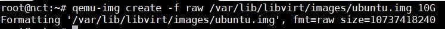

### Bước 3: Khởi tạo máy ảo

- Dùng câu lệnh `virsh create VMname.xml` để khởi tạo máy ảo:

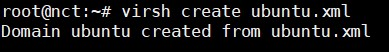

- Kiểm tra xem máy ảo đã được tạo hay chưa bằng câu lệnh `virsh list`

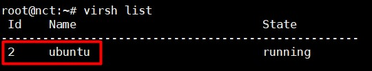

- Sử dụng virt-manager để quản lí máy ảo:

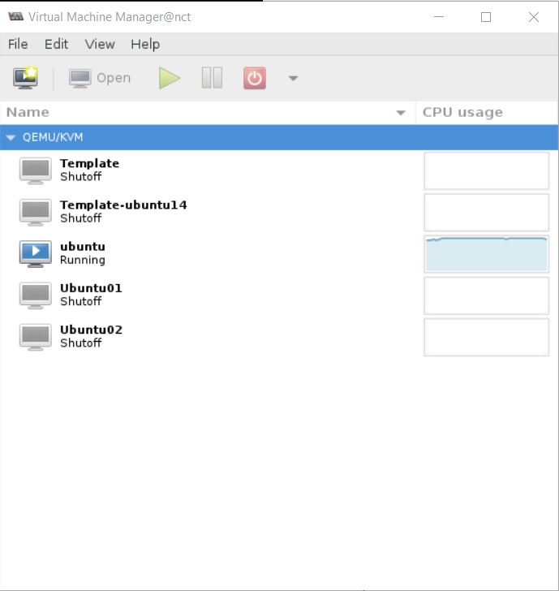