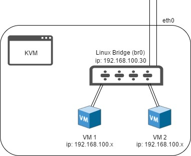
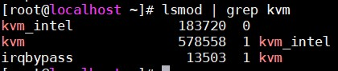

# Cài đặt KVM trên CentOS 7 sử dụng Linux Bridge

## Mô hình 

- Sử dụng VMWare làm môi trường dựng lab

- Server:

	- CentOS 7
	
	- Máy server cài các gói qemu-kvm, libvirt-bin, x-window và virt-manager để quản trị thông qua giao diện đồ hoạ
	
	- Sử dụng Linux Bridge để ảo hoá network cho các máy ảo
	
- Client:

	- Windows 10
	
	- Sử dụng MobaXterm để ssh từ xa
	


## Cài đặt 

### Bước 1:

- Để cài đặt KVM, CPU của máy phải hỗ trợ ảo hoá phần cứng Intel VT-x hoặc AMD-V. Để xác định CPU có những tính năng này không, thực hiện lệnh sau:

`egrep -c '(svm|vmx)' /proc/cpuinfo`

Giá trị 0 chỉ thị rằng CPU không hỗ trợ ảo hoá phần cứng trong khi giá trị khác 0 chỉ thị có hỗ trợ. Người dùng có thể vẫn phải kích hoạt chức năng hỗ trợ ảo hoá phần cứng trong BIOS của máy kể cả khi câu lệnh này trả về giá trị khác 0.

Nếu sử dụng VMWare, bật chức năng ảo hoá Intel VT-x/EPT hoặc AMD-V/RVI trong phần `Processors`


### Bước 2:

- Sử dụng câu lệnh sau để cài đặt KVM và các gói phụ trợ

`yum install -y qemu-kvm libvirt bridge-utils virt-manager`

- Trong đó:

	- **libvirt-bin**: Cung cấp libvirt mà bạn cần quản lý qemu và kvm bằng libvirt
	
	- **qemu-kvm**: Phần phụ trợ cho KVM 
	
	- **bridge-utils**: Chứa một tiện ích cần thiết để tạo và quản lý các thiết bị bridge.
	
	- **virt-manager**: Cung cấp giao diện đồ hoạ để quản lý máy ảo
	
- Đối với bản Server Minimal, người dùng phải cài đặt gói x-window thì mới có thể sử dụng được công cụ đồ hoạ virt-manager. Cài x-window bằng lệnh:

`yum install -y "@X Window System" xorg-x11-xauth xorg-x11-fonts-* xorg-x11-utils`

### Bước 3

- Kiểm tra để chắc chắn rằng các modules của KVM đã được load vào kernel bằng lệnh:

`lsmod | grep kvm`



### Bước 4:

- Start dịch vụ libvirt và cho phép khởi động cùng hệ thống bằng 2 câu lệnh:

```
systemctl start libvirtd
systemctl enable libvirtd
```

### Bước 5:

- Tạo mới một bridge tên là br0 bằng câu lệnh:

`nmcli c add type bridge autoconnect yes con-name br0 ifname br0`

- Gán địa chỉ IP cho bridge mới tạo bằng lệnh:

`nmcli c modify br0 ipv4.addresses 192.168.100.200/24 ipv4.method manual`

- Đặt gateway cho bridge bằng câu lệnh:

`nmcli c modify br0 ipv4.gateway 192.168.100.1`

- Đặt địa chỉ dns cho bridge bằng lệnh:

`nmcli c modify br0 ipv4.dns 8.8.8.8`

- Xoá cài đặt card mạng hiện tại:

`nmcli c delete ens33`

- Gán card mạng hiện tại vào bridge br0 bằng câu lệnh:

`nmcli c add type bridge-slave autoconnect yes con-name ens33 ifname ens33 master br0`

### Bước 6

- Reboot lại máy 