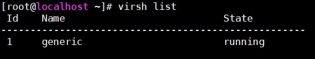
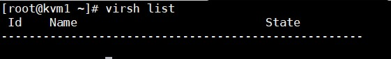
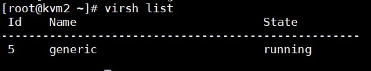

# Lab tính năng Migrate trên KVM

## Giới thiệu

- Migrate là di dời các máy ảo từ host này sang host khác.

- Migrate được sinh ra để làm nhiệm vụ bảo trì, nâng cấp hệ thống. Nhưng ngày nay tính năng này đã được phát triển để thực hiện nhiều tác vụ hơn như:

	- Cân bằng tải: Các máy ảo được di chuyển qua các host khác để đảm bảo host không bị quá tải.
	
	- Bảo trì, nâng cấp hệ thống: Các máy ảo được di chuyển ra khỏi host khi host cần được nâng cấp các vấn đề về phần cứng để duy trì trạng thái hoạt động của máy ảo.
	
	- Chuyển đổi vùng địa lý: Máy ảo được chuyển vì vị trí địa lý này sang địa lý khác để giảm độ trễ truy cập.
	
	- Khôi phục lại máy ảo khi host gặp lỗi.
	
- Yêu cầu để host đích có thể thực hiện Migrate:

	- Cùng OS
	
	- Cùng Hypervisor với host nguồn
	
	- Đã cài đặt service `libvirt`
	
## Cơ chế

Migrate có 2 cơ chế:

- Offline Migrate: là cơ chế cần phải tắt guest trước khi thực hiện việc di chuyển image và file xml của guest sang host khác.

- Live Migrate: là cơ chế di chuyển guest khi guest vẫn còn đang hoạt động, quá trình di chuyển rất nhanh và trong suốt với người dùng.

## Chuẩn bị

- 1 VM cài đặt KVM đã tạo 1 máy ảo, IP 10.10.10.6

- 1 VM cài đặt KVM chưa tạo máy ảo để làm host đích, IP 10.10.10.9

- 1 Server NFS làm Share Storage cho 2 máy KVM, IP 10.10.10.5

- Cả 3 máy dùng CentOS 7

## Cài đặt 

- Cài đặt KVM và tạo máy ảo xem tại [đây](https://github.com/doedoe12/Internship/blob/master/KVM/NFS/kvm_nfs.md)

- Kiểm tra các máy ảo đang chạy tại host .6:



- Để có thể Migrate thì máy ảo phải ở chế độ Cache=none, nếu máy ảo không trong chế độ này thì ta vào `virt-manager` chỉnh sửa lại cấu hình ổ cứng IDE của máy ảo, vào phần `advance setting` -> `performance option` chọn **none** ở mục `cache mode`.

- Cấu hình cho phép giao thức TCP trong libvirt ở cả 2 host bằng cách sửa file `/etc/libvirt/libvirtd.conf`:

```
listen_tls = 0  
listen_tcp = 1
tcp_port = "16509"
listen_addr = "0.0.0.0"
auth_tcp = "none"
mdns_adv = 0
```

Ở đây:

	- Listen_tls : tắt tls, mặc định nó được mở.
	
	- listen_tcp: bật chức năng kiểm duyệt tcp
	
	- tcp_port: cấu hình cổng tcp, mặc định là 16509
	
	- auth_tcp: bật hoặc tắt việc kiểm duyệt bằng mật khẩu
	
	- mdns_adv: bật/tắt tính năng mdns multicast, mặc định là tắt.

- Cấu hình cho libvirt với option `-l` lắng nghe các kết nối TCP, bỏ comment dòng `#LIBVIRTD_ARGS="--listen"` tại file /etc/sysconfig/libvirtd`

- Khởi động lại libvirt: `systemctl restart libvirtd`

- Sử dụng câu lệnh sau để di chuyển máy ảo sang host `10.10.10.9`:

```
virsh migrate generic qemu+tcp://10.10.10.9/system tcp://10.10.10.9
```

- Kiểm tra lại trên host `10.10.10.6`, không còn thấy máy ảo `generic` nữa:



- Kiểm tra lại trên host `10.10.10.9` thì thấy có máy ảo `generic` vẫn đang chạy:

