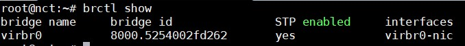
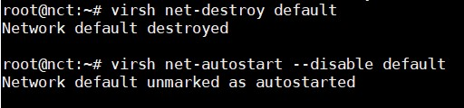
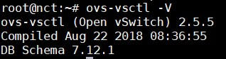
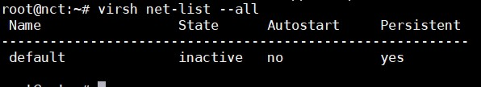
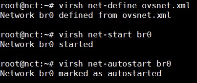
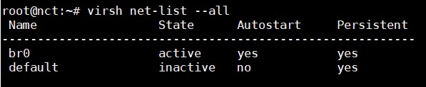
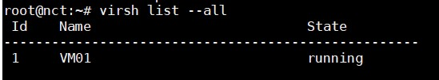

# Tìm hiểu về OpenVSwitch

## 1. Tổng quan Open Vswitch

### 1.1. OpenVSwitch là gì?

- Giống như Linux Bridge, OpenVSwitch là phần mềm cung cấp virtual switch cho các giải pháp ảo hoá network.

- Là phần mềm mã nguồn mở, sử dụng cho ảo hoá vswitch trong môi trường ảo hoá của server.

- OpenVSwitch có thể forward traffic giữa các máy VM trên cùng một máy chủ vật lý và forward traffic giữa các máy VM và các máy vật lý.

- OpenVSwitch được thiết kế tương thích với các switch hiện đại.

- OpenVSwitch phù hợp làm việc như là một switch ảo trong môi trường máy ảo VM. Ngoài việc kiểm soát và có khả năng hiển thị giao diện chuẩn cho các lớp mạng ảo, nó được thiết kế để hỗ trợ phân phối trên nhiều máy chủ vật lý. OpenvSwitch hỗ trợ nhiều công nghệ ảo hoá Linux-based như là Xen/Xen Server, KVM và Virtual Box.

- OpenvSwitch có thể chạy trên các nền tảng Linux, FreeBSD, Windows, non-POSIX embedded Systems,...

### 1.2. Các tính năng 

- Hỗ trợ tính năng VLAN chuẩn 802.IQ với các cổng trunk và access như một switch layer thông thường.

- Hỗ trợ giao diện NIC bonding có hoặc không có LACP trên cổng uplink switch.

- Hỗ trợ NetFlow, sFlow(R), và mirroring để tăng khả năng hiển thị.

- Hỗ trợ cấu hình QoS (Quality of Service) và các chính sách thêm vào khác.

- Hỗ trợ tạo tunnel GRE, VXLAN, STT và LISP.

- Hỗ trợ tính năng quản lý các kết nối 802.1aq

- Hỗ trợ OpenFlow các phiên bản từ 1.0 trở lên

- Cấu hình cơ sở dữ liệu với C và Python.

- Hoạt động forwarding với hiệu suất cao sử dụng module trong nhân Linux.

### 1.3. Các thành phần 


- **ovs-vswitchd**: Đóng vai trò daemon switch thực hiện các chức năng chuyển mạch kết hợp với module trong kernel Linux cho flow-based switching

- **ovs-server**: Database server mà ovs-vswitchd truy vấn tới để lấy cấu hình.

- **ovs-dpctl**: Công cụ cấu hình module chuyển mạch trong kernel

- **ovs-vsctl**: Công cụ thực hiện truy vấn và cập nhật các cấu hình của ovs-vswitchd.

- **ovs-appctl**: Công cụ gửi các lệnh tới OpenvSwitch daemon. OpenvSwitch cũng cung cấp một số công cụ sau:

- **ovs-ofctl**: Công cụ truy vấn và điều khiển chuyển mạch Open Flow và controller.

- **ovs-pki**: Công cụ cho phép tạo và quản lý các publickey cho các Open Flow switch.

- **ovs-testcontroller**: Một OpenFlow controller đơn giản có thể quản lý một số switch ảo thông qua giao thức OpenFlow, khiến chúng hoạt động như các switch lớp 2 hoặc như hub. Phù hợp để kiểm tra các mạng OpenFlow ban đầu.

## Cài đặt cài đặt KVM với OpenvSwitch trên Ubuntu 16.04

### Chuẩn bị

Máy ảo VMWare đã cài KVM, 2 card mạng, hệ điều hành Ubuntu 16

### Cài đặt

#### Bước 1:

Gán quyền cho user quản lý vào các group `libvirt` và `kvm`

```
sudo adduser `id -un` libvirtd
sudo adduser `id -un` kvm 
```

Khi cài đặt KVM, mặc đinh Linux Bridge sẽ được cài đặt và đồng thời tạo ra bridge `virbr0`. Kiểm tra các bridge hiện có bằng câu lệnh `brctl show`



Ta cần phải xoá các bridge đó đi để có thể sử dụng OpenvSwitch



#### Bước 2: Cài đặt các gói cần thiết 

```
sudo apt-get install -qy openvswitch-switch openvswitch-common
sudo service openvswitch-switch start
```

Kiểm tra xem cài được chưa



Cấu hình hỗ trợ thêm 

```
sudo echo "net.ipv4.ip_forward = 1" >> /etc/sysctl.conf
sudo sysctl -p /etc/sysctl.conf 
```

#### Bước 3: Tạo bridge bằng OpenvSwitch

Tạo bridge trên OpenvSwitch và gán card NAT của máy chủ vào bridge này

```
sudo ovs-vsctl add-br br0
sudo ovs-vsctl add-port br0 ens33
```

Tiếp theo cấu hình network cho server 

```
cat << EOF > /etc/network/interfaces

# ens34
auto ens34
iface ens34 inet dhcp

# ens33
auto ens33
iface ens33 inet manual
up ifconfig \$IFACE 0.0.0.0 up
up ip link set \$IFACE promisc on
down ip link set \$IFACE promisc off
down ifconfig \$IFACE down

# Dat IP dong cho bridge "br0". Interface nay duoc gan vao br0 cua OpenvSwitch
auto br0
iface br0 inet dhcp
# address 172.16.69.99
# netmask 255.255.255.0
# gateway 172.16.69.1
# dns-nameservers 8.8.8.8

EOF
```

Reset lại network

```
sudo ifdown --force -a && sudo ifup --force -a 
```

#### Bước 4: Cấu hình network cho KVM sử dụng OpenvSwitch

Kiểm tra các network đã tồn tại



Mặc định sẽ có 1 network tên là `default`, chính network này sẽ sử dụng Linux Bridge, do vậy cần tiến hành tạo network mới để libvirt sử dụng.

Tạo một file network mới

```
cat << EOF > ovsnet.xml
<network>
	<name>br0</name>
	<forward mode='bridge'/>
	<bridge name='br0'/>
	<virtualport type='openvswitch'/>
</network>
EOF
```

Chạy lệnh sau để tạo network

```
virsh net-define ovsnet.xml 
virsh net-start br0
virsh net-autostart br0 
```



Kiểm tra lại:



#### Bước 5: Tạo máy ảo gắn vào bridge của OpenvSwitch

Sử dụng virt-install để tạo máy ảo

```
cd /root/

sudo virt-install \
	-n VM01 \
	-r 128 \
	--vcpus 1 \
	--os-variant=generic \
	--disk path=/var/lib/libvirt/images/cirros-0.3.4-x86_64-disk.img,format=qcow2,bus=virtio,cache=none \
	--network bridge=br0,virtualport_type='openvswitch' \
	--hvm --virt-type kvm \
	--vnc --noautoconsole \
	--import
```

Kiểm tra 



