# Reset password của máy ảo KVM bằng guestfish

## Bước 1: Cài đặt Guestfish

### CentOS/RHEL Linux:

```
yum install libguestfs-tools 
```

### Fedora Linux:

```
dnf install libguestfs-tools
```

### Ubuntu/Debian Linux:

```
apt-get install libguestfs-tools
```

## Bước 2: Tắt máy ảo

Sử dụng lệnh `virsh list` để liệt kê các máy ảo đang chạy

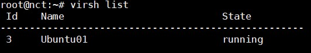

Tắt máy ảo bằng lệnh

```
virsh shutdown vm_id

hoặc 

virsh shutdown vm_name
```

## Bước 3: Xác định vị trí file image của máy ảo

Sử dụng câu lệnh:

```
virsh dumpxml Ubuntu1 | grep 'source file'
```

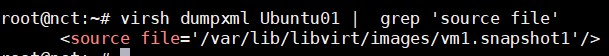

## Bước 4: Tạo mật khẩu mã khoá cho user của máy ảo

Sử dụng lệnh `openssl` để tạo ra một mật khẩu được mã hoá MD5:

```
openssl passwd -1 "your password"
```

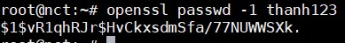

Copy đoạn password MD5 để sử dụng cho việc đổi mật khẩu.

## Bước 5: Chỉnh sửa image của máy ảo bằng Guestfish

Dùng lệnh sau để chỉnh sửa file image của máy ảo:

```
guestfish -rw -a [file image]
```

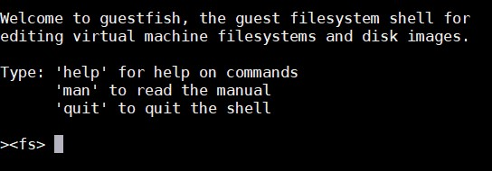

- Gõ lệnh `run` hoặc `launch` để mở backend.

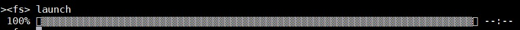

- Liệt kê các partitions

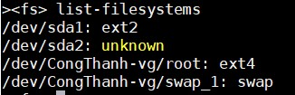

- Tiếp theo mount ổ đĩa tìm được. 

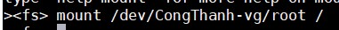

- Chỉnh sửa file `/etc/shadow`, tìm đến dòng `root` và thay đoạn mã hoá password của root bằng đoạn mật khẩu mã hoá mới tạo ở trên.

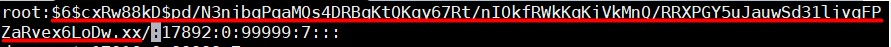

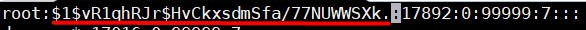

- Lưu lại và thoát

## Bước 6: Bật máy ảo

- Bật máy ảo và đăng nhập bằng mật khẩu mới

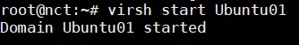

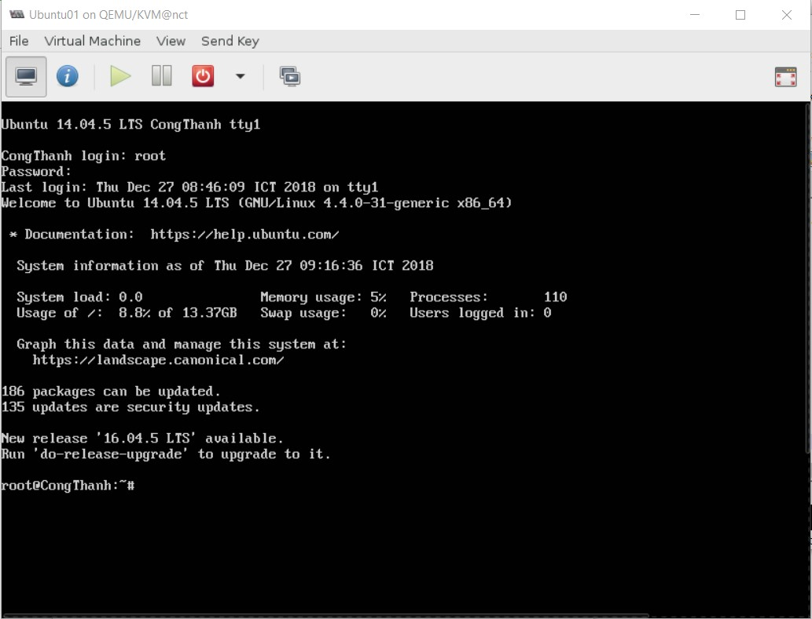