# Template và Snapshot trong KVM

## Template

### Giới thiệu về Template

- Template là một dạng file image pre-configured của hệ điều ành được dùng để tạo nhanh các máy ảo. Sử dụng Template sẽ khiến bạn tránh khỏi những bước cài đặt lặp đi lặp lại và tiết kiệm thời gian rất nhiều so với việc cài bằng tay từng bước một.

- Giả sử có 4 máy apache web server. Thông thường, sẽ phải cài 4 máy ảo rồi lần lượt cài hệ điều hành cho từng máy, sau đó lại tiếp tục tiến hành cài đặt dịch vụ hoặc phần mềm. Điều này tốn rất nhiều thời gian và template sẽ giúp bạn giải quyết vấn đề này.

- Hình dưới đây mô tả các bước mà bạn phải thực hiện theo ví dụ trên nếu bạn cài bằng tay. Rõ ràng từ bước 2-5 chỉ là những việc lặp lại và nó sẽ tiêu tốn rất nhiều thời gian không cần thiết.

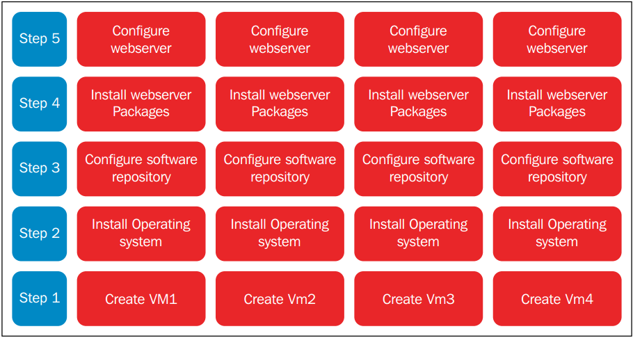

- Với việc sử dụng template, số bước mà người dùng phải thực hiện sẽ được rút ngắn đi rất nhiều, chỉ cần thực hiện 1 lần các bước từ 1-5 rồi tạo template là bạn đã có thể triển khai 4 web servers còn lại một cách rất dễ dàng. Điều này sẽ giúp người dùng tiết kiệm rất nhiều thời gian:

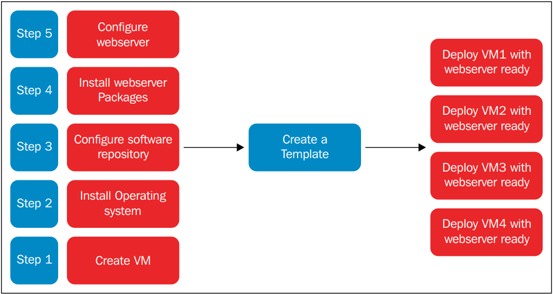

### Hướng dẫn tạo và quản lý template

- Hai khái niệm mà người dùng cần phân biệt đó là `clone` và `template`. Nếu `clone` đơn thuần chỉ là một bản sao của máy ảo thì `template` được coi là master copy của VM, nó có thể được dùng để tạo ra rất nhiều clone khác nữa.

- Có hai phương thức để triển khai máy ảo từ template đó là `Thin` và `Clone`

	- Thin: Máy ảo được tạo ra theo phương thức này sẽ sử dụng template như một base image, lúc này nó sẽ được chuyển sang trạng thái read only. Cùng với đó, sẽ có một ổ mới hỗ trợ "copy on write" được thêm vào để lưu dữ liệu mới. Phương thức này tốn ít dung lượng hơn tuy nhiên các VM được ra sẽ phụ thuộc vào base image, chúng sẽ không chạy được nếu không có base image.
	
	- Clone: Máy ảo được tạo ra là một bản sao hoàn chỉnh và hoàn toàn không phụ thuộc vào template cũng như máy ảo ban đầu. Mặc dù vậy, nó sẽ chiếm dung lượng giống như máy ảo ban đầu.
	
- Template thực chất là máy ảo được chuyển đổi sang. Quá trình này gồm 3 bước:

	- Bước 1: Cài đặt máy ảo với đầy đủ các phần mềm cần thiết để biến nó thành template
	
	- Bước 2: Loại bỏ tất cả những cài đặt cụ thể ví dụ như password SSH, địa chỉ MAC,... để đảm bảo rằng nó sẽ không được áp dụng giống nhau tới tất cả các máy ảo được tạo ra sau này.
	
	- Bước 3: Đánh dấu máy ảo là template bằng việc đổi tên.
	
### Các bước cụ thể tạo template với máy ảo Ubuntu 14

- Cài đặt Ubuntu 14 trên KVM bằng công cụ mà bạn ưu thích (virt-manager, virt-install,...). Cài đặt lên những dịch vụ cần thiết.

- Shutdown máy ảo bằng câu lệnh `virsh shutdown VMname`

- Sử dụng `virt-sysprep` để "niêm phong" máy ảo:

	- `virt-sysprep` là một tiện ích nằm trong gói `libguestfs-tools-c` được sử dụng để loại bỏ những thông tin cụ thể của hệ thống đồng thời niêm phong và biến máy ảo trở thành template.
	
	- Có 2 options để dùng `virt-sysprep` đó là `-a` và `-d`. Tuỳ chọn `-d` được sử dụng với tên hoặc UUID của máy ảo, tuỳ chọn `-a` được sử dụng với đường dẫn tới ổ đĩa máy ảo. 
	
- Người dùng cũng có thể liệt kê các options cụ thể khi sử dụng với `virt-sysprep`. Ví dụ: `virt-sysprep --operations ssh-hostkeys,udev-persistent-net -d`

- Giờ đây ta có thể đánh dấu máy ảo trở thành template. Người dùng cũng có thể backp file XML và tiến hành "undefine" máy ảo trong libvirt.

- Sử dụng `virt-manager` để thay đổi tên máy ảo, đối với việc backup file XML, hãy chạy câu lệnh: `virsh dumpxml Template_VMname > /root/Template_VMname.xml`

- Để undefine máy ảo, chạy câu lệnh `virsh undefine VMname`

### Triển khai máy ảo từ Template sử dụng phương thức "Clone" trên virt-manager

- Mở virt-manager, chọn máy ảo đã được chuyển đổi thành Template, click chuột phải và chọn `Clone` 

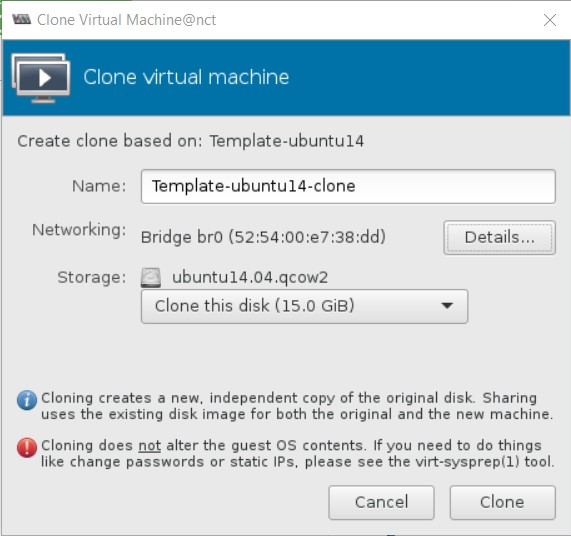

- Điền tên và chọn các thông tin liên quan như Networking, Storage,... Sau đó click vào `Clone` để tiến hành tạo máy ảo mới.

- Sau khi hoàn tất, máy ảo đã sẵn sàng để sử dụng.

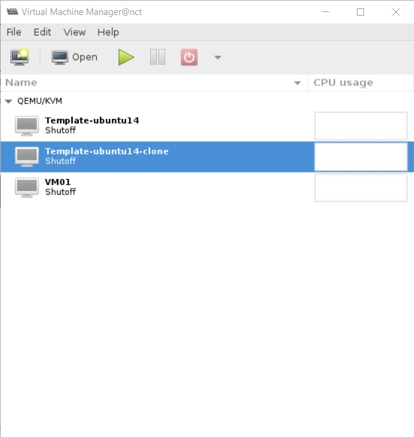

- Máy ảo khi tạo ra với phương thức `Clone` sẽ hoàn toàn độc lập với template, nó vẫn có thể chạy khi ta bỏ đi template.

### Triển khai máy ảo từ template sử dụng phương thức "Thin"

- Tạo ra file images mới với định dạng qcow2 với file Template làm file backup bằng câu lệnh: `qemu-img create -b / -f qcow2 /`

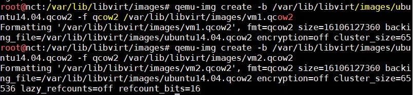

- Kiểm tra xem file mới tạo ra đã được chỉ tới file backup của nó hay chưa bằng câu lệnh: `qemu-img info /`

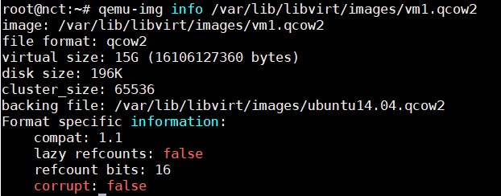

- Dùng `virt-clone` để tạo ra máy ảo mới từ file XML và image đã được backup: 

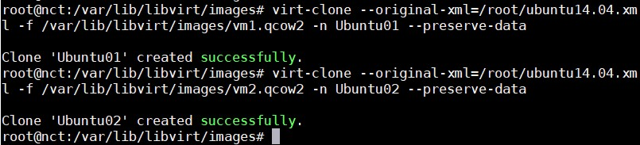

- Sử dụng câu lệnh `virsh list --all` để kiểm tra xem máy ảo đã được define hay chưa.

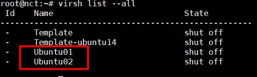

- Tiến hành download 1 số thứ rồi kiểm tra dung lượng. Máy ảo được tạo ra sẽ có dung lượng file image đúng bằng dung lượng file vừa down. Cơ chế hoạt động giống như Thin Provisioning giúp tiết kiệm bộ nhớ tuy nhiên nếu file template bị remove, các máy ảo tạo từ nó cũng sẽ không thể chạy được nữa.

## Tạo Snapshot trên VM 

- Snapshot là trạng thái của hệ thống ở một thời điểm nhất định, nó sẽ lưu lại cả những cài đặt và dữ liệu. Với snapshot, bạn có thể quay trở lại trạng thái của máy ảo ở một thời điểm nào đó rất dễ dàng.

- libvirt hỗ trợ việc tạo snapshot khi máy ảo đang chạy. Mặc dù vậy, nếu máy ảo của bạn đang chạy ứng dụng thì tốt hơn hết hãy tắt hoặc suspend trước khi tiến hành tạo snapshot.

- Có 2 loại snapshot chính được hỗ trợ bởi libvirt:

- Internal: Trước và sau khi tạo snapshot, dữ liệu chỉ được lưu trên một ổ đĩa duy nhất. Người dùng có thể tạo internal snapshot bằng công cụ virt-manager. Mặc dù vậy, nó vẫn có 1 vài hạn chế:

	- Chỉ hỗ trợ duy nhất định dạng qcow2 
	
	- VM sẽ bị ngưng lại khi tiến hành snapshot
	
	- Không hoạt động với LVM storage pools
	
- External: Dựa theo cơ chế copy-on-write. Khi snapshot được tạo, ổ đĩa ban đầu sẽ có trạng thái "read-only" và có một ổ đĩa khác chồng lên để lưu trữ dữ liệu mới:

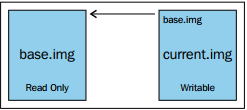

- Ổ đĩa được chồng lên được tạo ra có định dạng `qcow2`, hoàn toàn trống và nó có thể chứa lượng dữ liệu giống như ổ đĩa ban đầu. External snapshot có thể được tạo với bất kì định dạng ổ đĩa nào mà libvirt hỗ trợ. Tuy nhiên không có công cụ đồ hoạ nào hỗ trợ cho việc này.

### Tạo và quản lí Internal Snapshot

- Internal snapshot chỉ hỗ trợ định dạng `qcow2` vì thế hãy xem rằng ổ đĩa của máy ảo thuộc định dạng nào bằng câu lệnh `qemu-img info /`. Nếu định dạng ổ đĩa không phải là `qcow2`, hãy chuyển nó sang định dạng này bằng câu lệnh `qemu-img convert`

- Một vài câu lệnh `virsh` liên quan tới việc tạo và quản lí máy ảo:

	- **snapshot-create**: Tạo snapshot từ file XML
	
	- **snapshot-create-as**: Tạo snapshot với những tuỳ chọn
	
	- **snapshot-current**: Thiết lập hoặc lấy thông tin của snapshot hiện tại
	
	- **snapshot-delete**: Xoá một snapshot
	
	- **snapshot-dumpxml**: Tạo ra thêm 1 file XML cho một snapshot
	
	- **snapshot-edit**: Chỉnh sửa file XML của snapshot
	
	- **snapshot-info**: Lấy thông tin của snapshot
	
	- **snapshot-list**: Lấy danh sách các snapshot
	
	- **snapshot-parent**: Lấy tên của snapshot "cha" của một snapshot nào đó
	
	- **snapshot-revert**: Quay trở lại trạng thái khi tạo snapshot
	
- Để tạo mới một Internal Snapshot, thông thường ta hay sử dụng câu lệnh: `virsh snapshot-create-as VMname --name "Snapshot 1" --description "First Snapshot" --atomic`

Trong đó `Snapshot 1` là tên của snapshot, `First Snapshot` là mô tả và `--atomic` bảo đảm cho việc toàn vẹn dữ liệu.

- Người dùng có thể tạo ra nhiều các snapshot, thêm tuỳ chọn `--parent` vào `snapshot-list` để hiển thị ra danh sách snapshots theo mối quan hệ "cha-con"

- Để quay trở lại trạng thái của một internal snapshot, dùng câu lệnh: `virsh snapshot-revert VMname --snapshotname "Snapshot 1"`

- Để xoá một internal snapshot sử dụng câu lệnh `virsh snapshot-delete VMname Snapshotname`

### Tạo và quản lí External Snapshot

#### Tạo snapshot 

- Tiến hành kiểm tra ổ đĩa mà máy ảo muốn tạo snapshot đang sử dụng bằng câu lệnh `virsh domblklist VMname --details`

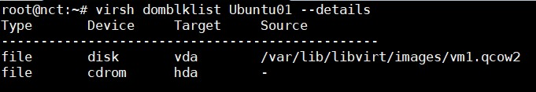

- Tiến hành tạo snapshot bằng câu lệnh `virsh snapshot-create-as VMname snapshot1 "Description" --disk-only --atomic 

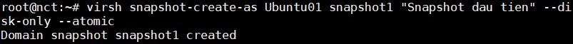

Trong đó `--disk-only` dùng để tạo snapshot cho riêng ổ đĩa.

- Check lại danh sách bằng câu lệnh `virsh snapshot-list VMname` 

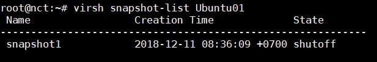

- Snapshot đã được tạo tuy nhiên nó chỉ lưu trữ duy nhất trạng thái ổ đĩa 

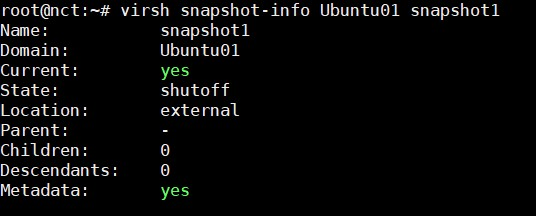

- Kiểm tra lại ổ đĩa mà máy ảo đang sử dụng 

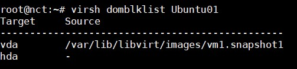

Lúc này ổ đĩa cũ đã biến thành trạng thái `read-only`, VM dùng ổ đĩa mới để lưu dữ liệu và `backingfile` sẽ là ổ đĩa ban đầu. Xem thông tin của ổ đĩa này:

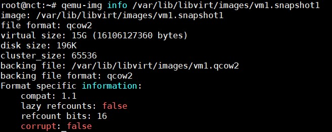

#### Revert lại trạng thái snapshot

- Để revert lại trạng thái của external snapshot, bạn phải cấu hình file XML bằng tay. Giả sử VM đang ở snapshot2 và muốn quay lại snapshot1:

	- Lấy đường dẫn tới ổ đĩa được tạo ra khi snapshot
	
	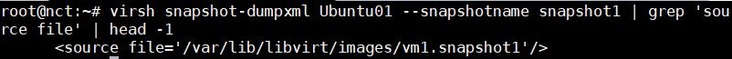
	
	- Kiểm tra để đảm bảo nó còn nguyên vẹn và được kết nối với backing file 
	
	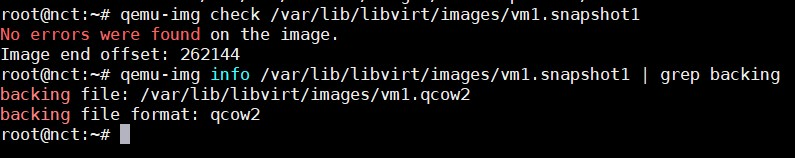
	
	- Chỉnh sửa bằng tay file XML, bỏ ổ đĩa hiện tại và thay thế bằng ổ đĩa ở trạng thái snapshot1
	
	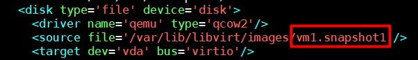
	
	- Kiểm tra lại xem máy ảo đã sử dụng đúng ổ chưa
	
	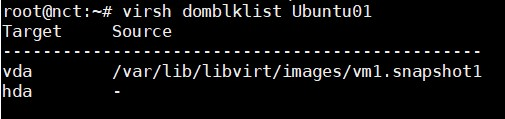
	
	- Khởi động máy ảo và kiểm tra
	
#### Xoá external snapshot

- Quy trình xoá một external snapshot khá phức tạp. Để có thể xoá, trước tiên bạn phải tiến hành hợp nhất nó với ổ đĩa cũ. Có hai kiểu hợp nhất đó là: 

	- blockcommit: Hợp nhất dữ liệu với ổ đĩa cũ 
	
	- blockpull: Hợp nhất dữ liệu với ổ đĩa được tạo ra khi snapshot. Ổ đĩa sau khi hợp nhất sẽ luôn có định dạng qcow2.
	
- Hợp nhất sử dụng `blockcommit`:

	- Kiểm tra ổ đĩa hiện tại mà máy ảo sử dụng bằng câu lệnh `virsh domblklist VM1`
	
	- Xem thông tin backing file của ổ đĩa đang được sử dụng bằng câu lệnh `qemu-img info --backing-chain /vmstore1/vm1.snap4 | grep backing`
	
	- Hợp nhất snapshot bằng câu lệnh `virsh blockcommit VM1 hda --verbose --pivot --active`. Lưu ý đối với Ubuntu, chỉ bản 16.04 mới hỗ trợ câu lệnh này.
	
	- Check lại ổ đĩa đang sử dụng bằng câu lệnh `virsh domblklist VM1` 
	
	- Kiểm tra lại danh sách các snapshot bằng câu lệnh `virsh snapshot-list VM1` 
	
	- Xoá snapshot bằng câu lệnh `virsh snapshot-delete VM1 snap1 --children --metadata`
	
- Hợp nhất sử dụng `blockpull`:

	- Xem ổ đĩa hiện tại máy ảo đang sử dụng 
	
	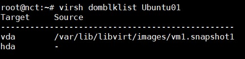
	
	- Xem backing file của VM 
	
	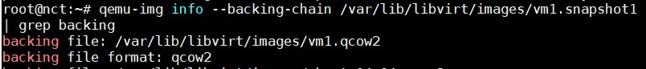
	
	- Hợp nhất ổ đĩa cũ với ỗ đĩa snapshot bằng lệnh `virsh blockpull VMname --path snap/shot/path --wait --verbose`
	
	- Xoá bỏ base image và snapshot metadata bằng câu lệnh `virsh snapshot-delete VMname snapshotname --metadata`