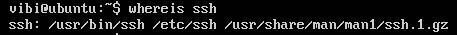
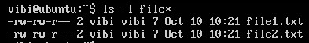
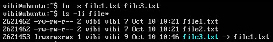

## Xác định vị trí của ứng dụng

Tuỳ thuộc vào các bản phân phối cụ thể, các chương trình và các gói phần mềm có thể được cài đặt ở các thư mục khác nhau. Nói chung là các chương trình thực thi nên đặt trong các thư mục sau:

```
/bin
/usr/bin
/sbin
/usr/sbin
/opt
```

Có một cách để tìm một chương trình là sử dụng tiện ích `which`. Ví dụ, để tìm chính xác vị trí chương trình `ssh` trong hệ thống:


Nếu như `which` không thể tìm thấy chương trình, thì `whereis` sẽ là một sự lựa chọn tốt vì nó sẽ tìm kiếm các gói trong một phạm vi rộng hơn của thư mục hệ thống:



## Truy cập thư mục

Những câu lệnh hữu dụng để truy cập thư mục:

| Câu lệnh | Kết quả |
|----------|---------|
| cd | Chuyển đến thư mục home của người dùng |
| cd .. | Chuyển tới thư mục cha của thư mục hiện hành |
| cd - | Chuyển tới thư mục vừa rời khỏi trước đó |
| cd / | Chuyển tới thư mục root (/) |

## Khám phá hệ thống tập tin

Lệnh `tree` là 1 cách tốt để có được cái nhìn tổng quát về cây hệ thống thư mục. Một số câu lệnh hữu ích:

| Câu lệnh | Kết quả |
|----------|---------|
| ls | Liệt kê nội dung thư mục hiện hành |
| ls -a | Liệt kê tất cả nội dung thư mục kể cả các tập tin, thư mục ẩn |
| tree | Hiển thị cây thư mục |
| tree -d | Chỉ hiển thị cây thư mục và bỏ qua các tập tin |

## Liên kết cứng và liên kết mềm

Lệnh `ln` sử dụng để tạo liên kết cứng hoặc liên kết mềm( được gọi là symbolic links hoặc symlinks). 2 kiểu liên kết này rất phổ biến trong các hệ điều hành UNIX-based

Sự khác biệt cơ bản của Hard links và Soft links:

- Hard links: Khi tạo 1 file mới hard links đến file cũ thì cả 2 file này sẽ cùng tham chiếu tới 1 vùng nhớ chứa địa chỉ của data, nên khi thay đổi nội dung từ 1 file thì file kia cũng sẽ đổi theo, và khi xoá file cũ đi thì file mới không bị ảnh hưởng.

- Soft links: Khi tạo 2 file soft links tới nhau thì file mới sẽ trỏ tới vùng địa chỉ của file cũ, nên khi xoá file cũ đi, file mới sẽ không thể truy cập đến dữ liệu được nữa.

#### Hard links

Giả sử đã tồn tại file1.txt, tạo hard links file2.txt

```
ln file1.txt file2.txt
```

Cả 2 file giờ đều cùng tồn tại



Thêm option `-i` ta sẽ thấy được ở cột đầu tiên là số i-node, và hai số này giống hệt nhau tức là đang cùng trỏ tới một vùng nhớ


#### Symbolic links

Symbolic links được tạo với option `-s` như sau:



Nhận thấy file3.txt không xuất hiện như 1 file thông thường mà xuất hiện là 1 điểm trỏ tới file1.txt với số inode khác. Symbolic links cực kỳ tiện lợi khi có thể dễ dàng sửa đổi để trỏ tới các điểm khác. Một cách dễ dàng để tạo shortcut ở thư mục home cho 1 đường dẫn dài đó là dùng Symbolic links.

Khác với hard links, soft links có thể trỏ tới đối tượng ở các filesystems (hoặc partitions) khác nhau mà có thể có hoặc không khả dụng thậm chí là không tồn tại. Trường hợp links không trỏ tới các đối tượng khả dụng hoặc đang tồn tại, bạn sẽ nhận được 1 liên kết treo.

Hard links rất hữu ích và tiết kiệm không gian, nhưng phải cẩn thận khi sử dụng.

