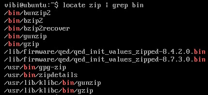
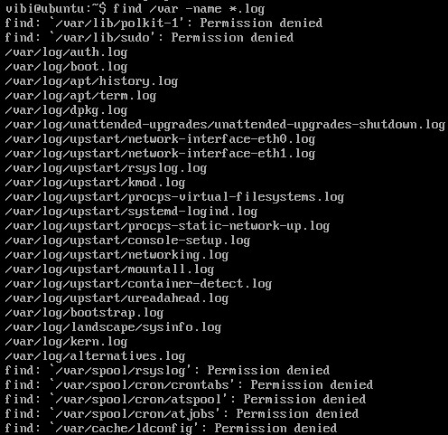
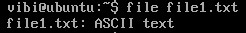

## The file Streams

Khi lệnh được thực thi, mặc định có 3 luồng file chuẩn:

- 1. Standard input or **stdin**

- 2. Standard output or **stdout**

- 3. Standard error or **stderr**

Thông thường, **stdin** là những gì nhập từ bàn phím, **stdout** và **stderr** được in lên terminal; thường thì **stderr** được chuyển hướng tới 1 file log ghi lỗi. **stdin** thường được cung cấp bởi đầu vào từ một file hoặc đầu ra của lệnh trước thông qua một đường ống. **stdout** cũng thường được chuyển hướng vào 1 file. Từ khi **stderr** là nơi các tin báo lỗi được viết, thì thường sẽ không có gì tới đó cả.

File descriptors trong Linux có các quy ước: 0 là stdin, 1 là stdout, 2 là stderr.

Chúng ta có thể chuyển hướng 3 standard filestreams nên có thể lấy input từ một file hoặc một command khác thay vì từ bàn phím, và chúng ta cũng có thể viết output và error ra file or send chúng như một input của lệnh tiếp theo. Ví dụ, có một chương trình được gọi là do_something có thể đọc stdin và viết stdout, stderr, chúng ta sẽ thay đổi input source: 

```
$ do_something < input-file
```

Nếu muốn gửi output tới file:

```
$ do_something > output-file
```

Bạn có thể pipe output của một command hoặc program khác như một input

```
$ command1 | command2 | command3
```

## Tìm kiếm file

Tiện ích `locate` thực hiện tìm kiếm thông qua cơ sở dữ liệu của file và thư mục được xây dựng trước đó trên hệ thống của bạn, matching với tất cả các mục có chưa chuỗi ký tự được chỉ định. `locate` sử dụng cơ sở dữ liệu được tạo bởi chương trình khác là `updatedb`. Đa số các hệ thống Linux chạy `updatedb` tự động mỗi ngày 1 lần. Tuy nhiên, bạn có thể update nó vào bất kì lúc nào bằng cách chạy `updatedb` từ commandline dưới quyền root.

```
sudo apt-get install -y mlocate
sudo updatedb
sudo locate zip
```

Kết quả của `locate` có thể rất dài, nên có thể sử dụng thêm `grep` để lọc.



`Wildcards` được sử dụng để search cho các filename bao gồm các ký tự đặc biệt

| Wildcards | Kết quả |
|-----------|---------|
| ? | Khớp với bất kỳ 1 ký tự đơn nào |
| * | Khớp với bất kỳ 1 chuỗi ký tự nào |
| [set] | Khớp với bất kỳ ký tự nào nằm trong tập [set] |
| [!set] | Khớp với bất kỳ ký tự nào không nằm trong tập [!set] |

`find` cực kỳ hữu dụng và thường xuyên được sử dụng trong công việc hàng ngày của quản trị viên hệ thống Linux. Ví dụ để tìm các file có phần mở rộng `.log` trong thư mục `/var` dùng lệnh:



Khi không có đối số, `find` sẽ hiển thị tất cả tập tin và thư mục con trong thư mục hiện hành.

Tuỳ chọn `-type d` để chỉ tìm các thư mục, `-type f` để chỉ tìm các file.

Để tìm kiếm và xoá tất cả các file kết thúc là `.swp`:

```
$ find -name "*.swp" -exec rm {}';'
$ find -name "*.swp" -ok rm {} \;
```

Nếu muốn sắp xếp kết quả tìm kiếm theo các thuộc tính như ngày được tạo, lần sử dụng cuối cùng,... hoặc dựa trên kích thước

- Tìm kiếm dựa trên thời gian. Tìm tất cả các file có trạng thái thay đổi lần cuối trong 3 ngày trước

```
$ find / -ctime 3
```

- Tìm kiếm dựa trên kích thước file, tìm các file có kích thước lớn hơn 10MB

```
$ find / -size +10M
```

## Manage files

Dùng các tính năng sau để xem files:

| Lệnh | Công dụng |
|------|-----------|
| cat | Dùng để xem 1 file không quá dài |
| tac | Dùng để xem file ngược, bắt đầu từ dòng cuối cùng |
| less | Dùng để xem file lớn vì cho phép phân trang |
| tail | Xem 10 dòng cuối của file, có thể thêm option -n để thay đổi số dòng muốn xem |
| head | ngược lại của tail, xem 10 dòng cuối của file |

`touch` ngoài việc tạo ra một file mới, thì `touch` còn dùng để set hoặc update các thời gian access, change và modify của files.

Set thời gian cho file với time stamp 4 p.m, March 20th (03 20 1600)

```
touch -t 03201600 <filename> 
```

`mkdir` tạo một thư mục, `rmdir` xóa một thư mục, nếu thư mục không rỗng sử dụng lệnh `rm -rf <thư muc>`. Cận thận khi dùng lệnh này với thư mục root (/)

## Compare files 

Dùng lệnh `diff` để so sánh các files và thư mục 

```
$ diff file1.txt file2.txt
```

## The file utility

`file` dùng để xác định xem 1 file là plain text, chương trình thực thi, scripts hay là một cái gì khác

