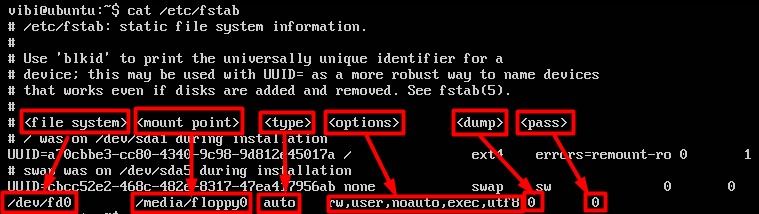
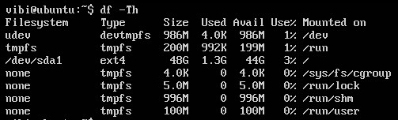

## Filesyste Structure

Trên nhiều hệ điều hành, gồm cả Linux, `filesystem` có cấu trúc hình cây. Cây này thường được miêu tả ngược, bắt đầu từ thư mục `root`, là gốc của hệ thống thư mục, biểu thị bằng `/`.

Đơn giản filesystem là các quy chuẩn về: cách thức cấp phát không gian lưu trữ cho file, quản lý thuộc tính của file, cách tổ chức sắp xếp dữ liệu trên các thiết bị sao cho việc tìm kiếm, truy cập tới dữ liệu nhanh chóng và thuận tiện.

Các định dạng mà Linux hỗ trợ:

- **ext3** , **ext4**, **btrfs**, **xfs** ( native Linux filesystems)

- **vfat**, **ntfs**, **hfs** (filesystems from other OS)

Mỗi hệ thống tập tin nằm trên 1 partition của đĩa cứng. Partitions giúp tổ chức nội dung của đĩa dựa trên loại dữ liệu nó chứa và cách nó được sử dụng. Ví dụ, các chương trình quan trọng cần để chạy hệ thống thường được giữ trong partition riêng hơn là trong partition chứa files của người dùng thông thường. Thêm nữa, các files tạm thời được tạo ra và huỷ trong quá trình hoạt động của Linux thường được giữ trong partition riêng; theo cách này, việc sử dụng toàn bộ không gian khả dụng trên 1 partition cụ thể có thể không làm ảnh hưởng đến hoạt động bình thường của hệ thống.

Trước khi bạn có thể sử dụng 1 filesystem, bạn cần phải mount nó đến filesystem tree tại 1 **mountpoint**. Đây đơn giản là 1 thư mục ( có thể trống hoặc không ) nơi mà filesystem được gán vào (mounted). Đôi khi bạn cũng cần phải tạo 1 thư mục nếu nó chưa tồn tại. Nếu bạn mount 1 filesystem vào 1 thư mục không trống, thì các nội dung có sẵn trên thư mục sẽ được che lại và không thể truy cập cho đến khi filesystem được unmounted. Vì vậy, mountpoint thường là 1 thư mục rỗng.

Khi cài đặt cần tạo ra ít nhất 2 phân vùng, một để mount root cho `\`, một cho `swap`.

- Bạn có thể  mount tự động thông qua file `/etc/fstab`, kernel sẽ đọc thông tin ở đây khi nó khởi động. Nếu sửa nội dung file này thì cần mount lại:

```
$ sudo mount -a
```

- Mount bằng tay: sử dụng câu lệnh `mount`, ví dụ gắn thư mục windows: Nếu ổ `C:` định dạng ntfs cài windows có tên /dev/sda1 muốn mount vào hệ thống Linux để sử dụng thì đầu tiên cần tạo một thư mục để gắn nó, rồi sau đó mount:

```
$ mkdir /mnt/Windows
$ mount -v -t ntfs /dev/sda1 /mnt/Windows
```

Lúc này /dev/sda1 là đường dẫn cần mount, /mnt/Windows là mountpoint, từ giờ có thể truy cập đến ổ C qua /mnt/Windows

Nếu không muốn dùng nữa thì unmount

```
$ sudo umount /mnt/Windows
hoặc
$ sudo umount /dev/sda1

#### Lưu ý: một số điểm cần lưu ý khi mount

- Các thiết bị không có mặt trong file /etc/fstab thì chỉ có root mới có thể mount được

- Người dùng bình thường chỉ có thể mount được những thiết bị có trong file /etc/fstab thôi

### The home directories

Trong bất kì hệ thống UNIX nào, mỗi user đều có thư mục home của riêng mình, thường đặt tại `/home`. Thư mục `/root` là thư mục home của user root. 

### The binary directories

Thư mục `/bin` chứa các mã nhị phân có thể thực hiện, những câu lệnh cần dùng trong single-user mode, và các lệnh cần thiết cho tất cả người dùng hệ thống như `ps`, `ls`, `cp`. Những lệnh không cần thiết cho hệ thống trong single-user mode được đặt trong thư mục `/usr/bin`, thư mục `/sbin` dùng cho mã nhị phân cần thiết liên quan đến quản trị hệ thống, như `ifconfig` và `shutdown`. Ở đây có 1 thư mục `/usr/sbin` để chứa những chương trình ít cần thiết cho quản trị viên hệ thống. Tất cả thư mục binary đều năm trong root partition. Đôi khi `/usr` là 1 filesystem riêng biệt có thể không khả dụng trong single-user mode. Đó là lí do vì sao các lệnh cần thiết được tách ra khỏi những lệnh không cần thiết. Tuy nhiên, trong 1 vài hệ thống Linux hiện đại nhất thì những sự phân biệt này được xem là lỗi thời, và `/usr/bin` và `/bin` thực sự chỉ được kết nối với nhau như là `/usr/sbin` và `/sbin`.

### The device directories

Thư mục `/dev` chứa các device nodes, 1 loại pseudo-file được sử dụng bởi hầu hết các hardware và software devices, trừ các network devices. 

```
/dev/sda1
/dev/lp1
/dev/dvd1
```

### The variable directory

`/var` bao gồm các file có thể thay đổi size và nội dung khi hệ thống đang chạy, một số thư mục sau:

- System log files: `/var/log`

- Packages files: `/var/lib`

- Print queues: `/var/spool`

- Temp files: `/var/tmp`

- FTP home directory: `/var/ftp`

- Web Server directory: `/var/www`

Thư mục `/var` có thể được đặt trên một patition riêng vì vậy khi không gian lưu trữ hoặc kích thước file tăng có thể không ảnh hưởng đến hệ thống.

### File System Table

File `etc/fstab` là file dạng văn bản (plain text) gồm:

- Đường dẫn đến file đại diện cho các thiết bị
- Mount point: cho biết các thiết bị được moun vào thư mục nào
- Các tùy chọn: chỉ ra các thiết bị được mount như thế nào...

Nội dung file `fstab`



- `Filesystem`: Loại thiết bị phân vùng, cho biết đường dẫn tới thiết bị đó

- `Mountpoint`: Đường dẫn của mountpoint

- `Type`: Kiểu filesystem. `auto` có nghĩa là không phải 1 loại filesystem, hệ thống sẽ tự động nhận diện khi thiết bị được mount

- `Options`: Các tuỳ chọn mount

| Options | Meaning |
|---------|---------|
| auto | tự động mount thiết bị khi máy tính khởi động |
| noauto | không tự động mount, nếu muốn sử dụng thiết bị thì sau khi khởi động vào hệ thống bạn cần chạy lệnh mount |
| user | cho phép người dùng thông thường được quyền mount |
| nouser | chỉ có người dùng root mới được quyền mount |
| exec | cho phép chạy các file nhị phân trên thiết bị |
| noexec | không cho phép chạy các file nhị phân trên thiết bị |
| ro | chỉ cho phép quyền đọc trên thiết bị |
| rw | cho phép quyền đọc và ghi trên thiết bị |
| sync | thao tác nhập xuất trên filesystem được đồng bộ hoá |
| async | thao tác nhập xuất trên filesystem diễn ra không đồng bộ |
| defaults | tương đương với tập các tuỳ chọn rw, suid, dev, exec, auto, nouser, async |

- `dump`: tuỳ chọn sao lưu cho chương trình dump, công cụ sao lưu filesystem. `0` là không sao lưu, `1` là thực hiện sao lưu

- `pass`: tuỳ chọn cho chương trình fsck, công cụ dò lỗi trên filesystem. `0` là không kiểm tra, `1` là thực hiện kiểm tra.

Command `df -Th` hiển thị thông tin về các filesystem được mount 


