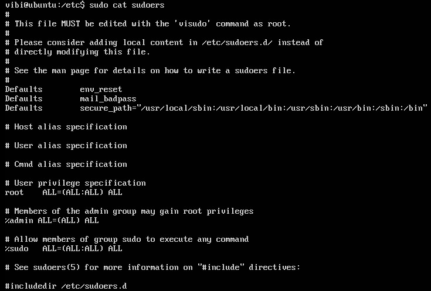

## File Permissions

Trong Unix và Linux, mỗi file đều có một user sở hữu gọi là owner. Mỗi file cũng sẽ có một group sở hữu, những người trong group này có các quyền nhất định: read, write và execute

| Command | Result | 
|---------|--------|
| chown | Thay đổi người sở hữu file và thư mục |
| chgrp | Thay đổi group sở hữu |
| chmod | Thay đổi quyền trên file hoặc thư mục |

Files có 3 kiểu permission: read(r), write(w), execute(x). Chúng thường được biểu diễn theo thứ tự `rwx`. Các permission này ảnh hưởng tới các nhóm của người sở hữu: user(u), group(g), other(o).

### Lệnh `chmod`

```
chmod [option] [permission] [Tên file/thư mục]
```

Phần `permission` có 3 kiểu:

#### Kiểu ký tự

| Permission | Name | Note |
|------------|------|------|
| r | read | owner có quyền đọc file |
| w | write | owner có quyền sửa và xoá file | 
| x | execute | owner có quyền thực thi đối với file, với thư mục thì được phép sử dụng lệnh `cd` để truy cập |
| s | setuid hoặc setgid | Tất cả các file và thư mục con sẽ được kế thừa group owner |
| t | sticky bit | Chỉ có owner mới có thể rename và xoá file trong tất cả các file của thư mục |
| - | Không set quyền | |

Với quyền execute(x)

| | Không có suid | có suid |
|-|---------------|---------|
| Không có execute | - | S |
| Có execute | x | s |

Ví dụ: `o + rws` cho phép user sở hữu full quyền đồng thời set suid

#### Kiểu ugo 

| Operator | |
|----------|-|
| + | Thêm quyền |
| - | Bỏ quyền |
| = | Gán quyền |

| Owner | |
|-------|-|
| a | u + g + o |
| u | user owner |
| g | group owner |
| o | other user | 

Ví dụ: 

```
chmod a=-, u+rwx, g+rwsx, u-w
```

Lệnh trên có ý nghĩa: Bỏ toàn bộ quyền của cả 3 nhóm, sau đó thêm quyền rwx cho user sở hữu, thêm quyền rwsx cho group sở hữu, loại bỏ quyền w của các user khác.

#### Kiểu số

| Permission | Binary | Number | 
|------------|--------|--------|
| --- | 000 | 0 |
| --x | 001 | 1 |
| -w- | 010 | 2 |
| -wx | 011 | 3 |
| r-- | 100 | 4 | 
| r-x | 101 | 5 |
| rw- | 110 | 6 |
| rwx | 111 | 7 |

Ngoài ra người ta còn sử dụng thêm 1 bit thứ 4 để biểu diễn suid, sgid và sticky bit

| Permission | Number |
|------------|--------|
| suid | 4000 |
| sgid | 2000 |
| sticky | 1000| 

Mặc định khi set permission cho thư mục thì sẽ có tính kế thừa cho các file và thư mục con 

### Group sudo 

File cấu hình sudo nằm ở: 

```
/etc/sudoers
/etc/sudoers.d/
```



Dòng `%sudo ALL=(ALL:ALL) ALL` có nghĩa là group sudo có quyền thực thi tất cả các lệnh. Muốn user có quyền của nhóm sudo thì thêm vào nhóm này. Ví dụ thêm group uet để các thành viên đều có quyền thực thi tất cả các lệnh thì thêm dòng `%uet ALL=(ALL:ALL) ALL` 

Lệnh tạo 1 group: `groupadd uet` sau đó thêm user vibi vào group này: `usermod -G uet vibi`

Kiểm tra xem mình đã trong group chưa: `groups vibi` 