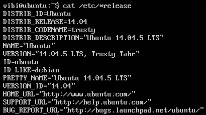
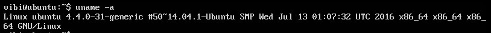
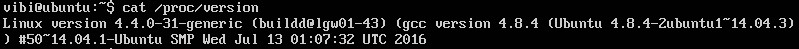
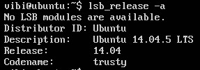

## Command check system info

Một số command để check các thông tin của hệ điều hành

- Command `cat /etc/*release`



Lệnh này sẽ cho chúng ta thông tin về tên hệ điều hành, phiên bản và distro đang dùng và một số các thông tin trợ giúp khác.

- Command `uname -a` dùng cho cả Ubuntu với CentOS



Lệnh này show ra các thông tin của kernel như phiên bản kernel, 32bit hay 64bit.

Có thể dùng các option khác để show ra từng thông tin một

```
-a, --all                print all information, in the following order, except omit -p and -i if unknown:
-s, --kernel-name        print the kernel name
-n, --nodename           print the network node hostname
-r, --kernel-release     print the kernel release
-v, --kernel-version     print the kernel version
-m, --machine            print the machine hardware name
-p, --processor          print the processor type (non-portable)
-i, --hardware-platform  print the hardware platform (non-portable)
-o, --operating-system   print the operating system
    --help     display this help and exit
    --version  output version information and exit
```

- Command `cat /proc/version`: cũng kiểm tra thông tin kernel



- Một số các thông tin khác chứa trong `/proc`, các lệnh cơ bản
	- `/proc/meminfo`: Ram info 
	- `/proc/cpuinfo`: thông tin CPU
	- `/proc/mounts`: xem trạng thái tất cả các file system đã mount
	- `/proc/partitions`: thông tin các phân vùng
	
- Command `lsb_release -a` kiểm tra phiên bản hệ điều hành distro của nó không dùng được trên CentOS



- Command `sudo lspci` liệt kê các thiết bị PCI trong máy và command `sudo lsusb` liệt kê tất cả các thiết bị usb

- Command `lscpu` hiển thị thông tin về CPU

- Command `free -m` xem thông tin RAM và SWAP

- Command `fdisk -l` xem các thông tin phân vùng ổ cứng

- Command `df -h` hiển thị các thông tin về không gian sử dụng đĩa

- Command `du -sh` xem dung lượng của thư mục hiện hành, `du` để xem dung lượng của tất cả các thư mục con bên trong.