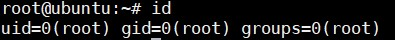
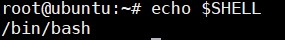
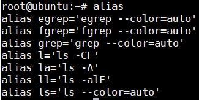

## User and Groups

Linux là một hệ thống multiuser, cho phép nhiều người dùng log on cùng một lúc.

Command `who` liệt kê ra các user hiện tại đang đăng nhập. Để xác định mình đang dùng user nào thì dùng command `whoami`

Linux sử dụng các nhóm để tổ chức user. Groups bao gồm các tài khoản với các quyền được chia sẻ. Việc quản lý các thành viên của group sẽ được thông qua file `/etc/group`, file này ghi lại danh sách các nhóm và các thành viên của nhóm. Mặc định, mỗi user sẽ có một default group hoặc primary group. Khi các user log in, user sẽ được thiết lập làm thành viên của group chính của họ và tất cả các thành viên đều có các quyền hạn giống nhau. Permission trên các file và thư mục có thể được sửa đổi theo cấp group.

Tất cả các user Linux đều được gán một user ID duy nhất là uid, và một hoặc nhiều group ID gọi là gid, bao gồm cả tên mặc định giống với user người dùng. Trong lịch sử, các bản phân phối dựa trên Github đều bắt đầu từ 500. Các bản phân phối khác bắt đầu từ 1000. Các thông số này được lưu ở file `/etc/passwd` và `/etc/group`.

Command để chuyển đổi group: `newgrp <tên group>`

Chỉ có user root mới có quyền thêm và xoá các user và các group. Muốn thêm user mới sử dụng lệnh `useradd` và xoá user dùng `userdel`. `useradd` sẽ đồng thời tạo ra user mới và thư mục `home` mặc định cho user thêm vào đó các file cơ bản được thiết lập mặc định shell là `/bin/bash`

Khi xoá user `userdel` sử dụng thêm tuỳ chọn `-r` để xoá cả thư mục `home` của user đó.

`id` cung cấp thông tin về người dùng hiện tại.



Đổi password với lệnh `passwd` 

Thêm mới group và xoá group

```
groupadd newgroup
groupdel newgroup
```

Thêm user vào group

```
useradd newuser 
groupadd newgroup
usermod -G newgroup newuser 
```

Xem user thuộc các nhóm nào 

```
groups newuser 
```

Command `groupmod` có thể được dùng để thay đổi các thuộc tính của group như gid hoặc name 

#### Root User

Root là tài khoản có toàn quyền trên hệ thống. Các hệ thống khác thường gọi là administrator account, Linux thường gọi là Superuser Account. Phải thật cẩn thận khi cấp quyền truy cập root cho các user. Sử dụng `su` để chuyển đổi giữa các user.

#### Startup Files 

Trong Linux, chương trình dòng lệnh shell, nhìn chung bash sẽ sử dụng một hoặc nhiều file để cấu hình môi trường. File trong `/etc` xác định các cài đặt chung cho tất cả user khi khởi tạo thư mục home của user có thể bao gồm hoặc ghi đè các cài đặt chung.

Startup files có thể làm bất cứ điều gì người dùng muốn trong mỗi câu lệnh shell như:

- Tuỳ chọn ghi chú của người dùng

- Định nghĩa shortcuts và aliases dòng lệnh

- Cài đặt các text editor mặc định

- Cài đặt đường dẫn, nơi mà có thể tìm thấy chương trình thực thi 

Khi lần đầu log in vào Linux, `/etc/profile` sẽ được đọc và xác định, sau đó các tệp sau sẽ được tìm kiếm lần lượt:

- `~/.bash_profile`

- `~/.bash_login`

- `~/.profile` 

#### Environment variables

Các biến môi trường được đặt tên đơn giản theo số lượng các giá trị cụ thể và được hiểu bởi command shell, như `bash`. Một số các thông số được thiết lập trước bởi hệ thống, và một số khác được thiết lập bởi user bằng command line hoặc trong khi khởi động. Một biến môi trường thực sự không qua một chuỗi ký tự chứa thông tin được sử dụng bởi một hoặc nhiều ứng dụng. Có một số cách để xem các giá trị của các biến môi trường hiện tại đang được thiết lập, sử dụng command `set`, `env`, `export`.

Mặc định, các biến được tạo ra trong script chỉ có sẵn cho shell hiện đang chạy. Tất cả các chương trình con (sub-shell) sẽ không có quyền truy cập vào các biến đã được thiết lập hoặc sửa đổi. Cho phép các chương trình con được xem các giá trị, yêu cầu sử dụng lệnh `export` 

| Task | Command |
|------|---------|
| Hiển thị giá trị biến môi trường | echo $SHELL | 
| Gán giá trị mới | export VAR=value |
| Thêm giá trị mới vĩnh viễn | add the line export to VAR=value to ~/.bashrc | 

`HOME` là biến môi trường đại diện cho thư mục `home`. Command `cd` sẽ mặc định về thư mục home.

Dấu `~` là viết tắt của `$HOME` 

Biến môi trường `PATH` là một danh sách được sắp xếp theo thứ tự các thư mục được quét khi một lệnh được đưa ra để tìm chương trình hoặc tệp lệnh thích hợp để chạy. Mỗi thư mục trong đường dẫn được phân cách bằng dấu hai chấm. Tên thư mục trống cho biết thư mục hiện tại tại bất kì thời điểm nào.

Biến môi trường `PS` được sử dụng để tuỳ chọn các chuỗi ghi chú của bạn trên cửa sổ terminal để hiển thị ra thông tin bạn muốn. `PS1` là biến prompt chính để điều khiển command line prompt trông như thế nào. Các ký tự đặc biệt trong PS1:

| Character | Usage |
|-----------|-------|
| \u | Username |
| \h | Hostname |
| \w | Current working directory | 
| ! | History number of this command |
| \d | Date | 

Biến môi trường `SHELL` trỏ tới command shell mặc định của user ( chương trình đang xử lý bất cứ điều gì bạn gõ trên cửa sổ lệnh, thường là bash) và chứa tên đường dẫn đầy đủ đến shell.



#### Command history 

Bash sẽ lưu trữ tất cả các dòng lệnh đã gõ trong bộ đệm history, bạn có thể gọi lại các lệnh trước đó bằng cách sử dụng phím `up` và `down`. Để xem tất cả các lệnh đó dùng command `history`. Danh sách các lệnh được hiển thị với lệnh gần đây nhất sẽ xuất hiện từ cuối lên. Thông tin này được lưu trữ trong file `~/.bash_history`. Một số biến môi trường có thể sử dụng để lấy thông tin này:

| Variable | Usage |
|----------|-------|
| HISTFILE | stores the location of the history file |
| HISTFILESIZE | stores the maximum number of lines in the history file |
| HISTSIZE | stores the maximum number of the lines in the history file for the current session | 

Một số cú pháp được sử dụng để sử dụng các lệnh trước đó:

| Syntax | Usage |
|--------|-------|
| !! | Execute the previous command |
| ! | Start a history substitution |
| !$ | Refer to the last argument in a line |
| !n | Refer to the n-th command line |
| !string | Refer to the most recent command starting with string |

#### Creating Aliases

Tuỳ chỉnh command có thể được tạo để thay đổi các hành vi đã tồn tại sẵn bằng `aliases`. Thường thì aliases được đặt ở `~/.bashrc` nên chúng sẵn sàng cho bất kỳ một command shell nào mà bạn tạo. Command `alias` không đối số thì sẽ liệt kê các aliases hiện đang được định nghĩa.


