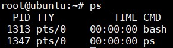
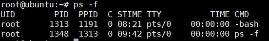
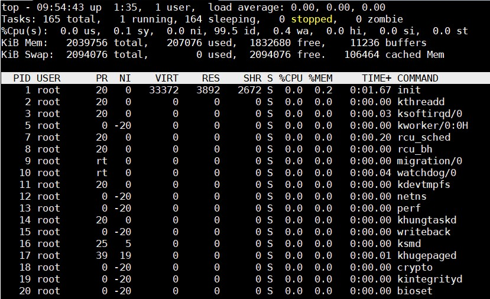
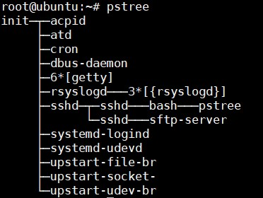

## Linux processes

Một `processes` đơn giản là một thể hiện của một hay nhiều luồng (threads) thực hiện trên cùng một máy.

Hệ điều hành sẽ theo dõi các tiến trình thông qua một ID có 5 chữ số mà được biết như là pid hay processes ID. Mỗi tiến trình có duy nhất 1 pid.

Tại cùng một lúc không thể có 2 tiến trình có cùng pid

Khi bắt đầu một tiến trình (đơn giản là chạy 1 lệnh), có 2 cách để chạy nó:

- Foreground Process: Mặc định khi bắt đầu các tiến trình là Foreground, nhận input từ bàn phím và output tới màn hình. Trong khi chương trình chạy thì không thể chạy bất cứ tiến trình nào khác.

- Background Process: chạy mà không kết nối với bàn phím của bạn. Lợi thế là khi đó đang chạy tiến trình background vẫn có chạy các tiến trình khác.

Để bắt đầu một tiến trình Background thì thêm dấu `&` vào cuối câu lệnh. Ví dụ `ls &`

ở đây lệnh `ls` muốn có một đầu vào, nó tiến vào trạng thái dừng tới khi bạn chuyển nó vào trong foreground.

Liệt kê các tiến trình đang chạy 





Trong đó: 

| Thông số | Miêu tả |
|----------|---------|
| UID | ID user sở hữu tiến trình |
| PID | Process ID |
| PPID | Process ID gốc (ID của tiến trình bắt đầu nó) |
| C | CPU sử dụng của tiến trình |
| STIME | Thời gian bắt đầu tiến trình |
| TTY | Kiểu terminal liên kết với tiến trình | 
| TIME | Thời gian CPU bị sử dụng bởi tiến trình | 
| CMD | Lệnh mà bắt đầu tiến trình này |

Một số command với `ps`:

- `ps -ef`: Liệt kê process đang chạy bây giờ.

- `ps -f -u user1,user2`: Hiển thị tất cả process dựa trên UID.

- `ps -f -pid ID`: Hiển thị tất cả processes dựa trên process ID. Điền PID hoặc PPID thay vào chỗ ID. Có thể được dùng với PPID để lọc process dựa trên parent ID. 

- `ps -C command/name`: Lọc processes dựa trên tên của nó hoặc command.

- `ps aux -sort=-pcpu,+pmem`: Hiển thị process đang dùng nhiều tài nguyên nhất của CPU.

- `ps -e -o pid,uname,pcpu,pmem,comm`: Được dùng để lọc column được chỉ định.

- `ps -e -o pid,comm,etime`: Hiển thị thời gian đã được dùng của process.

Dừng tiến trình

```
kill <pid>
hoặc
killall <pname>
```

Nếu tiến trình này quá cứng thì sử dụng `kill -p <pid>`

### Command `top` 

Lệnh `top` hiển thị các thông tin để có thể giám sát các thông số CPU, RAM,... các tiến trình đang hoạt động trên cùng hệ thống.



Ý nghĩa các thông tin của lệnh top xem tại [đây](https://github.com/doedoe12/Internship/blob/master/Linux/Command_meaning.md)

Command `pstree` hiển thị các tiến trình đang chạy trên hệ thống dưới dạng một sơ đồ cây thể hiện mối quan hệ của các tiến trình con và tiến trình cha cùng toàn bộ các tiến trình khác mà nó tạo ra. Các luồng được thể hiện bằng dấu ngoặc nhọn



### Scheduling processes

Lệnh `at` được sử dụng để thực thi 1 chương trình được chỉ định thời gian cụ thể, cần cài đặt `atd` để sử dụng. Trên Ubuntu 16 đã được cài đặt mặc định.

Lệnh `atq` được sử dụng để liệt kê danh sách các job đang được đặt lịch bởi command `at`

Tiện ích `cron` là một chương trình lập lịch dựa trên thời gian. Cron được định hướng bởi một file cấu hình là `/etc/crontab` chứa các lệnh shell khác nhau cần chạy vào đúng thời điểm đã được lên lịch. Mỗi dòng trong file này lại đại diện cho một công việc. Lệnh `crontab -e` sẽ mở crontab editor để chỉnh sửa hoặc thêm các jobs mới. Mỗi dòng sẽ gồm 6 dòng.

- MIN minutes 0-59 

- HOUR Hour field 0-23

- DOM Day of month 1-31

- MON Month field 1-12

- DOW Day of week 0-6 (0 = Chủ nhật)

- CMD Command bất kỳ một command nào được thực thi 

Ví dụ: 

```
* * * * * /usr/local/bin/execute/this/script.sh
```

Lệnh trên nghĩa là thực hiện lệnh mỗi phút 1 lần.

```
30 08 10 06 * /home/sysadmin/full-backup
```

Đặt lịch cho full-backup lúc 8h30 ngày 10 tháng 6 không quan tâm là ngày thứ mấy.

### Delaying process

Khi có một công việc nào đó cần trì hoãn hoặc tạm dừng thì ta có thể sử dụng lệnh `sleep` sẽ dùng lệnh thực thi trong một thời gian cụ thể rồi chạy tiếp.

```
$ cat script.sh
#!/bin/bash
echo "The system will go to sleep fo 30 seconds ..."
sleep 15
echo "The system is awaked"
$ chmod u+x script.sh
$ ./script.sh
The system will go to sleep fo 30 seconds ...
The system is awaked
```

Tổng quan về sự chuyển đổi giữa các tiến trình 

