## Logical Volume Manager

### 1. Overview

#### 1.1 Khái niệm

LVM (Logical Volume Manager) là một kỹ thuật cho phép tạo ra các không gian ổ đĩa ảo từ ổ đĩa cứng để có thể thay đổi kích thước dễ dàng hơn.

#### 1.2 Vai trò

LVM giúp nới rộng hoặc thu hẹp không gian ổ đĩa mà không cần phải chia lại partition trên đĩa cứng, không ảnh hưởng đến hệ thống và các dịch vụ đang chạy.

LVM có thể gom nhiều ổ đĩa cứng thành một ổ ảo, giúp tăng kích thước lưu trữ.

### 2. Architecture and component

#### 2.1 Các thành phần 

Bố cục cơ bản LVM trông giống như sau:

- Physical Volume(s): Là những ổ cứng vật lý hoặc các partition trên nó như: /dev/sdb1, /dev/sdc1, /dev/sdd1,...

- Volume Group(s): Có thể coi đây là ổ đĩa ảo, bao gồm nhiều các Physical Volume, fileserver

- Logical Volume(s): Có thể coi đây là các phân vùng ảo trên ổ đĩa ảo, có thể thay đổi kích thước tuỳ ý: /dev/fileserver/share, /dev/fileserver/backup, /dev/fileserver/media

#### 2.2 Kiến trúc 

**Partitions** là các phân vùng của Hard drives, mỗi Hard drives có 4 partition, trong đó partition bao gồm 2 loại là primary partition và extended partition.

- Primary partition: là phân vùng chính, có thể khởi động, mỗi đĩa cứng có thể có tối đa 4 phân vùng này

- Extended partition: Phân vùng mở rộng, có thể tạo ra những vùng luân lý

**Physical Volume**: Là một cách gọi khác của partition trong kỹ thuật LVM, nó là những thành phần cơ bản được sử dụng bởi LVM. Một Physical Volume không thể mở rộng ra ngoài phạm vi một ổ đĩa.

**Logical Volume Group**: Nhiều Physical Volume trên những ổ đĩa khác nhau được kết hợp lại thành một Logical Volume Group, với LVM Logical Volume Group được xem như một ổ đĩa ảo.

**Logical Volumes**: Logical Volume Group được chia nhỏ thành nhiều Logical Volume, mỗi Logical Volume có ý nghĩa tương tự như partition. Nó được dùng cho các mount point và được format với những định dạng khác nhau như ext2,ext3,... Khi dung lượng của Logical Volume được sử dụng hết ta có thể đưa thêm ổ đĩa mới bổ sung cho Logical Volume Group và do đó tăng được dung lượng của Logical Volume.

**Physic Extent**: Là một đại lượng thể hiện một khối dữ liệu dùng làm đơn vị tính dung lượng của Logical Volume

### 3. Cơ chế hoạt động 

Bạn có một hoặc nhiều Physical Volumes trên nhiều disk, từ các physical volume này, bạn có thể gom lại thành một hoặc nhiều các volume groups, mỗi volume group có thể chia ra làm một hay nhiều các logical volume.

Nếu bạn sử dụng nhiều physical volume thì mỗi logical volume có thể lớn hơn một physical volume, nhưng tất nhiên tổng kích thước của logical volume không thể vượt quá tổng kích thước của physical volume.

LVM giúp bạn phân bố không gian ổ đĩa hợp lý hơn, khi có bất kỳ phân vùng nào không dùng đến thì có thể dể dàng ghép nó vào phân vùng đang cần mở rộng. Bạn có thể thay đổi kích thước bất cứ khi nào cần.

Với LVM, một ổ cứng, một tập các ổ cứng hay các partition khác nhau trên cùng một ổ cứng được phân bổ cho một hay nhiều physical volume. Physical volume có thể được đặt trên các block devices khác, các mà có thể nằm trên nhiều disk. Các physical volume này sẽ kết hợp thành logical volume ngoại trừ partition `/boot`.

`/boot` không thể nằm trong logical volume group được bởi vì boot loader không thể đọc nó. Nếu partition `root` nằm trên logical volume thì hãy tạo một partition riêng cho `/boot` mà không phải là một phần của volume group.

Bởi vì physical volume không thể mở rộng trên nhiều ổ driver nên để mở rộng nhiều driver thì hãy tạo một hoặc nhiều physical volume trên một drive.

Volume group có thể chia làm các logical volume để làm các mount point như là `/home` và `root` và các loại file system như ext2 và ext3. Khi các partition full dung lượng, không gian trống trong volume group có thể được thêm vào các logical volume để tăng dung lượng cho partition. Khi có ổ cứng mới được lắp vào hệ thông, nó có thể được thêm vào volume group và tăng kích thước cho logical volumes.

### 4. Ưu nhược điểm

#### 4.1 Ưu điểm

- Có thể gom nhiều đĩa cứng vật lý lại thành một đĩa ảo dung lượng lớn.

- Có thể tạo ra các vùng dung lượng lớn nhỏ tuỳ ý.

- Có thể thay đổi các vùng dung lượng đó dễ dàng, linh hoạt mà không cần format lại ổ đĩa.

#### 4.2 Nhược điểm 

- Các bước thiết lập phức tạp, khó khăn hơn.

- Càng gắn nhiều đĩa cứng và thiết lập càng nhiều LVM thì hệ thống khởi động càng lâu.

- Khả năng mất dữ liệu khi một trong số các đĩa cứng vật lý bị hỏng.

- Windows không thể nhận ra vùng dữ liệu của LVM. Nếu bạn Dual-boot Windows sẽ không thể truy cập dữ liệu chứa trong LVM.

### Lab LVM

Khi gắn thêm một ổ cứng SCSI 20GB và thêm vào volume group

- Sử dụng `fdisk -l` để liệt kê các ổ đĩa đang có 

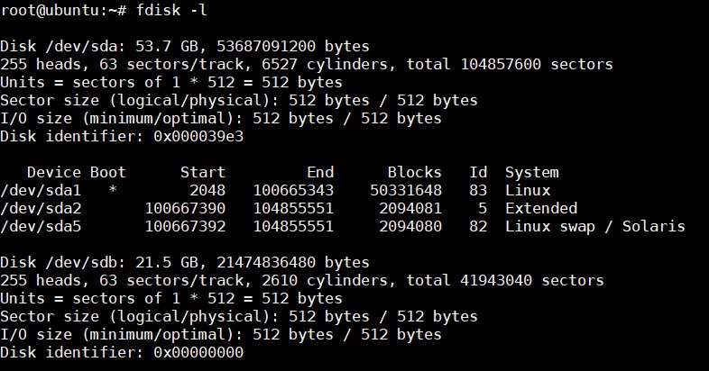

- Dùng lệnh `ls /dev/sd*` để liệt kê các ổ đĩa bắt đầu bằng `sd`

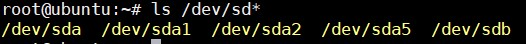

Ở đây sẽ thấy có một ổ `sdb` mới được gắn vào và chưa nằm trong logical volume

#### Tạo partition

Dùng lệnh `fdisk /dev/sdb` và gõ `m` để hiển thị trợ giúp. Để add thêm partition mới chọn `n`, để thêm partition extended chọn `e`, để thêm partition primary chọn `p`.

Tại `First sector` để mặc định, `Last sector` chọn +1G để partition tạo ra có dung lượng 1GB

Chọn `w` để lưu và thoát

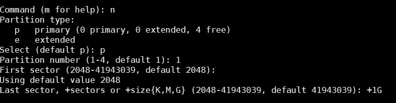

Tiếp theo thay đổi định dạng partition mới tạo thành LVM với lệnh `fdish /dev/sdb`, chọn `t` để thay đổi định dạng partition và chọn 8e để đổi thành LVM

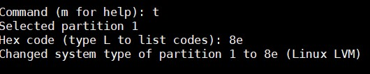

#### Tạo Logical Volume trên LVM

Dùng lệnh `lsblk` để kiểm tra các phân vùng ổ cứng 

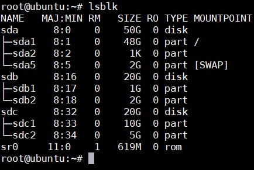

Tạo Physical Volume: Dùng lệnh `pvcreate` cho các partition

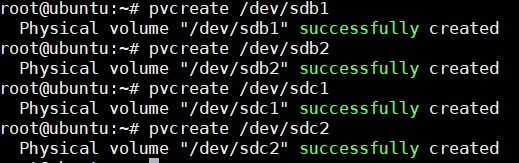

Dùng lệnh `pvs` hoặc `pvdisplay` để kiểm tra các Physical Volume.

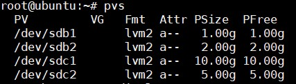

Tạo Volume Group với tên vg-demo1

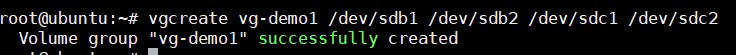

Dùng lệnh `vgs` hoặc `vgdisplay` để kiểm tra 

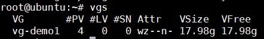

#### Tạo Logical Volume từ Volume Group

Để tạo ra một Logical Volume tên là lv-demo1 có dung lượng là 1GB trong group vg-demo1 sử dụng lệnh:

```
lvcreate -L 1G -n lv-demo1 vg-demo1 
```

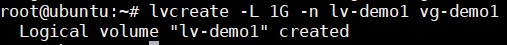

Dùng lệnh `lvs` hoặc `lvdisplay` để kiểm tra

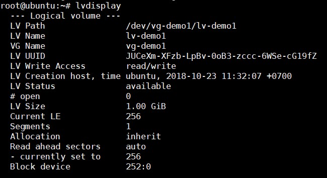

Định dạng Logical Volume: Để format các Logic Volume thành các định dạng như ext2, ext3, ext4 ta làm như sau:

```
mkfs -t ext4 /dev/vg-demo1/lv-demo1
```

Mount và sử dụng: Tạo một thư mục để mount Logical Volume đã tạo vào. Sau đó tiến hành mount logical volume. Lưu ý đây là kiểu mount mềm, sẽ bị mất nếu máy khởi động lại. Để có thể sử dụng ngay cả khi reboot máy cần phải mount cứng.

```
mkdir demo1
mount /dev/vg-demo1/lv-demo1 demo1 
```

Kiểm tra lại sử dụng `df -h`

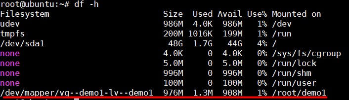

#### Thay đổi dung lượng LVM

Trước khi thay đổi dung lượng thì nên kiểm tra lại một lần xem trạng thái hiện tại có cho phép thay đổi không. `VG Status` đang ở trạng thái `resizeable` là cho phép thay đổi.

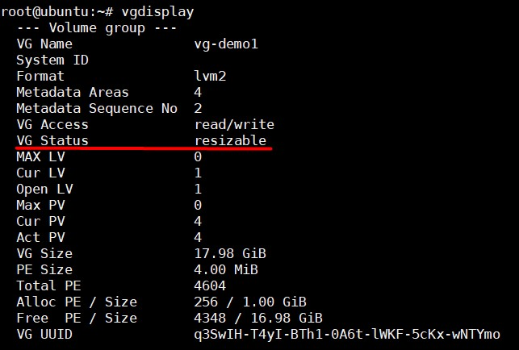

- Để tăng kích thước Logical Volume thêm 50MB dùng lệnh:

```
lvextend -L +50M /dev/vg-demo1/lv-demo1
```

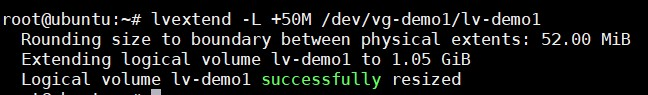

- Sau khi tăng kích thước cho Logical Volume thì kích thước Logical Volume đã được tăng nhưng file system trên Volume này vẫn chưa thay đổi, phải sử dụng thêm lệnh sau:

```
resize2fs /dev/vg-demo1/lv-demo1
# Or
xfs_growfs /dev/vg-demo1/lv-demo1
```

- Để giảm kích thước đầu tiên cần phải unmount trước, kiểm tra lại file system xem còn dung lượng không rồi thực hiện thay đổi:

```
mkdir /dump
mv /root/demo1/* /dump/
umount /root/demo1
e2fsck -ff /dev/vg-demo1/lv-demo1 
lvreduce -L 20M /dev/vg-demo1/lv-demo1
mkfs.ext4 /dev/vg-demo1/lv-demo1
```

#### Thay đổi dung lượng của Volume Group

- Khi muốn tăng kích thước của Volume Group, bạn cần có các partition sẵn sàng để thêm vào, sau đó dùng lệnh sau để thêm partition `/dev/sdb3` vào group:

```
vgextend /dev/vg-demo1 /dev/sdb3 
```

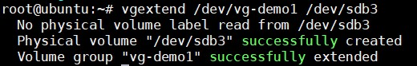

- Giảm dung lượng 

```
vgreduce /dev/vg-demo1 /dev/sdb3 
```


- Kiểm tra dung lượng Volume Group `vgs` 

- Kiểm tra dung lượng Logical Volume `lvs`

#### Xoá một volume

- Để xoá một logical volume, trước tiên unmount, sau đó mới xoá:

```
umount /dev/vg-demo1/lv-demo1
lvremove /dev/vg-demo1/lv-demo1
```

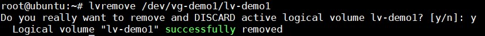

- Để xoá 1 Volume Group, trước tiên phải xoá các Logical Volume mà nó quản lý trước

```
vgremove /dev/vg-demo1
```

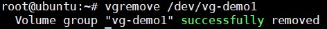

- Để xoá các Physical Volume, cần xoá các Volume Group mà đang chứa nó trước rồi mới xoá được bằng lệnh sau:

```
pvremove /dev/sdb1 
pvremove /dev/sdb2
pvremove /dev/sdc1
pvremove /dev/sdc2
```
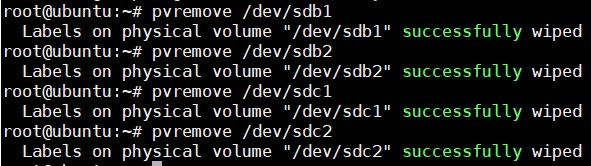

Kiểm tra lại với câu lệnh `lvmdiskscan` sẽ cho biết partition nào đang là LVM physical volume.

#### Đổi tên 

- Đổi tên một Volume Group

```
vgrename vg-demo1 vg-demo2
```

### Các kiểu ghi dữ liệu của LVM

#### Linear 

Là một hình thức ghi đĩa mặc định trên LVM, đọc ghi từng ổ đĩa Logical Volume một, đầy ổ này mới ghi tiếp sang ổ tiếp theo.

- Ưu điểm: Do lưu dữ liệu lần lượt lên từng ổ đĩa nên các ổ chưa sử dụng sẽ có tuổi thọ cao hơn, năng lượng dành cho việc ghi đĩa thấp hơn.

- Nhược điểm: Ghi từng ổ nên tốc độ đọc ghi chỉ dừng ở maxspeed của ổ đĩa 

Câu lệnh để tạo Logical Volume kiểu Linear:

```
lvcreate -L <dung lượng muốn tạo> -n <tên lv> <tên vg>
```

##### Kiểm tra kiểu ghi dữ liệu Linear 

- Tạo một Volume Group tên là vg-linear và tạo Logical Volume tên lv-linear

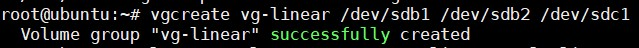

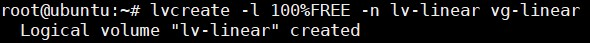

- Kiểm tra kiểu ghi dữ liệu 

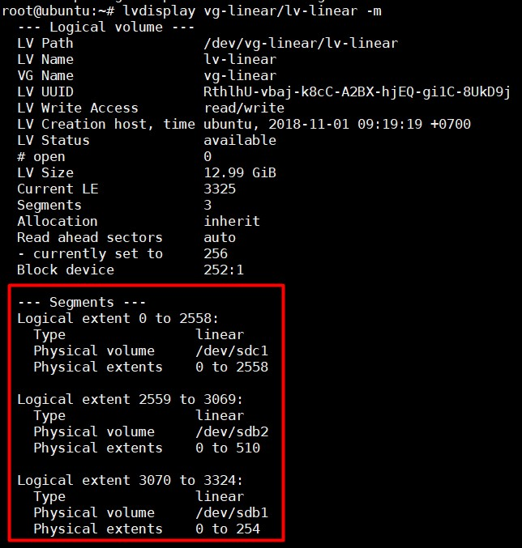

Nhìn vào hình có thể thấy rằng dữ liệu sẽ được ghi vào Physical Volume `sdc1` đầu tiên, đến khi `sdc1` hết dung lượng sẽ chuyển sang ghi lên `sdb2` và cuối cùng là `sdb1`.

#### Striped

Là hình thức ghi đọc/ghi dữ liệu lên tất cả các ổ đĩa cùng một lúc

- Ưu điểm: Tốc độ đọc ghi cao hơn nhiều lần so với Linear 

- Nhược điểm: Khi muốn add thêm ổ cứng, nếu ban đầu có 2 ổ thì cần thêm 2 ổ nữa mới mở rộng dung lượng của Logical Volume được. Tuổi thọ của các ổ đĩa không cao bằng Linear. Tiêu tốn năng lượng hơn.

Câu lệnh tạo Logical Volume kiểu Striped:

```
lvcreate -L <dung lượng> --type striped -i <số lượng ổ cứng> -n <tên lv> <tên vg>
```

##### Kiểm tra kiểu ghi dữ liệu Striped

- Tạo một Volume Group tên là vg-striped và Logical Volume lv-striped 

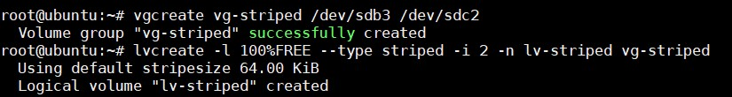

- Kiểm tra 

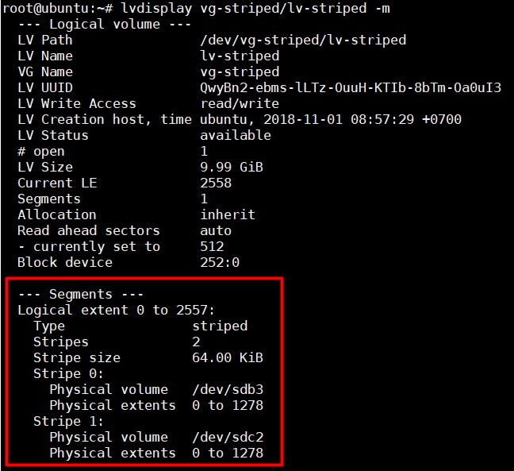

Nhìn hình có thể thấy, dữ liệu sẽ được ghi đều lên cả 2 Physical Volume `sdb3` và `sdc2`
