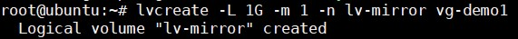
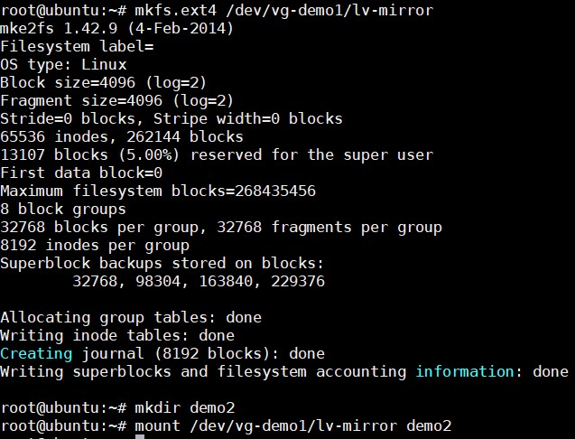
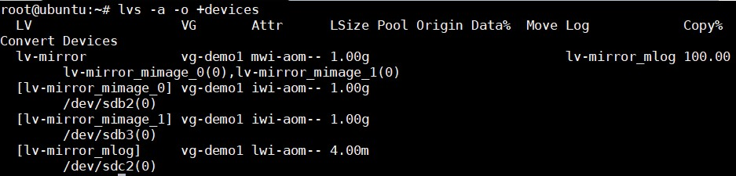
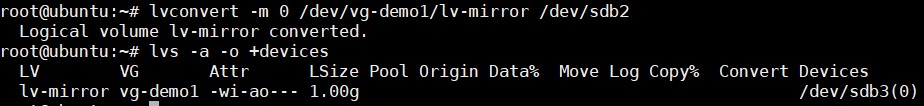
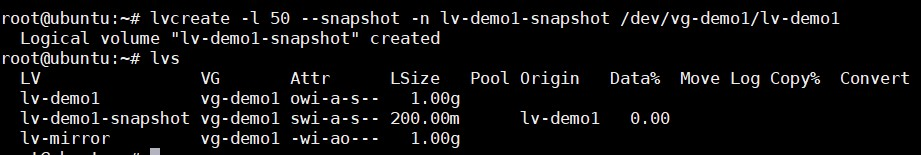

## LVM Migrating

- LVM Migrating là một tính năng của LVM cho phép tạo ra một bản sao dữ liệu từ một Logical Volume này đến một ổ đĩa mới mà không làm mất dữ liệu hay xảy ra tình trạng downtime.

- User case: Khi có một ổ cứng cũ bị lỗi, bạn muốn thêm một ổ cứng mới gắn vào và di chuyển dữ liệu trên ổ cũ sang ổ này thì migrating là một lựa chọn tốt của LVM.

### Thực hành

Tạo một mirror volume với lệnh:

```
lvcreate -L 1G -m 1 -n lv-mirror vg-demo1
```



Lệnh này sẽ tạo ra một logical volume `lv-mirror` và một bản sao của nó với tuỳ chọn `-m 1`

Tiếp theo tạo một thư mục để mount vaò logical volume này và kiểm tra tính năng:

```
mkfs.ext4 /dev/vg-demo1/lv-mirror
mkdir demo2
mount /dev/vg-demo1/lv-mirror demo2 
```



Tạo một file trong thư mục mới tạo 

```
cd demo2 
echo "Hello World." >> greet.txt
```

Kiểm tra thông tin về Logical Volume bằng câu lệnh:

```
lvs -a -o +devices
```



Ta thấy `lv-mirror` đang gắn với lv-mirror_mimage_0(0) và lv-mirror_mimage_1(0), mà lv-mirror_mimage_0(0) đang gắn với `/dev/sdb2`, lv-mirror_mimage_1(0) đang gắn với `/dev/sdb3`. Như vậy ta có thể thấy dữ liệu lưu trên Mirror Volume được lưu ở hai chỗ.

Nếu muốn xoá một bản đi, ta sử dụng lệnh:

```
lvconvert -m 0 /dev/vg-demo1/lv-mirror /dev/sdb2 
```

Kết quả:



Kiểm tra lại nội dung file `greet.txt` lúc đầu tạo thấy không có gì thay đổi, dữ liệu còn nguyên.

## LVM Snapshot

### Snapshot LVM là gì?

Snapshot là một tính năng của LVM cho phép tạo một bản sao lưu của thời điểm hiện tại để backup cho sau này, ta có thể khôi phục lại thời điểm đã backup trước đó nếu cần.

### Thực hành

Ở đây, ta sẽ tạo ra một bản snapshot cho Logical Volume `lv-demo1`. Sử dụng lệnh: 

```
lvcreate -l 50 --snapshot -n lv-demo1-snapshot /dev/vg-demo1/lv-demo1 
```



Vì Snapshot LVM cũng là một Logical Volume nên có thể xoá, tăng giảm kích thước như Logical Volume. Ví dụ nếu muốn xoá snapshot đi:

```
lvremove /dev/vg-demo1/lv-demo1-snapshot 
```

Để phục hồi lại một snapshot, trước tiên phải ummount Logical Volume của bản snapshot trước

```
umount -v /dev/vg-demo1/lv-demo1
lvconvert --merge /dev/vg-demo1/lv-demo1-snapshot
```

## Thin Provisioning trong LVM 

### Thin Provisioning là gì?

Thin Provisioning là một tính năng nữa của LVM, nó cho phép tạo ra những ổ đĩa ảo từ storage pool giúp tận dụng tối đa tài nguyên của ổ đĩa.

Ví dụ một storage pool có dung lượng là 15GB, cấp cho 3 người, mỗi người 5GB, tổng tất cả mới sử dụng hết 6GB, nếu có thêm một user nữa thì sẽ không thể cấp phát mặc dù còn rất nhiều dung lượng trống (Thick Volume). Để giải quyết vấn đề đó, ta sử dụng Thin Provisioning. Khi đó có thể cấp phát thêm cho user thứ 4 5GB để sử dụng. Cái này có nghĩa là dùng bao nhiêu cấp bấy nhiêu sẽ đỡ lãng phí tài nguyên.

### Thực hành

Đầu tiên cần cài đặt gói 

```
apt-get -y install thin-provisioning-tools
```

Tạo một Volume Group

```
vgcreate -s 32M vg-thin /dev/sdc1
```

Tạo một  LV thin pool với kích thước 6GB 

```
lvcreate -L 6G --thinpool thin-mdt vg-thin 
```

Tạo các Thin Volume

```
lvcreate -V 2G --thin -n thin-1 vg-thin/thin-mdt
lvcreate -V 2G --thin -n thin-2 vg-thin/thin-mdt
lvcreate -V 2G --thin -n thin-3 vg-thin/thin-mdt
lvcreate -V 2G --thin -n thin-4 vg-thin/thin-mdt
```

Tạo thư mục, format và mount để sử dụng 

```
mkdir /mnt/si{1..4}
mkfs.ext3 /dev/vg-thin/thin-1 && mkfs.ext3 /dev/vg-thin/thin-2 && mkfs.ext3 /dev/vg-thin/thin-3  mkfs.ext3 /dev/vg-thin/thin-4
mount /dev/vg-thin/thin-1 /mnt/si1
mount /dev/vg-thin/thin-2 /mnt/si2
mount /dev/vg-thin/thin-3 /mnt/si3
mount /dev/vg-thin/thin-4 /mnt/si4
```