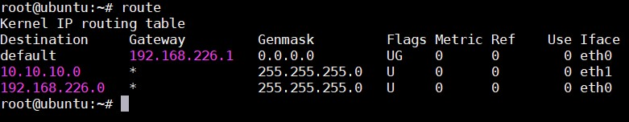

## Network interfaces

Network interfaces là kênh kết nối giữa devices và network. Về mặt vật lý, network interfaces chính là network interfaces card (NIC). Một hệ thống có thể có nhiều card mạng cùng hoạt động. Các card mạng có thể được lắp vào hoặc ngắt ra bất cứ lúc nào.

Để kiểm tra các card mạng đang hoạt động dùng lệnh `ifconfig`

Đối với Debian, file cấu hình nằm trong `/etc/network/interfaces`. Đối với RedHat, file cấu hình nằm trong `/etc/sysconfig/network`. Đối với file cấu hình cho `eth0` được đặt tại `/etc/sysconfig/network-scripts/ifcfg-eth0`. Đối với SUSE, file cấu hình nằm trong thư mục `/etc/sysconfig/network`.

Cấu hình đặt ip tĩnh trong Ubuntu: Sửa file `/etc/network/interfaces` như sau:

```
auto eth0 
iface eth0 inet static
address 10.0.0.41
netmask 255.255.255.0
network 10.0.0.0
broadcast 10.0.0.255
gateway 10.0.0.1
dns-nameservers 10.0.0.1 8.8.8.8
dns-domain acme.com
dns-search acme.com
```

Muốn để nhận ip từ dhcp server thì cấu hình như sau:

```
auto eth0 
iface eth0 inet dhcp 
```

## Routing table

Lệnh `route` được sử dụng để xem hoặc chỉnh sửa bằng định tuyến IP, thêm, xoá hoặc thay đổi IP 



Một số câu lệnh để thêm hoặc xoá các route trong bảng định tuyến

```
route add 192.168.0.110  gw 192.168.0.1
route delete 192.168.0.110  gw 192.168.0.1
route add -net 192.168.0.0 netmask 255.255.255.0 gw 192.168.226.0 eth0
route delete -net 192.168.0.0 netmask 255.255.255.0 gw 192.168.226.0 eth0
```