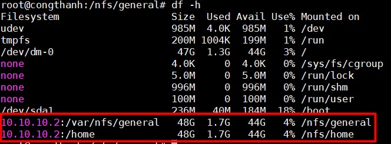

## Network Filesystem

NFS ( Network File System) là một giao thức được dùng cho việc chia sẻ data qua physical systems. Người quản trị gắn các thư mục của người dùng từ xa trên một máy chủ để cho phép họ truy cập vào cùng một tệp và cấu hình.

Hoạt động theo cơ chế client-server

Hiện tại NFS có 4 phiên bản. NFSv4 là phiên bản đang được sử dụng nhiều nhất và hỗ trợ phát huy tối đa của giao thức NFS

Một số vấn đề với NFS 

- Không bảo mật, mã hoá dữ liệu

- Hiệu suất hoạt động trung bình ở mức khá, nhưng không ổn định

- Dữ liệu phân tán có thể bị phá vỡ nếu có nhiều phiên sử dụng đồng thời 

File `/etc/export` chứa các đường dẫn thư mục và quyền hạn mà một host muốn chia sẻ dữ liệu với host khác qua NFS.

Các máy chủ có quyền hạn sau:

- `rw`: Đọc và ghi

- `ro`: Chỉ được đọc

- `noaccess`: Cấm truy cập vào các thư mục con của thư mục được chia sẻ

Ví dụ muốn chia sẻ thư mục `/share` cho các máy có địa chỉ trong 192.168.1.1/28 có quyền đọc ghi thì thêm vào nội dung file dòng sau:

```
/share 192.168.1.1/28(rw)
```

Lưu ý các dấu cách trong dòng trên.

## Cài đặt trên Ubuntu

### Requirements

Server

```
Ubuntu 14.04
ip: 10.10.10.2
```

Client

```
Ubuntu 14.04
ip: 10.10.10.4
```

### Installation

Cài đặt NFS trên server 

```
sudo apt-get install nfs-kernel-server 
```

Trên client sẽ cài một gói nfs-common cung cấp chức năng NFS mà không bao gồm các thành phần server không cần thiết.

```
sudo apt-get install nfs-common
```

Trên server, tạo ra một thư mục để share các tệp tin và thay đổi quyền sở hữu tệp tin thành không sở hữu bởi ai:

```
sudo mkdir /var/nfs/general -p 
sudo chown nobody:nogroup /var/nfs/general
```

Sửa nội dung file `/etc/exports` để share thư mục vừa tạo và thư mục `/home`

```
sudo vim /etc/exports
/var/nfs/general 10.10.10.4(rw,sync,no_subtree_check)
/home 10.10.10.4(rw,sync,no_root_squash,no_subtree_check,no_all_squash)
```

Trong đó:

- `rw`: Tuỳ chọn cho phép máy client truy cập quyền đọc và viết vào bộ đĩa (volume).

- `sync`: Tuỳ chọn bắt buộc NFS phải ghi các thay đổi vào đĩa trước khi trả lời. Điều này dẫn đến một môi trường ổn định và phù hợp hơn kể từ khi trả lời phản ánh tình trạng thực tế của bộ đĩa (volume) từ xa. Tuy nhiên, nó cũng làm giảm tốc độ của hoạt động tập tin.

- `no_subtree_check`: Tuỳ chọn này ngăn cản việc kiểm tra cây con, đó là một quá trình mà host phải kiểm tra xem các tập tin thực sự vẫn có sẵn trong cây xuất cho mỗi yêu cầu.

- `no_root_squash`: Theo mặc định, NFS chuyển yêu cầu từ người dùng root từ xa vào một người dùng không có đặc quyền trên máy chủ. Điều này được dự định như là tính năng bảo mật để ngăn chặn một tài khoản root trên máy client sử dụng hệ thống tập tin của máy chủ như là root.

- `no_all_squash`: Enable the user's authority

Khởi động NFS:

```
sudo service nfs-kernel-server start
```

Check xem trên server có đang bật firewall không bằng lệnh `sudo ufw status`, nếu đang bật thì cần điều chỉnh để mở cổng 2049:

```
sudo ufw allow from 10.10.10.4 to any port nfs 
```

Trên client tạo thư mục để mount các thư mục được share:

```
sudo mkdir -p /nfs/general
sudo mkdir -p /nfs/home
```

Mount các thư mục được share vào client:

```
sudo mount 10.10.10.2:/var/nfs/general /nfs/general
sudo mount 10.10.10.2:/home /nfs/home
```

Kiểm tra xem đã mount thành công chưa bằng lệnh `df -h`.



Cách mount trên chỉ là tạm thời, khởi động lại client là sẽ tự động unmount. Để client tự động mount mỗi khi khởi động thì thêm nội dung sau vào tệp `/etc/fstab`:

```
10.10.10.2:/var/nfs/general /nfs/general nfs auto,nofail,noatime,nolock,intr,tcp,actimeo=1800 0 0
10.10.10.2:/home /nfs/home nfs auto,nofail,noatime,nolock,intr,tcp,actimeo=1800 0 0
```

Nếu không muốn dùng nữa thì trên client `unmount` thư mục share đó đi