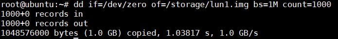
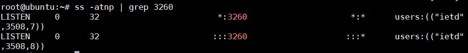
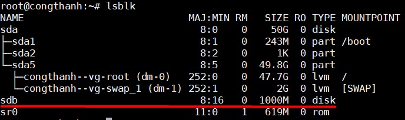

## Chia sẻ bộ nhớ qua mạng với iSCSI

### 1. iSCSI là gì?

iSCSI (internet Small Computer System Interface) là một giao thức phát triển nhằm mục tiêu truyền tải các lệnh SCSI qua mạng bằng giao thức TCP/IP.

iSCSI cho phép truy cập các khối dữ liệu trên hệ thống lưu trữ SAN qua các lệnh SCSI và truyền tải dữ liệu qua hệ thống mạng network (LAN/WAN).

iSCSI sẽ giúp tạo 1 ổ cứng local trong máy tính của bạn với mọi chức năng y như 1 ổ cứng gắn trong máy tính. Chỉ khác là dung lượng thực tế nằm trên NAS và do NAS quản lý.

### 2. Cơ chế hoạt động

- Khi một người dùng hoặc một ứng dụng gửi 1 request yêu cầu truy xuất dữ liệu trong storage

- Hệ thống sẽ tạo ra một số lệnh SCSI tương ứng với yêu cầu

- Sau đó đóng gói, mã hoá và gửi đi trên đường Network

- Khi server nhận được sẽ mở gói, giải mã và nhận được các lệnh SCSI

- Các lệnh này sẽ được đưa vào SCSI Controller để thực thi và xử lý yêu cầu

- Các ổ đĩa iSCSI được tạo ra từ các server chạy các hệ điều hành như Windows/Linux

### 3. Lab

#### Requirements

Target (Server):

```
Ubuntu 14.04 
ip: 10.10.10.2
```

Initiator (Client):

```
Ubuntu 14.04
ip: 10.10.10.4
```

Target tạo ra 1 image `lun1.img` để chia sẽ cho Inititor làm một ổ cứng ảo.

### Cài đặt

#### Target 

Cài đặt iSCSI:

```
sudo apt-get update -y 
sudo apt-get install iscsitarget iscsitarget-dkms -y 
```

Tạo một thư mục để chứa các image, mỗi image này sẽ được chia sẻ với các máy initiator và được coi như một ổ ảo trên máy đó

```
sudo mkdir /storage
```

Sử dụng lệnh `dd` để tạo ra các image trong `/storage`, ở đây tạo ra 1 image tên là lun1.img có dung lượng 1GB

```
sudo dd if=/dev/zero of=/storage/lun1.img bs=1M count=1000
```



Cấu hình để kích hoạt dịch vụ iSCSI bằng cách sửa file `/etc/default/iscsitarget`:

```
ISCSITARGET_ENABLE=true
```

Cấu hình file `/etc/iet/ietd.conf` để khai báo iSCSI target vừa tạo:

```
Target iqn.2018-10.nct.vn:storage.lun1
# cung cấp đường dẫn tới thiết bị iSCSI tartget 
Lun 0 Path=/storage/lun1.img,Type=fileio
# khai báo địa chỉ IP của máy iSCSI Initiator mà cho phép kết nối
initiator-address 10.10.10.4
# thông tin để xác thực (username và password. Lưu ý, đây là username trên máy initiator.
incominguser vibi thanh123
```

	- Chú ý:
	
		- Target name phải là tên duy nhất, chuẩn iSCSI định nghĩa iQN(iSCSI Qualified Name) như sau: `iqn.yyyy-mm.<reversed domain name>[:identifier]`
		
		- `yyyy-mm` là thời điểm mà domain còn hoạt động, cấu hình tuỳ ý
		
		- `incominguser <username> <password>`: Thông tin về username và password của nó trên máy client để login và sử dụng 
		
		- Dòng `lun`: Xác định đường dẫn tới file .img mà tạo ra làm iSCSI target chia sẻ với iSCSI initiator
		
		- `initiator-address`: Địa chỉ ip của client được phép truy cập vào target 

Khởi động lại dịch vụ:

```
service iscsitarget restart 
```

Kiểm tra lại cấu hình:



#### Initiator

Cài đặt iSCSI:

```
sudo apt-get install open-iscsi -y 
```

Sửa file `/etc/iscsi/iscsid.conf` 

```
[...]
node.startup = automatic
[...]
```

Khởi động lại dịch vụ:

```
service open-iscsi restart 
```

Kiểm tra lại xem đã kết nối được với target server chưa bằng 1 trong 2 lệnh sau:

```
iscsiadm -m discovery -t st -p 10.10.10.2
iscsiadm -m node 
```

Tiếp theo cấu hình username và password cho initiator 

```
iscsiadm -m node --targetname "ign.2018-10.nct.vn:storage.lun1" --portal "10.10.10.2:3260" --op=update --name node.session.auth.authmethod --value=CHAP
iscsiadm -m node --targetname "ign.2018-10.nct.vn:storage.lun1" --portal "10.10.10.2:3260" --op=update --name node.session.auth.username --value=vibi
iscsiadm -m node --targetname "ign.2018-10.nct.vn:storage.lun1" --portal "10.10.10.2:3260" --op=update --name node.session.auth.password --value=thanh123
```

hoặc có thể chỉnh sửa file `/etc/iscsi/nodes/iqn.2018-10.nct.vn:storage.lun1/10.10.10.2,3260,1/default` thêm nội dung:

```
node.session.auth.authmethod = CHAP
node.session.auth.username = vibi 
node.session.auth.password = thanh123 
```

Sau khi xác thực thông tin thì login vào để sử dụng:

```
iscsiadm -m node --targetname "iqn.2018-10.nct.vn:storage.lun1" --portal "10.10.10.2:3260" --login 
```

Kiểm tra lại bằng lệnh `lsblk`:



Chúng ta thấy có thêm ổ `sdb` với dung lượng 1000M chính là image `lun1.img` bên target. `sdb` sẽ đóng vai trò như một ổ thật và có thể sử dụng nó bình thường như những ổ khác nhưng dữ liệu trên đó thực sự lại được lưu trên máy target. Dung lượng được lấy từ máy target và chia sẻ với máy initiator qua giao thức iSCSI.

### Tham khảo 

https://github.com/trangnth/Report_Intern/blob/master/Linux-note/15.%20iSCSI.md