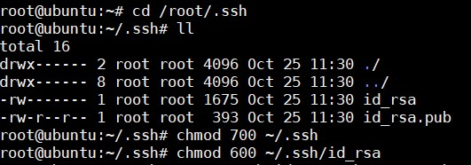
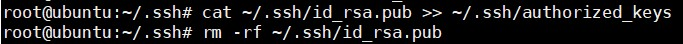

## Linux Security

Mặc định, Linux có nhiều loại tài khoản để phân chia cho các processes và workloads:

	- 1. Root
	
	- 2. System
	
	- 3. Normal
	
	- 4. Network
	
Với môi trường làm việc an toàn, nên giới hạn các quyền hạn ở mức tối thiểu cho các tài khoản và loại bỏ các tài khoản không hoạt động. Command `last` sẽ show ra lịch sử người dùng đăng nhập vào hệ thống, xác định các tài khoản ít và đã lâu không sử dụng để loại bỏ.

User `root` sẽ có quyền cao nhất trong hệ thống. Nó có quyền quản trị hệ thống, tạo, xoá hay thay đổi mật khẩu tài khoản, kiểm tra log, cài đặt phần mềm,...

Một tài khoản người dùng thường có thể thực hiện những hoạt động yêu cầu sự cấp quyền, tuy nhiên nên cấu hình cho phép những hoạt động đó được thực thi. Chạy một network client hoặc chia sẻ file qua mạng là những hành động không yêu cầu tài khoản root để thực thi.

### Sudo và Su command

| su | sudo |
|----|------|
| Dùng để nâng quyền, cần nhập password cho root | Xin quyền root, cần nhập password của chính bạn |
| Sau khi nâng quyền, người dùng có thể thực hiện bất cứ lệnh nào mà root có thể thực hiện mà không yêu cầu lại password | Những gì user có thể thực hiện được kiểm soát và có thể bị hạn chế, sau một thời gian nhất định phải nhập lại mật khẩu | 
| Không cần thuộc group `sudo` | Phải thuộc nhóm `sudo` mới có thể dùng |
| Giới hạn một số tính năng đăng nhập | Các tính năng đăng nhập chi tiết có sẵn |

### Sudo command

Cấp quyền `sudo` cho người dùng sẽ ít nguy hiểm hơn `su`

Mặc định, `sudo` sẽ kích hoạt cho mỗi người dùng, tuy nhiên với một số các distro như Ubuntu thì chỉ kích hoạt cho ít nhất một người dùng chính.

Khi sử dụng `sudo <command>` lệnh sẽ được thực hiện với quyền root, sau khi thực hiện xong sẽ trở về với quyền của người dùng bình thường.

File cấu hình `/etc/sudoers` và `/etc/sudoers.d`. Có thể sửa file `/etc/sudoers` bằng lệnh `sudo` với các trình soạn thảo.

Có thể xem log về việc sử dụng `sudo` thất bại trong `/var/log/secure`

Khi `sudo` được thực hiện, sẽ có một tiến trình trỏ tới `/etc/sudoers` và file trong `/etc/sudoers.d` để xác định người dùng đó có được cấp quyền `sudo` không, nếu được cấp thì có những quyền gì. Nếu không được phép thực hiện lệnh đó thì sẽ ghi lại log về thông tin đăng nhập.

### Tiến trình riêng biệt (The process isolation)

Linux bảo mật hơn các hệ điều hành khác là do các tiến trình chạy độc lập với nhau. Một tiến trình không thể truy cập tài nguyên của các tiến trình khác kể cả khi nó đang chạy cùng phiên của một người dùng.

Một cơ chế đã được bổ sung vào để bảo mật và hạn chế tối thiều các mối nguy hại đã được giới thiệu:

- `Control Groups`: cho phép người quản trị phân nhóm các tiến trình và cấp tài nguyên hữu hạn cho mỗi nhóm (cgroup).

- `Linux Containers`: cho phép chạy nhiều phiên bản Linux trên cùng một hệ thống.

- `Virtualization`: phần cứng được tính toán sao cho không chỉ tách biệt các tiến trình, đồng thời cũng phải tách biệt với phần cứng mà các máy ảo sử dụng trên cùng một host vật lý.

### Mã hoá mật khẩu 

Hầu hết các phiên bản Linux đều sử dụng một thuật toán mã hoá là SHA-512, được phát triển bởi NSA để mã hoá mật khẩu. SHA-512 được sử dụng rộng rãi để bảo vệ các ứng dụng và giao thức như TLS, SSL, PHP, S/MINE và IPSec.

### Password aging

Password aging là một phương thức nhắc nhở người dùng tạo password mới sau một thời gian sử dụng, nhằm nâng cao tính bảo mật. Điều này có thể củng cố cho việc bảo mật, nếu hệ thống bị xâm nhập thì cũng chỉ sử dụng được trong một thời gian nhất định.

Sử dụng `chage` để cấu hình thông tin mật khẩu cho người dùng

Có thể sử dụng `chage -l` để xem các option của lệnh `chage` 

`chage --list <username>` để kiểm tra thông tin về mật khẩu của user 

### Public/Private Keys authentication

Public Key Encryption sẽ cho phép server và client tin tưởng lẫn nhau mà không cần password. Private key sẽ được cài đặt trên server, public Public Key Encryption sẽ cho phép server và client tin tưởng lẫn nhau mà không cần password. Private key sẽ được cài đặt trên server, public key sẽ được chia sẻ cho clients. Private key phải được giữ bí mật, public key có thể được phân phôi tự do giữa các client. Hai khóa sẽ được mã hóa cùng nhau nên chúng là một cặp. Server cần phải ủy quyền cho public key thì client mới sử dụng được.

Sử sụng Public Key Encryption bạn sẽ không cần password để đăng nhập, và có thể vô hiệu hóa hoàn toàn việc sử dụng password để login, nếu không có key thì sẽ không thể truy cập hệ thống.

Tạo private key cho client và public key cho server như sau:




Ở đây sẽ tạo ra 2 file `id_rsa` và `id_rsa.pub` trong thư mục ẩn `/root/.ssh` lần lượt là private và public key. Cài public key đó vào `authorized keys list` rồi xoá khỏi server 



Copy private key lên client và sẽ sử dụng nó để login 

Sử dụng private key để login vào server 

```
ssh -i ~/.ssh/id_rsa root@10.10.10.2
```