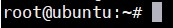
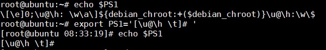

## Modify the Command Line Prompt

Biến `PS1` là chuỗi ký tự được hiển thị như lời nhắc của command line. Hầu hết các bản distro đều set PS1 là các giá trị mặc định đã biết, ví dụ Ubuntu là user và hostname:

Ta có thể thay đổi nó:

