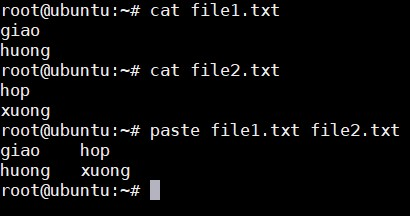

## Text commands

Linux cung cấp các công cụ cho việc thao tác với file và text

- Hiển thị nội dung sử dụng `cat` và `echo`

- Chỉnh sửa nội dung sử dụng `sed` và `awk`

- Tìm kiếm các đơn vị sử dụng `grep`

### Hiển thị nội dung 

`cat` sẽ in ra màn hình toàn bộ nội dung file 

`tac` giống `cat` nhưng sẽ in ngược từ cuối file lên đầu

`echo` chỉ đơn giản dùng để in ra màn hình 

### Edit file content 

Command `sed` là một công cụ mạnh mẽ để làm việc với các đoạn text. Nó sẽ lọc và sắp xếp sự bổ sung trong các dòng liệu (data streams). Dữ liệu từ nguồn vào (hoặc streams) sẽ được nhận và đưa vào một khu vực xử lý riêng. Toàn bộ danh sách hoạt động, việc chỉnh sửa được áp dụng vào dữ liệu trong khu vực làm việc và nội dung cuối cùng sẽ được chuyển ra ngoài khu vực làm việc đến nơi xuất dữ liệu chuẩn (hoặc streams).

Command `awk` dùng để giải nén và in ra nội dung cụ thể của một file, thường được sử dụng để xây dựng các bản báo cáo. Nó là một công cụ mạnh mẽ và là một trình thông dịch ngôn ngữ lập trình. Làm việc tốt với các dữ liệu theo dạng field (một mẩu dữ liệu riêng lẻ, đặc biệt là các cột) và các ghi chép (tập hợp các fields, đặc biệt là các dòng trong file).

### File manipulation

Lệnh `sort` sắp xếp lại các dòng trong file text theo một thứ tự nào đó theo option

Lệnh `unig` loại bỏ các dòng bị lặp trong file text. Ví dụ kết hợp với lệnh `sort` để hiển thị các dòng đã được sắp xếp và số lần bị lặp lại của dòng đó

Lệnh `paste` để gộp 2 file theo các dòng (gộp từng dòng một với nhau)



Lệnh `join` cũng để gộp hai file nhưng yêu cầu file đã được sắp xếp, sử dụng tuỳ chọn `--nocheck-order` để gộp mà không cần sắp xếp. Ví dụ:

```
join --nocheck-order file1.txt file2.txt
```

Lệnh `grep` để tìm kiếm các từ khoá. Ví dụ tìm trong file tất cả các dòng bắt đầu bằng ký tự `t`

```
grep ^t file1.txt
```

Lệnh `tr`. Nếu muốn đổi hết chữ thường thành chữ in hoa dùng lệnh:

```
cat file1.txt | tr a-z A-Z
```

Lệnh `tee` lấy output từ bất cứ cmd nào trong khi xuất ra output và lưu nó vào file 

```
ls -l | tee list.txt
```

`wc` đếm số dòng, số từ, số kí tự trong một file hoặc một list các file 

	- Đếm số dòng: `wc -l file1.txt`
	
	- Đếm số kí tự: `wc -c file1.txt`
	
	- Đếm số từ: `wc -w file1.txt` 
	
Lệnh `cut` làm việc với các cột trong file và thiết kế để xuất nội dung của một cột cụ thế. Phân cách mặc định là `tab` và có thể tuỳ chọn các cách cắt khác. Ví dụ cắt theo dấu cách " " và lấy ra cột đầu tiên

```
cut -d" " -f1 file1.txt
```

Lệnh `head` mặc định in ra 10 dòng đầu tiên của file. Ví dụ in 4 dòng đầu tiên của file1.txt:

```
head -n 4 file1.txt 
```

Lệnh `tail` mặc định in ra 10 dòng cuối của file. In ra 4 dòng cuối dùng lệnh: 

```
tail -f -n 4 file1.txt
```

`tail` hay `tail -f` thường được sử dụng cho file ghi log real-time, hai lệnh này sẽ cho phép tiếp tục xem file, nếu có dòng được add vào file, nó sẽ được hiển thị thêm.
